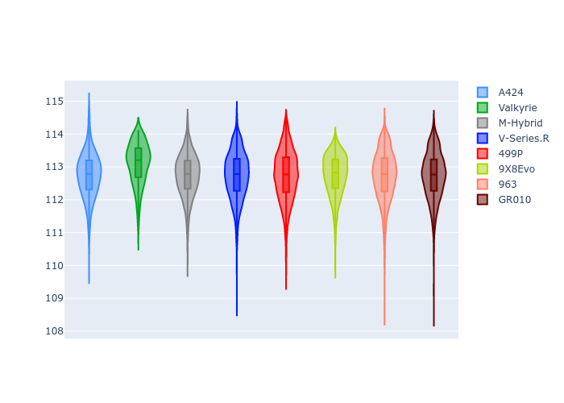
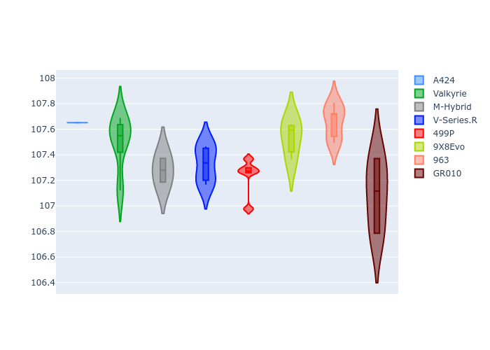

# Combined Plots

## Metadata

- BoP Accuracy: 99.90%
- Overall BoP Grade: A1
- Track: BAHRAIN
- Threshhold: 0.0kph

## BoP Table
| Manufacturer   | Car        | Weight   | Power   | PINC   | E/Stint   | FDS    | RDP    | QDP    | TDP    |
|:---------------|:-----------|:---------|:--------|:-------|:----------|:-------|:-------|:-------|:-------|
| Alpine         | A424       | 1042kg   | 510.0kw | -      | 912MJ     | -      | 52.35% | 61.85% | 27.84% |
| Aston Martin   | Valkyrie   | 1031kg   | 517.0kw | -      | 908MJ     | -      | 53.59% | 53.33% | 21.51% |
| BMW            | M-Hybrid   | 1043kg   | 512.0kw | -      | 909MJ     | -      | 53.26% | 57.23% | 34.54% |
| Cadillac       | V-Series.R | 1050kg   | 520.0kw | -      | 912MJ     | -      | 47.80% | 56.73% | 19.63% |
| Ferrari        | 499P       | 1067kg   | 513.0kw | -      | 912MJ     | 190kph | 53.02% | 42.32% | 9.88%  |
| Peugeot        | 9X8Evo     | 1031kg   | 513.0kw | -      | 911MJ     | 190kph | 48.47% | 51.26% | 16.02% |
| Porsche        | 963        | 1043kg   | 511.0kw | -      | 906MJ     | -      | 50.87% | 45.25% | 30.77% |
| Toyota         | GR010      | 1065kg   | 510.0kw | -      | 907MJ     | 190kph | 52.43% | 57.12% | 12.82% |

## Performance Table
| Manufacturer   | Car        | RP      | QP      | Vavg      |   RDLC | BOP-Grade   | Match   |
|:---------------|:-----------|:--------|:--------|:----------|-------:|:------------|:--------|
| Alpine         | A424       | 1:51.56 | 1:47.15 | 290.42kph |   1.04 | ~A1         | 99.79%  |
| Aston Martin   | Valkyrie   | 1:51.56 | 1:46.54 | 292.21kph |   1.05 | ~A1         | 100.00% |
| BMW            | M-Hybrid   | 1:51.56 | 1:46.77 | 289.84kph |   1.04 | ~A1         | 100.00% |
| Cadillac       | V-Series.R | 1:51.56 | 1:46.81 | 287.36kph |   1.04 | ~A1         | 100.00% |
| Ferrari        | 499P       | 1:51.54 | 1:46.27 | 291.19kph |   1.05 | ~A1         | 99.81%  |
| Peugeot        | 9X8Evo     | 1:51.55 | 1:46.95 | 294.20kph |   1.04 | ~A1         | 100.00% |
| Porsche        | 963        | 1:51.57 | 1:46.85 | 290.20kph |   1.04 | ~A1         | 99.86%  |
| Toyota         | GR010      | 1:51.54 | 1:46.15 | 291.76kph |   1.05 | ~A1         | 99.74%  |

## Race Laptimes

## Quali Laptimes

## Topspeeds

## Laptimes Lineplot

