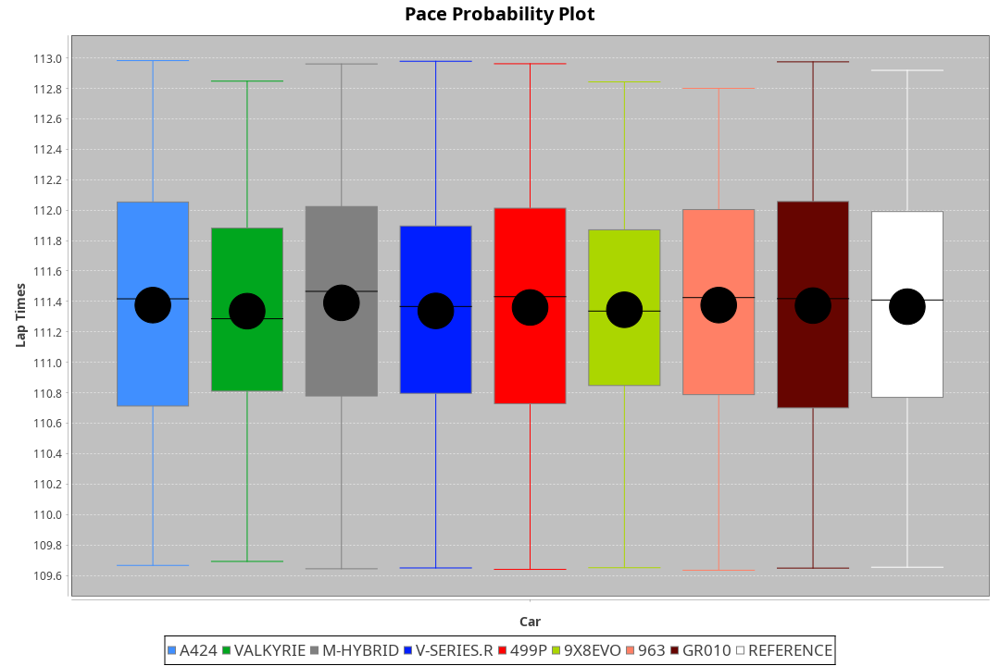
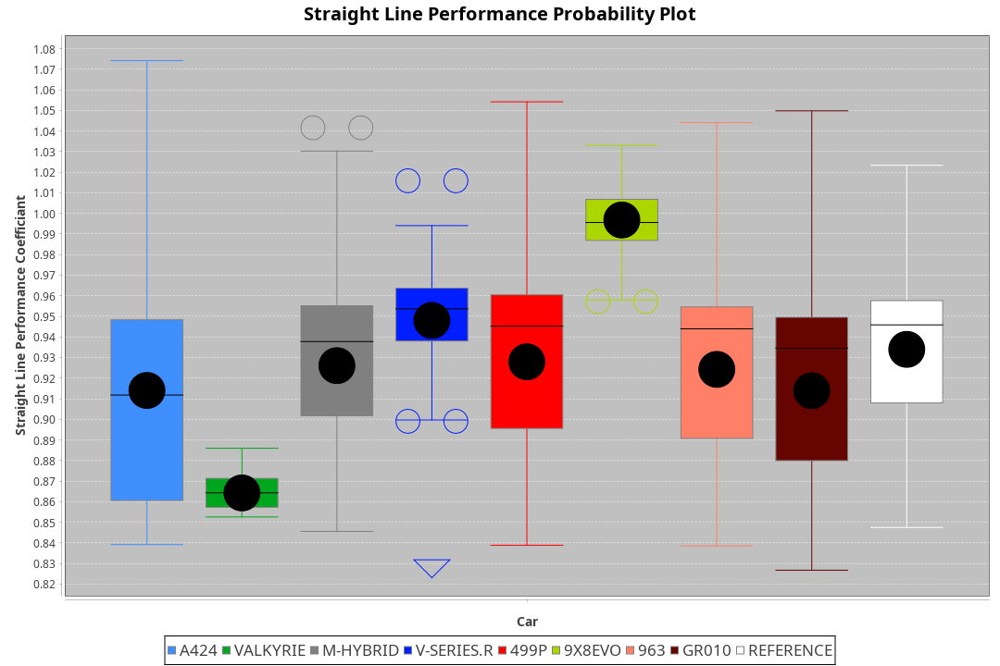
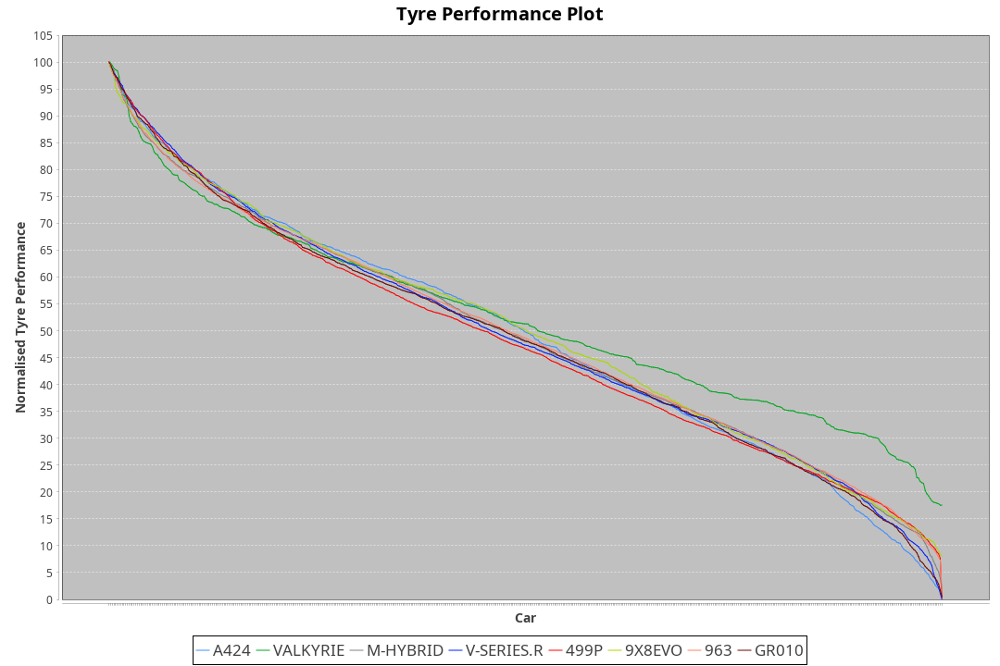

| Manufacturer | Car        | Weight | Power   | PINC    | E/Stint | FDS     |
|:-|:-|:-|:-|:-|:-|:-|
| Alpine       | A424       | 1050kg | 505.0kw |    -    | 908MJ   |    -    |
| Aston Martin | Valkyrie   | 1031kg | 512.0kw |    -    | 904MJ   |    -    |
| BMW          | M-Hybrid   | 1055kg | 517.0kw |    -    | 914MJ   |    -    |
| Cadillac     | V-Series.R | 1055kg | 520.0kw |    -    | 912MJ   |    -    |
| Ferrari      | 499P       | 1084kg | 508.0kw |    -    | 909MJ   | 190kph  |
| Peugeot      | 9X8Evo     | 1032kg | 502.0kw |    -    | 901MJ   | 190kph  |
| Porsche      | 963        | 1059kg | 515.0kw |    -    | 912MJ   |    -    |
| Toyota       | GR010      | 1089kg | 507.0kw |    -    | 907MJ   | 190kph  |

### BoP Accuracy: 96.61%; Overall BoP Grade: A1
| Manufacturer | Car        | Type  | RP      | QP      | Weight | Power¹  | Threshhold | PINC    | Power²   | E/Stint | AVG Vmax  | FDS     | RDLC | L/Stint | BOP-Grade | Model Accuracy | Model Points | Match%  | SimDiff |
|:-|:-|:-|:-|:-|:-|:-|:-|:-|:-|:-|:-|:-|:-|:-|:-|:-|:-|:-|:-|
| Alpine       | A424       | LMDH  | 1:51.32 | 1:46.77 | 1050kg | 505.0kw | 0.0kph     |    -    | 505.00kw |  908MJ  | 284.78kph |    -    | 1.01 | 34      | ~A1       | 97.47%         | 1810         | 95.54%  | +0.15   |
| Aston Martin | Valkyrie   | LMHNH | 1:51.32 | 1:46.25 | 1031kg | 512.0kw | 0.0kph     |    -    | 512.00kw |  904MJ  | 279.74kph |    -    | 1.05 | 34      | +B1       | 100.00%        | 466          | 87.47%  | #       |
| BMW          | M-Hybrid   | LMDH  | 1:51.31 | 1:46.51 | 1055kg | 517.0kw | 0.0kph     |    -    | 517.00kw |  914MJ  | 282.71kph |    -    | 1.01 | 34      | ~A1       | 100.00%        | 3339         | 100.00% | +0.03   |
| Cadillac     | V-Series.R | LMDH  | 1:51.31 | 1:46.40 | 1055kg | 520.0kw | 0.0kph     |    -    | 520.00kw |  912MJ  | 283.87kph |    -    | 1.01 | 34      | ~A1       | 99.00%         | 6039         | 96.21%  | +0.42   |
| Ferrari      | 499P       | LMHHU | 1:51.30 | 1:46.46 | 1084kg | 508.0kw | 0.0kph     |    -    | 508.00kw |  909MJ  | 279.40kph | 190kph  | 1.02 | 34      | ~A1       | 99.56%         | 7418         | 100.00% | +0.67   |
| Peugeot      | 9X8Evo     | LMHHU | 1:51.32 | 1:46.68 | 1032kg | 502.0kw | 0.0kph     |    -    | 502.00kw |  901MJ  | 291.74kph | 190kph  | 1.02 | 34      | ~A1       | 100.00%        | 1889         | 98.29%  | +0.51   |
| Porsche      | 963        | LMDH  | 1:51.30 | 1:46.31 | 1059kg | 515.0kw | 0.0kph     |    -    | 515.00kw |  912MJ  | 280.30kph |    -    | 1.01 | 34      | ~A1       | 100.00%        | 14574        | 96.96%  | +0.09   |
| Toyota       | GR010      | LMHHU | 1:51.32 | 1:46.43 | 1089kg | 507.0kw | 0.0kph     |    -    | 507.00kw |  907MJ  | 276.77kph | 190kph  | 1.01 | 34      | ~A1       | 97.78%         | 5323         | 98.41%  | +0.68   |

## Power below Threshhold
| N/Nmax    | A424    | VALKYRIE | M-HYBRID | V-SERIES.R | 499P    | 9X8EVO  | 963     | GR010   |
|:-|:-|:-|:-|:-|:-|:-|:-|:-|
|  0.550    |  249    |  252     |  255     |  256       |  250    |  247    |  254    |  250    |
|  0.575    |  272    |  275     |  278     |  279       |  273    |  270    |  277    |  273    |
|  0.600    |  292    |  296     |  298     |  300       |  293    |  290    |  297    |  293    |
|  0.625    |  312    |  317     |  320     |  322       |  314    |  310    |  319    |  314    |
|  0.650    |  333    |  338     |  341     |  343       |  335    |  331    |  340    |  335    |
|  0.675    |  355    |  359     |  363     |  365       |  357    |  352    |  362    |  356    |
|  0.700    |  376    |  381     |  385     |  387       |  378    |  374    |  383    |  377    |
|  0.725    |  397    |  403     |  407     |  409       |  399    |  395    |  405    |  399    |
|  0.750    |  417    |  423     |  427     |  430       |  420    |  415    |  426    |  419    |
|  0.775    |  436    |  442     |  446     |  449       |  439    |  434    |  445    |  438    |
|  0.800    |  454    |  460     |  464     |  467       |  456    |  451    |  463    |  455    |
|  0.825    |  469    |  475     |  479     |  482       |  471    |  466    |  478    |  470    |
|  0.850    |  480    |  486     |  491     |  494       |  483    |  477    |  489    |  482    |
|  0.875    |  490    |  497     |  502     |  505       |  493    |  487    |  500    |  492    |
|  0.900    |  497    |  504     |  509     |  512       |  500    |  494    |  507    |  499    |
|  0.925    |  502    |  509     |  514     |  517       |  505    |  499    |  512    |  504    |
| **0.950** | **505** | **512**  | **517**  | **520**    | **508** | **502** | **515** | **507** |
|  0.975    |  503    |  510     |  515     |  518       |  506    |  500    |  513    |  505    |
|  1.000    |  500    |  506     |  511     |  514       |  503    |  497    |  509    |  502    |
|  1.025    |  431    |  437     |  441     |  444       |  434    |  429    |  440    |  433    |

## Power above Threshhold
| N/Nmax    | A424    | VALKYRIE | M-HYBRID | V-SERIES.R | 499P    | 9X8EVO  | 963     | GR010   |
|:-|:-|:-|:-|:-|:-|:-|:-|:-|
|  0.550    |  249    |  252     |  255     |  256       |  250    |  247    |  254    |  250    |
|  0.575    |  272    |  275     |  278     |  279       |  273    |  270    |  277    |  273    |
|  0.600    |  292    |  296     |  298     |  300       |  293    |  290    |  297    |  293    |
|  0.625    |  312    |  317     |  320     |  322       |  314    |  310    |  319    |  314    |
|  0.650    |  333    |  338     |  341     |  343       |  335    |  331    |  340    |  335    |
|  0.675    |  355    |  359     |  363     |  365       |  357    |  352    |  362    |  356    |
|  0.700    |  376    |  381     |  385     |  387       |  378    |  374    |  383    |  377    |
|  0.725    |  397    |  403     |  407     |  409       |  399    |  395    |  405    |  399    |
|  0.750    |  417    |  423     |  427     |  430       |  420    |  415    |  426    |  419    |
|  0.775    |  436    |  442     |  446     |  449       |  439    |  434    |  445    |  438    |
|  0.800    |  454    |  460     |  464     |  467       |  456    |  451    |  463    |  455    |
|  0.825    |  469    |  475     |  479     |  482       |  471    |  466    |  478    |  470    |
|  0.850    |  480    |  486     |  491     |  494       |  483    |  477    |  489    |  482    |
|  0.875    |  490    |  497     |  502     |  505       |  493    |  487    |  500    |  492    |
|  0.900    |  497    |  504     |  509     |  512       |  500    |  494    |  507    |  499    |
|  0.925    |  502    |  509     |  514     |  517       |  505    |  499    |  512    |  504    |
| **0.950** | **505** | **512**  | **517**  | **520**    | **508** | **502** | **515** | **507** |
|  0.975    |  503    |  510     |  515     |  518       |  506    |  500    |  513    |  505    |
|  1.000    |  500    |  506     |  511     |  514       |  503    |  497    |  509    |  502    |
|  1.025    |  431    |  437     |  441     |  444       |  434    |  429    |  440    |  433    |
