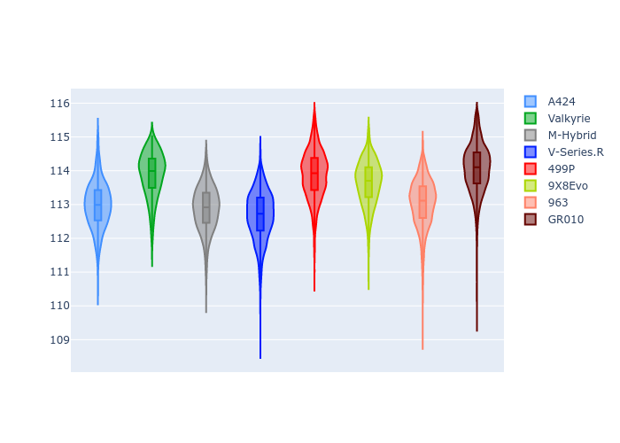
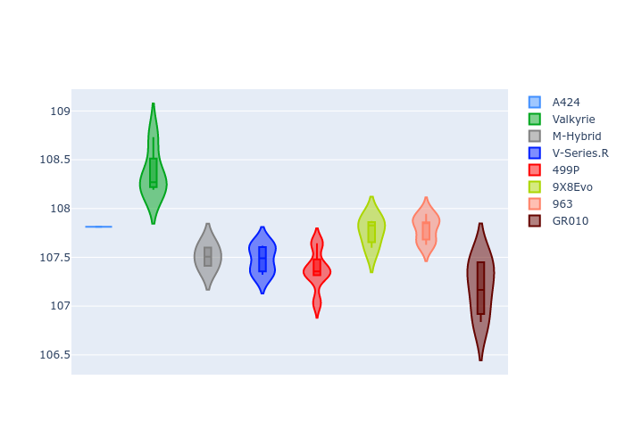
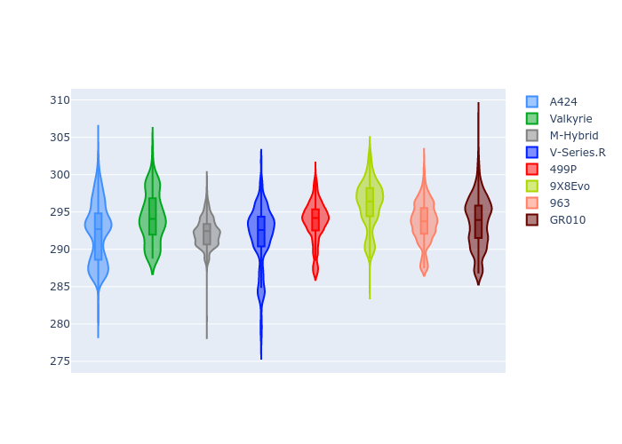
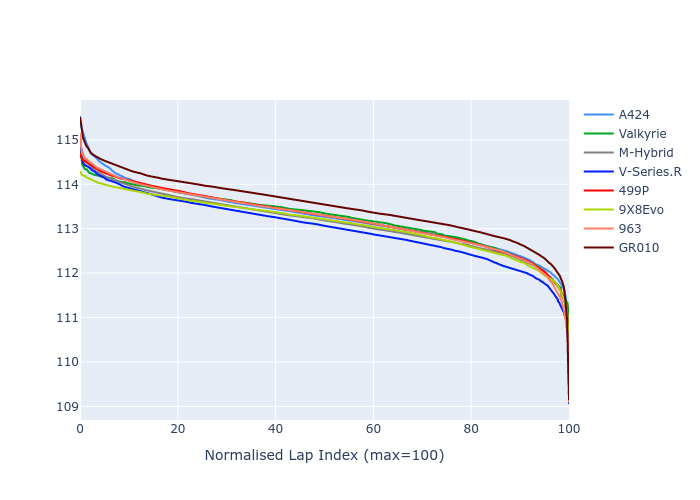

# Combined Plots

## Metadata

- BoP Accuracy: 99.72%
- Overall BoP Grade: A1
- Track: BAHRAIN
- Threshhold: 250.0kph
- Average Laptime: 1:53.22
- Average Quali Laptime: 1:48.00
- Laptime Std Dev: 0.13 seconds
- Filtered Average Topspeed: 292.93kph

## BoP Table
| Manufacturer   | Car        | Weight   | Power   | PINC   | E/Stint   | FDS    | RDP    | QDP    | TDP    |
|:---------------|:-----------|:---------|:--------|:-------|:----------|:-------|:-------|:-------|:-------|
| Alpine         | A424       | 1054kg   | 511.0kw | +0.10% | 915MJ     | -      | 51.38% | 57.54% | 26.10% |
| Aston Martin   | Valkyrie   | 1030kg   | 516.0kw | -      | 907MJ     | -      | 52.56% | 51.11% | 27.23% |
| BMW            | M-Hybrid   | 1050kg   | 513.0kw | +0.10% | 911MJ     | -      | 52.62% | 53.36% | 32.99% |
| Cadillac       | V-Series.R | 1047kg   | 519.0kw | -      | 910MJ     | -      | 48.29% | 59.47% | 18.65% |
| Ferrari        | 499P       | 1052kg   | 503.0kw | -0.60% | 899MJ     | 190kph | 51.25% | 43.28% | 10.17% |
| Peugeot        | 9X8Evo     | 1052kg   | 518.0kw | -0.10% | 918MJ     | 190kph | 48.70% | 50.83% | 18.68% |
| Porsche        | 963        | 1052kg   | 511.0kw | -0.10% | 907MJ     | -      | 50.57% | 42.80% | 29.05% |
| Toyota         | GR010      | 1061kg   | 502.0kw | -0.10% | 899MJ     | 190kph | 51.03% | 51.78% | 14.64% |

## Performance Table
| Manufacturer   | Car        | RP      | QP      | Vavg      |   RDLC | BOP-Grade   | Match   |
|:---------------|:-----------|:--------|:--------|:----------|-------:|:------------|:--------|
| Alpine         | A424       | 1:53.24 | 1:48.31 | 291.38kph |   1.05 | ~A1         | 98.90%  |
| Aston Martin   | Valkyrie   | 1:53.25 | 1:48.58 | 293.67kph |   1.04 | ~A1         | 100.00% |
| BMW            | M-Hybrid   | 1:53.15 | 1:47.88 | 291.71kph |   1.05 | ~A1         | 100.00% |
| Cadillac       | V-Series.R | 1:53.01 | 1:47.71 | 290.95kph |   1.05 | ~A1         | 99.93%  |
| Ferrari        | 499P       | 1:53.24 | 1:47.65 | 294.02kph |   1.05 | ~A1         | 100.00% |
| Peugeot        | 9X8Evo     | 1:53.12 | 1:48.11 | 294.46kph |   1.05 | ~A1         | 100.00% |
| Porsche        | 963        | 1:53.23 | 1:47.91 | 293.41kph |   1.05 | ~A1         | 99.90%  |
| Toyota         | GR010      | 1:53.50 | 1:47.86 | 293.84kph |   1.05 | ~A1         | 99.04%  |

## Race Laptimes

## Quali Laptimes

## Topspeeds

## Laptimes Lineplot

