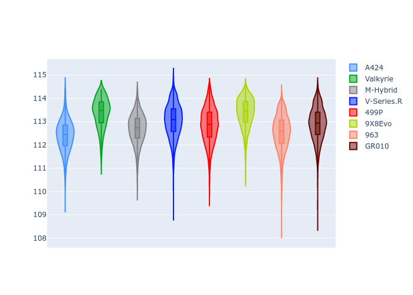

# Combined Plots

## Metadata

- BoP Accuracy: 98.75%
- Overall BoP Grade: A1
- Track: BAHRAIN
- Threshhold: 210.0kph

## BoP Table
| Manufacturer   | Car        | Weight   | Power   | PINC   | E/Stint   | FDS    |
|:---------------|:-----------|:---------|:--------|:-------|:----------|:-------|
| Alpine         | A424       | 1057kg   | 520.0kw | -1.00% | 920MJ     | -      |
| Aston Martin   | Valkyrie   | 1042kg   | 505.0kw | +0.40% | 900MJ     | -      |
| BMW            | M-Hybrid   | 1051kg   | 512.0kw | +1.00% | 912MJ     | -      |
| Cadillac       | V-Series.R | 1044kg   | 510.0kw | +1.00% | 904MJ     | -      |
| Ferrari        | 499P       | 1073kg   | 508.0kw | -1.00% | 905MJ     | 190kph |
| Peugeot        | 9X8Evo     | 1060kg   | 510.0kw | -1.00% | 909MJ     | 190kph |
| Porsche        | 963        | 1057kg   | 516.0kw | -1.00% | 910MJ     | -      |
| Toyota         | GR010      | 1090kg   | 512.0kw | +1.00% | 914MJ     | 190kph |

## Performance Table
| Manufacturer   | Car        | RP      | QP      | Vavg      |   RDLC | BOP-Grade   | Match   |
|:---------------|:-----------|:--------|:--------|:----------|-------:|:------------|:--------|
| Alpine         | A424       | 1:50.72 | 1:46.52 | 290.37kph |   1.04 | ~A1         | 99.81%  |
| Aston Martin   | Valkyrie   | 1:52.08 | 1:47.03 | 288.94kph |   1.05 | ~A1         | 96.55%  |
| BMW            | M-Hybrid   | 1:50.90 | 1:46.34 | 289.87kph |   1.04 | ~A1         | 99.84%  |
| Cadillac       | V-Series.R | 1:51.29 | 1:46.79 | 286.94kph |   1.04 | ~A1         | 99.92%  |
| Ferrari        | 499P       | 1:51.06 | 1:46.41 | 288.85kph |   1.04 | ~A1         | 99.86%  |
| Peugeot        | 9X8Evo     | 1:51.84 | 1:47.24 | 289.85kph |   1.04 | +A2         | 94.35%  |
| Porsche        | 963        | 1:50.96 | 1:46.47 | 288.69kph |   1.04 | ~A1         | 99.85%  |
| Toyota         | GR010      | 1:50.88 | 1:46.14 | 290.10kph |   1.04 | ~A1         | 99.80%  |

## Race Laptimes

## Quali Laptimes

## Topspeeds

## Laptimes Lineplot

