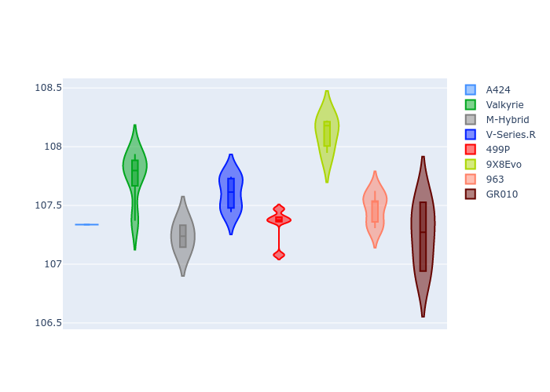

# Combined Plots

## Metadata

- BoP Accuracy: 99.84%
- Overall BoP Grade: A1
- Track: BAHRAIN
- Threshhold: 250.0kph
- Average Laptime: 1:52.89
- Average Quali Laptime: 1:47.51
- Average Topspeed: 292.58kph

## BoP Table
| Manufacturer   | Car        | Weight   | Power   | PINC   | E/Stint   | FDS    | RDP    | QDP    | TDP    |
|:---------------|:-----------|:---------|:--------|:-------|:----------|:-------|:-------|:-------|:-------|
| Alpine         | A424       | 1057kg   | 520.0kw | -0.10% | 923MJ     | -      | 51.64% | 59.31% | 26.80% |
| Aston Martin   | Valkyrie   | 1041kg   | 518.0kw | -      | 910MJ     | -      | 53.50% | 53.33% | 21.51% |
| BMW            | M-Hybrid   | 1051kg   | 512.0kw | +0.10% | 910MJ     | -      | 52.89% | 56.22% | 33.41% |
| Cadillac       | V-Series.R | 1044kg   | 510.0kw | +0.10% | 902MJ     | -      | 48.63% | 60.80% | 19.01% |
| Ferrari        | 499P       | 1073kg   | 508.0kw | -0.10% | 908MJ     | 190kph | 51.38% | 44.98% | 9.83%  |
| Peugeot        | 9X8Evo     | 1048kg   | 511.0kw | -      | 911MJ     | 190kph | 48.87% | 52.78% | 15.41% |
| Porsche        | 963        | 1057kg   | 516.0kw | -0.10% | 912MJ     | -      | 50.70% | 44.30% | 29.51% |
| Toyota         | GR010      | 1090kg   | 512.0kw | -0.10% | 911MJ     | 190kph | 51.09% | 52.71% | 11.46% |

## Performance Table
| Manufacturer   | Car        | RP      | QP      | Vavg      |   RDLC | BOP-Grade   | Match   |
|:---------------|:-----------|:--------|:--------|:----------|-------:|:------------|:--------|
| Alpine         | A424       | 1:52.39 | 1:47.34 | 292.70kph |   1.05 | ~A1         | 99.94%  |
| Aston Martin   | Valkyrie   | 1:53.37 | 1:47.75 | 293.47kph |   1.05 | ~A1         | 100.00% |
| BMW            | M-Hybrid   | 1:52.69 | 1:47.24 | 291.26kph |   1.05 | ~A1         | 100.00% |
| Cadillac       | V-Series.R | 1:53.04 | 1:47.60 | 289.16kph |   1.05 | ~A1         | 99.33%  |
| Ferrari        | 499P       | 1:52.85 | 1:47.34 | 293.39kph |   1.05 | ~A1         | 99.88%  |
| Peugeot        | 9X8Evo     | 1:53.37 | 1:48.12 | 293.49kph |   1.05 | ~A1         | 100.00% |
| Porsche        | 963        | 1:52.53 | 1:47.47 | 293.87kph |   1.05 | ~A1         | 99.84%  |
| Toyota         | GR010      | 1:52.90 | 1:47.25 | 293.26kph |   1.05 | ~A1         | 99.71%  |

## Race Laptimes

## Quali Laptimes

## Topspeeds

## Laptimes Lineplot

