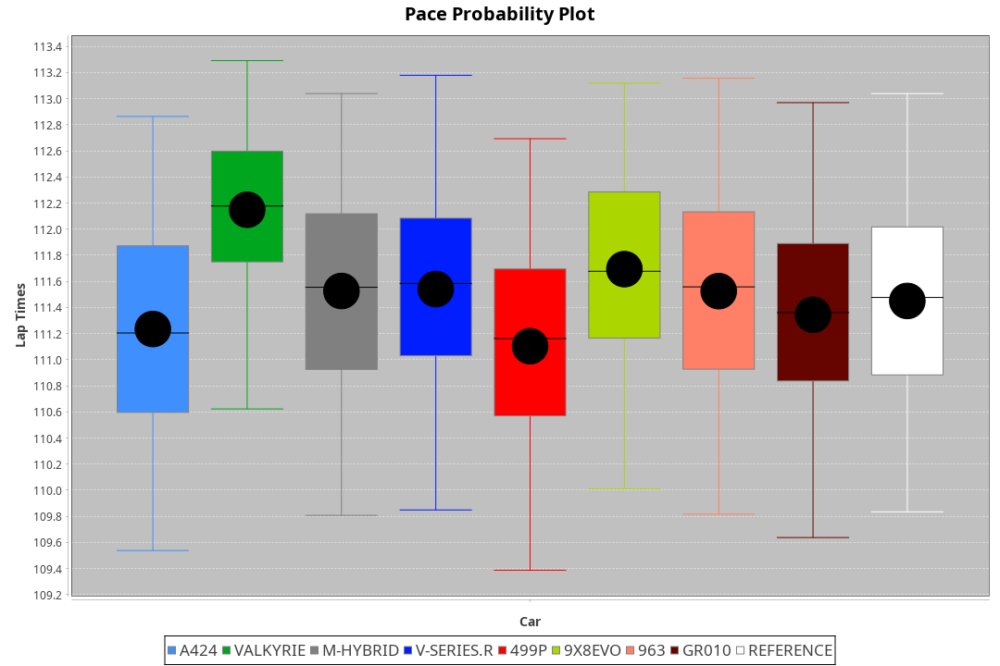
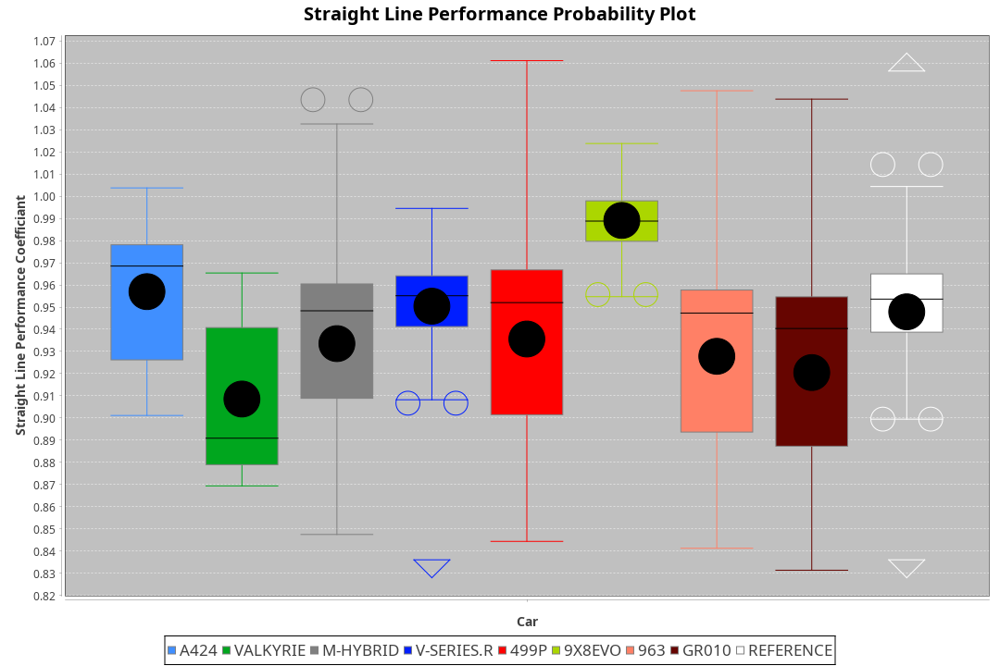
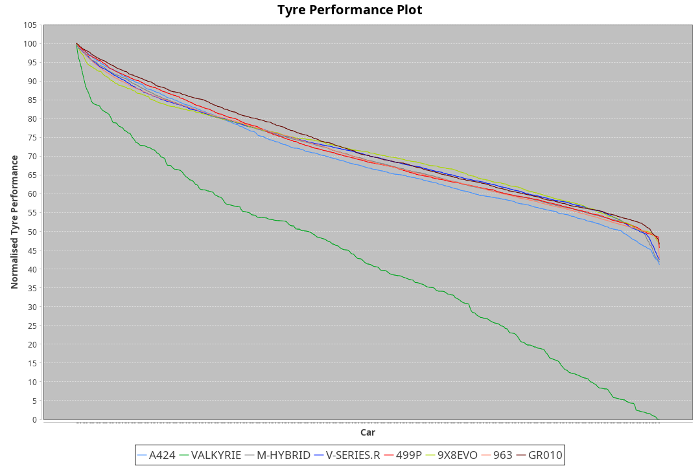

| Manufacturer | Car        | Weight | Power   | PINC    | E/Stint | FDS     |
|:-|:-|:-|:-|:-|:-|:-|
| Alpine       | A424       | 1059kg | 495.0kw | 5.00%   | 911MJ   |    -    |
| Aston Martin | Valkyrie   | 1035kg | 520.0kw |    -    | 911MJ   |    -    |
| BMW          | M-Hybrid   | 1055kg | 503.0kw | 3.30%   | 909MJ   |    -    |
| Cadillac     | V-Series.R | 1051kg | 507.0kw | -1.00%  | 898MJ   |    -    |
| Ferrari      | 499P       | 1078kg | 480.0kw | 1.00%   | 885MJ   | 200kph  |
| Peugeot      | 9X8Evo     | 1033kg | 507.0kw | -5.30%  | 894MJ   | 190kph  |
| Porsche      | 963        | 1055kg | 491.0kw | 5.90%   | 903MJ   |    -    |
| Toyota       | GR010      | 1078kg | 481.0kw | 4.90%   | 893MJ   | 200kph  |

### BoP Accuracy: 91.49%; Overall BoP Grade: A2
| Manufacturer | Car        | Type  | RP      | QP      | Weight | Power¹  | Threshhold | PINC    | Power²   | E/Stint | AVG Vmax  | FDS     | RDLC | L/Stint | BOP-Grade | Model Accuracy | Model Points | Match% | SimDiff |
|:-|:-|:-|:-|:-|:-|:-|:-|:-|:-|:-|:-|:-|:-|:-|:-|:-|:-|:-|:-|
| Alpine       | A424       | LMDH  | 1:51.46 | 1:47.00 | 1059kg | 495.0kw | 210.0kph   | 5.00%   | 519.80kw |  911MJ  | 277.81kph |    -    | 1.02 | 34      | ~A1       | 98.45%         | 2220         | 98.74% | -0.04   |
| Aston Martin | Valkyrie   | LMHNH | 1:51.46 | 1:46.43 | 1035kg | 520.0kw | 210.0kph   |    -    | 520.00kw |  911MJ  | 280.92kph |    -    | 1.04 | 34      | +C2       | 100.00%        | 466          | 72.94% | #       |
| BMW          | M-Hybrid   | LMDH  | 1:51.45 | 1:46.65 | 1055kg | 503.0kw | 210.0kph   | 3.30%   | 519.60kw |  909MJ  | 280.31kph |    -    | 1.02 | 34      | ~A1       | 100.00%        | 3339         | 96.50% | +0.01   |
| Cadillac     | V-Series.R | LMDH  | 1:51.75 | 1:46.86 | 1051kg | 507.0kw | 210.0kph   | -1.00%  | 501.90kw |  898MJ  | 279.66kph |    -    | 1.02 | 34      | +B1       | 99.03%         | 6041         | 89.24% | +0.37   |
| Ferrari      | 499P       | LMHHU | 1:51.93 | 1:46.93 | 1078kg | 480.0kw | 210.0kph   | 1.00%   | 484.80kw |  885MJ  | 274.30kph | 200kph  | 1.03 | 34      | +A2       | 99.97%         | 7286         | 92.86% | +0.82   |
| Peugeot      | 9X8Evo     | LMHHU | 1:51.45 | 1:46.80 | 1033kg | 507.0kw | 210.0kph   | -5.30%  | 480.10kw |  894MJ  | 285.41kph | 190kph  | 1.03 | 34      | +B1       | 100.00%        | 1890         | 87.07% | +0.58   |
| Porsche      | 963        | LMDH  | 1:51.45 | 1:46.62 | 1055kg | 491.0kw | 210.0kph   | 5.90%   | 520.00kw |  903MJ  | 279.68kph |    -    | 1.02 | 34      | ~A1       | 99.89%         | 15174        | 96.70% | +0.14   |
| Toyota       | GR010      | LMHHU | 1:51.45 | 1:46.59 | 1078kg | 481.0kw | 210.0kph   | 4.90%   | 504.60kw |  893MJ  | 276.46kph | 200kph  | 1.02 | 34      | ~A1       | 99.82%         | 5457         | 97.86% | +0.76   |

## Power below Threshhold
| N/Nmax    | A424    | VALKYRIE | M-HYBRID | V-SERIES.R | 499P    | 9X8EVO  | 963     | GR010   |
|:-|:-|:-|:-|:-|:-|:-|:-|:-|
|  0.550    |  244    |  256     |  248     |  250       |  236    |  250    |  242    |  237    |
|  0.575    |  266    |  279     |  271     |  273       |  258    |  273    |  264    |  259    |
|  0.600    |  286    |  300     |  291     |  293       |  277    |  293    |  284    |  278    |
|  0.625    |  306    |  322     |  311     |  314       |  297    |  314    |  304    |  298    |
|  0.650    |  327    |  343     |  332     |  335       |  317    |  335    |  324    |  318    |
|  0.675    |  348    |  365     |  353     |  356       |  337    |  356    |  345    |  338    |
|  0.700    |  369    |  387     |  374     |  377       |  358    |  377    |  366    |  359    |
|  0.725    |  389    |  409     |  395     |  399       |  378    |  399    |  386    |  379    |
|  0.750    |  409    |  430     |  416     |  419       |  397    |  419    |  406    |  398    |
|  0.775    |  428    |  449     |  435     |  438       |  415    |  438    |  424    |  416    |
|  0.800    |  445    |  467     |  452     |  455       |  431    |  455    |  441    |  432    |
|  0.825    |  459    |  482     |  467     |  470       |  445    |  470    |  455    |  446    |
|  0.850    |  470    |  494     |  478     |  482       |  456    |  482    |  466    |  457    |
|  0.875    |  480    |  505     |  488     |  492       |  466    |  492    |  476    |  467    |
|  0.900    |  487    |  512     |  495     |  499       |  472    |  499    |  483    |  473    |
|  0.925    |  492    |  517     |  500     |  504       |  477    |  504    |  488    |  478    |
| **0.950** | **495** | **520**  | **503**  | **507**    | **480** | **507** | **491** | **481** |
|  0.975    |  493    |  518     |  501     |  505       |  478    |  505    |  489    |  479    |
|  1.000    |  490    |  514     |  498     |  502       |  475    |  502    |  486    |  476    |
|  1.025    |  423    |  444     |  430     |  433       |  410    |  433    |  419    |  411    |

## Power above Threshhold
| N/Nmax    | A424       | VALKYRIE | M-HYBRID   | V-SERIES.R | 499P       | 9X8EVO     | 963        | GR010      |
|:-|:-|:-|:-|:-|:-|:-|:-|:-|
|  0.550    |  256.37    |  256     |  256.30    |  247.46    |  238.39    |  236.06    |  256.48    |  248.28    |
|  0.575    |  279.40    |  279     |  279.32    |  270.50    |  260.43    |  258.07    |  279.52    |  271.31    |
|  0.600    |  299.43    |  300     |  299.35    |  290.54    |  279.46    |  277.07    |  299.56    |  291.33    |
|  0.625    |  321.46    |  322     |  321.37    |  310.58    |  299.49    |  297.08    |  321.60    |  312.35    |
|  0.650    |  342.49    |  343     |  342.39    |  331.61    |  320.53    |  317.09    |  342.64    |  333.38    |
|  0.675    |  364.53    |  365     |  364.42    |  352.65    |  340.56    |  337.09    |  364.68    |  354.40    |
|  0.700    |  386.56    |  387     |  386.45    |  373.69    |  361.60    |  358.10    |  386.72    |  375.42    |
|  0.725    |  408.59    |  409     |  408.47    |  394.73    |  381.63    |  378.10    |  408.76    |  396.45    |
|  0.750    |  429.62    |  430     |  429.50    |  414.77    |  400.66    |  397.11    |  429.80    |  416.47    |
|  0.775    |  448.65    |  449     |  448.52    |  433.80    |  418.69    |  415.11    |  448.84    |  435.49    |
|  0.800    |  466.67    |  467     |  466.54    |  450.84    |  435.72    |  431.12    |  466.87    |  453.51    |
|  0.825    |  481.70    |  482     |  481.56    |  465.86    |  449.74    |  445.12    |  481.90    |  468.53    |
|  0.850    |  493.71    |  494     |  493.57    |  476.88    |  460.76    |  456.12    |  493.92    |  479.54    |
|  0.875    |  504.73    |  505     |  504.58    |  486.90    |  470.78    |  466.13    |  504.94    |  489.55    |
|  0.900    |  511.74    |  512     |  511.59    |  493.92    |  476.79    |  472.13    |  511.95    |  496.56    |
|  0.925    |  516.75    |  517     |  516.60    |  498.92    |  481.80    |  477.13    |  516.96    |  501.57    |
| **0.950** | **519.75** | **520**  | **519.60** | **501.93** | **484.80** | **480.13** | **519.97** | **504.57** |
|  0.975    |  517.75    |  518     |  517.60    |  499.93    |  482.80    |  478.13    |  517.97    |  502.57    |
|  1.000    |  513.74    |  514     |  513.59    |  496.92    |  479.79    |  475.13    |  513.96    |  499.56    |
|  1.025    |  443.64    |  444     |  443.51    |  428.79    |  413.68    |  410.11    |  443.83    |  430.49    |
