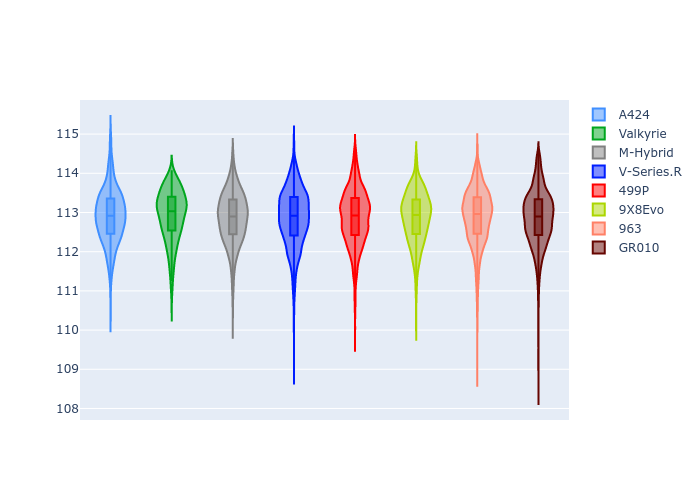
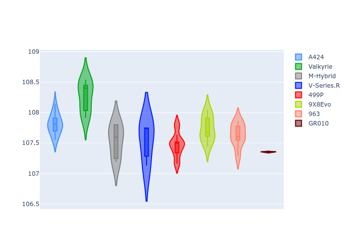
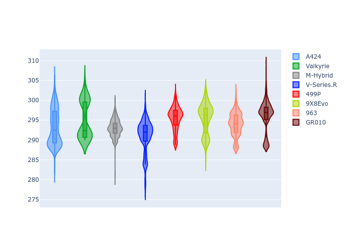
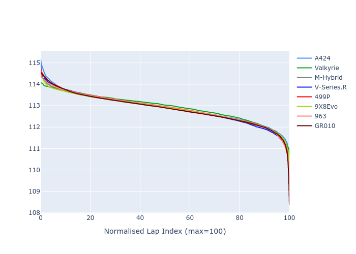

# Combined Plots

## Metadata

- BoP Accuracy: 99.78%
- Overall BoP Grade: A1
- Track: BAHRAIN
- Threshhold: 250.0kph
- Average Laptime: 1:52.88
- Average Quali Laptime: 1:47.47
- Average Topspeed: 294.14kph

## BoP Table
| Manufacturer   | Car        | Weight   | Power   | PINC   | E/Stint   | FDS    | RDP    | QDP    | TDP    |
|:---------------|:-----------|:---------|:--------|:-------|:----------|:-------|:-------|:-------|:-------|
| Alpine         | A424       | 1042kg   | 495.0kw | +5.00% | 912MJ     | -      | 51.64% | 59.31% | 26.80% |
| Aston Martin   | Valkyrie   | 1030kg   | 520.0kw | -      | 911MJ     | -      | 53.50% | 53.33% | 21.51% |
| BMW            | M-Hybrid   | 1042kg   | 503.0kw | +3.30% | 910MJ     | -      | 52.89% | 56.22% | 33.41% |
| Cadillac       | V-Series.R | 1045kg   | 520.0kw | -      | 911MJ     | -      | 48.63% | 60.80% | 19.01% |
| Ferrari        | 499P       | 1060kg   | 520.0kw | -2.10% | 911MJ     | 190kph | 51.38% | 44.98% | 9.83%  |
| Peugeot        | 9X8Evo     | 1030kg   | 520.0kw | -2.10% | 912MJ     | 190kph | 48.87% | 52.78% | 15.41% |
| Porsche        | 963        | 1037kg   | 512.0kw | -1.40% | 903MJ     | -      | 50.70% | 44.30% | 29.51% |
| Toyota         | GR010      | 1059kg   | 520.0kw | -2.30% | 908MJ     | 190kph | 51.09% | 52.71% | 11.46% |

## Performance Table
| Manufacturer   | Car        | RP      | QP      | Vavg      |   RDLC | BOP-Grade   | Match   |
|:---------------|:-----------|:--------|:--------|:----------|-------:|:------------|:--------|
| Alpine         | A424       | 1:52.89 | 1:47.82 | 293.25kph |   1.05 | ~A1         | 98.93%  |
| Aston Martin   | Valkyrie   | 1:52.93 | 1:47.35 | 295.01kph |   1.05 | ~A1         | 100.00% |
| BMW            | M-Hybrid   | 1:52.86 | 1:47.41 | 292.98kph |   1.05 | ~A1         | 100.00% |
| Cadillac       | V-Series.R | 1:52.86 | 1:47.44 | 291.01kph |   1.05 | ~A1         | 99.68%  |
| Ferrari        | 499P       | 1:52.88 | 1:47.20 | 295.45kph |   1.05 | ~A1         | 99.94%  |
| Peugeot        | 9X8Evo     | 1:52.87 | 1:47.69 | 295.39kph |   1.05 | ~A1         | 100.00% |
| Porsche        | 963        | 1:52.89 | 1:47.64 | 293.96kph |   1.05 | ~A1         | 99.91%  |
| Toyota         | GR010      | 1:52.87 | 1:47.18 | 296.09kph |   1.05 | ~A1         | 99.75%  |

## Race Laptimes

## Quali Laptimes

## Topspeeds

## Laptimes Lineplot

