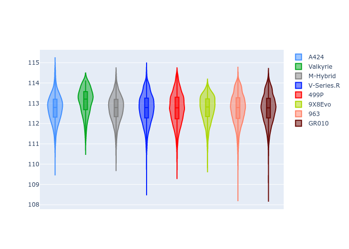

# Combined Plots

## Metadata

- BoP Accuracy: 99.91%
- Overall BoP Grade: A1
- Track: BAHRAIN
- Threshhold: 250.0kph

## BoP Table
| Manufacturer   | Car        | Weight   | Power   | PINC   | E/Stint   | FDS    | RDP    | QDP    | TDP    |
|:---------------|:-----------|:---------|:--------|:-------|:----------|:-------|:-------|:-------|:-------|
| Alpine         | A424       | 1042kg   | 503.0kw | +2.40% | 912MJ     | -      | 52.35% | 61.85% | 27.84% |
| Aston Martin   | Valkyrie   | 1030kg   | 520.0kw | -1.10% | 908MJ     | -      | 53.59% | 53.33% | 21.51% |
| BMW            | M-Hybrid   | 1045kg   | 503.0kw | +3.30% | 910MJ     | -      | 53.26% | 57.23% | 34.54% |
| Cadillac       | V-Series.R | 1050kg   | 520.0kw | -      | 912MJ     | -      | 47.80% | 56.73% | 19.63% |
| Ferrari        | 499P       | 1069kg   | 518.0kw | -1.50% | 912MJ     | 190kph | 53.02% | 42.32% | 9.88%  |
| Peugeot        | 9X8Evo     | 1030kg   | 520.0kw | -2.50% | 910MJ     | 190kph | 48.47% | 51.26% | 16.02% |
| Porsche        | 963        | 1043kg   | 503.0kw | +2.80% | 907MJ     | -      | 50.87% | 45.25% | 30.77% |
| Toyota         | GR010      | 1065kg   | 520.0kw | -3.40% | 907MJ     | 190kph | 52.43% | 57.12% | 12.82% |

## Performance Table
| Manufacturer   | Car        | RP      | QP      | Vavg      |   RDLC | BOP-Grade   | Match   |
|:---------------|:-----------|:--------|:--------|:----------|-------:|:------------|:--------|
| Alpine         | A424       | 1:51.55 | 1:47.15 | 290.95kph |   1.04 | ~A1         | 99.79%  |
| Aston Martin   | Valkyrie   | 1:51.55 | 1:46.53 | 292.00kph |   1.05 | ~A1         | 100.00% |
| BMW            | M-Hybrid   | 1:51.58 | 1:46.80 | 290.49kph |   1.04 | ~A1         | 100.00% |
| Cadillac       | V-Series.R | 1:51.56 | 1:46.81 | 287.36kph |   1.04 | ~A1         | 100.00% |
| Ferrari        | 499P       | 1:51.58 | 1:46.30 | 290.75kph |   1.05 | ~A1         | 99.83%  |
| Peugeot        | 9X8Evo     | 1:51.56 | 1:46.95 | 293.62kph |   1.04 | ~A1         | 100.00% |
| Porsche        | 963        | 1:51.55 | 1:46.84 | 290.85kph |   1.04 | ~A1         | 99.87%  |
| Toyota         | GR010      | 1:51.56 | 1:46.17 | 290.93kph |   1.05 | ~A1         | 99.76%  |

## Race Laptimes

## Quali Laptimes

## Topspeeds

## Laptimes Lineplot

