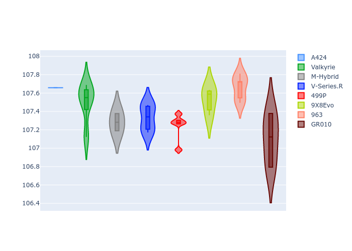
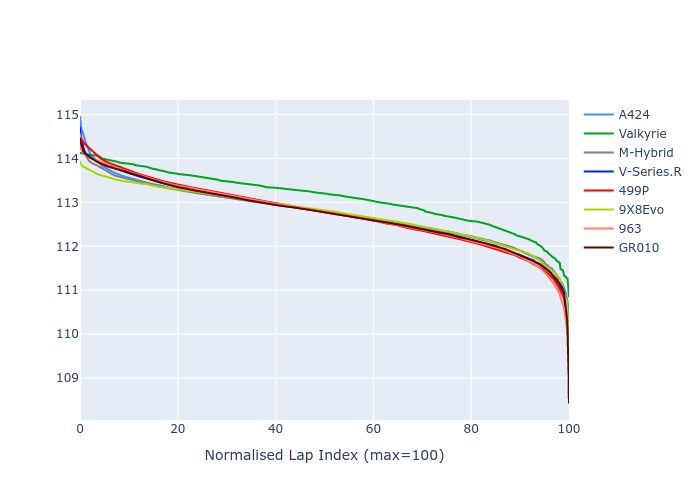

# Combined Plots

## Metadata

- BoP Accuracy: 99.77%
- Overall BoP Grade: A1
- Track: BAHRAIN
- Threshhold: 250.0kph
- Average Laptime: 1:52.78
- Average Quali Laptime: 1:47.41
- Average Topspeed: 293.37kph

## BoP Table
| Manufacturer   | Car        | Weight   | Power   | PINC   | E/Stint   | FDS    | RDP    | QDP    | TDP    |
|:---------------|:-----------|:---------|:--------|:-------|:----------|:-------|:-------|:-------|:-------|
| Alpine         | A424       | 1041kg   | 480.0kw | +7.80% | 906MJ     | -      | 51.64% | 59.31% | 26.80% |
| Aston Martin   | Valkyrie   | 1030kg   | 520.0kw | -      | 911MJ     | -      | 53.50% | 53.33% | 21.51% |
| BMW            | M-Hybrid   | 1042kg   | 487.0kw | +6.70% | 904MJ     | -      | 52.89% | 56.22% | 33.41% |
| Cadillac       | V-Series.R | 1046kg   | 519.0kw | +0.10% | 911MJ     | -      | 48.63% | 60.80% | 19.01% |
| Ferrari        | 499P       | 1060kg   | 520.0kw | -4.80% | 904MJ     | 190kph | 51.38% | 44.98% | 9.83%  |
| Peugeot        | 9X8Evo     | 1030kg   | 520.0kw | -0.10% | 917MJ     | 190kph | 48.87% | 52.78% | 15.41% |
| Porsche        | 963        | 1035kg   | 496.0kw | +1.30% | 896MJ     | -      | 50.70% | 44.30% | 29.51% |
| Toyota         | GR010      | 1059kg   | 520.0kw | -5.60% | 899MJ     | 190kph | 51.09% | 52.71% | 11.46% |

## Performance Table
| Manufacturer   | Car        | RP      | QP      | Vavg      |   RDLC | BOP-Grade   | Match   |
|:---------------|:-----------|:--------|:--------|:----------|-------:|:------------|:--------|
| Alpine         | A424       | 1:52.74 | 1:47.66 | 292.36kph |   1.05 | ~A1         | 99.08%  |
| Aston Martin   | Valkyrie   | 1:53.10 | 1:47.50 | 295.01kph |   1.05 | ~A1         | 100.00% |
| BMW            | M-Hybrid   | 1:52.74 | 1:47.28 | 292.34kph |   1.05 | ~A1         | 99.94%  |
| Cadillac       | V-Series.R | 1:52.74 | 1:47.33 | 290.80kph |   1.05 | ~A1         | 99.65%  |
| Ferrari        | 499P       | 1:52.74 | 1:47.24 | 293.07kph |   1.05 | ~A1         | 99.88%  |
| Peugeot        | 9X8Evo     | 1:52.73 | 1:47.53 | 297.13kph |   1.05 | ~A1         | 100.00% |
| Porsche        | 963        | 1:52.73 | 1:47.66 | 293.10kph |   1.05 | ~A1         | 99.86%  |
| Toyota         | GR010      | 1:52.74 | 1:47.10 | 293.17kph |   1.05 | ~A1         | 99.79%  |

## Race Laptimes

## Quali Laptimes

## Topspeeds

## Laptimes Lineplot

