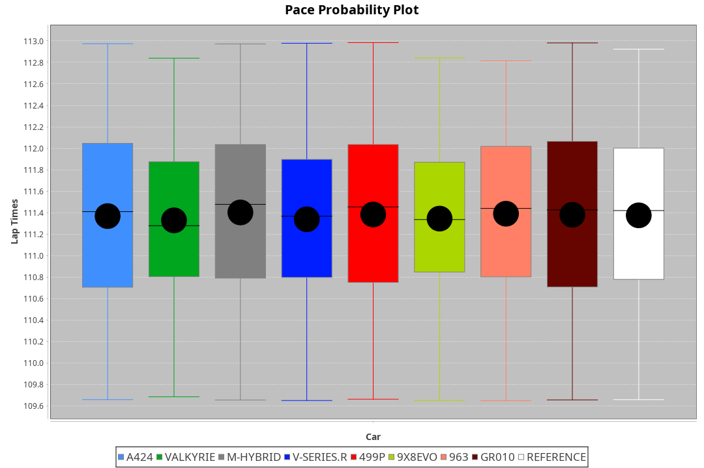
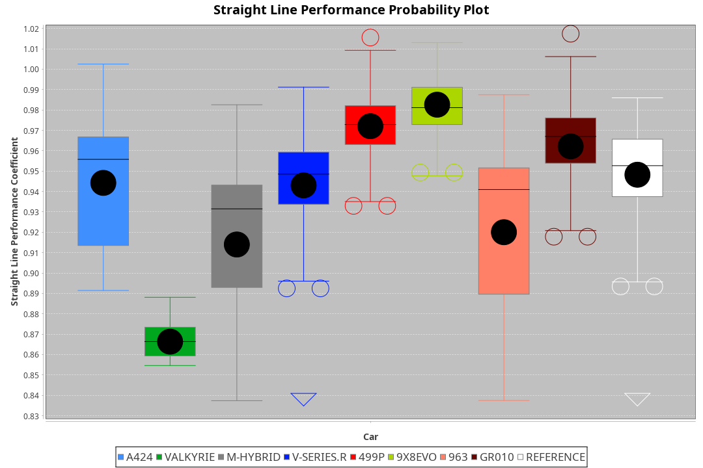
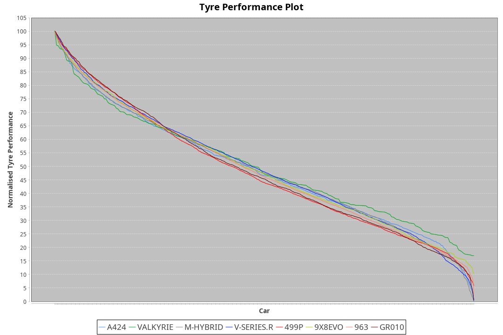

| Manufacturer | Car        | Weight | Power   | PINC    | E/Stint | FDS     |
|:-|:-|:-|:-|:-|:-|:-|
| Alpine       | A424       | 1063kg | 520.0kw |    -    | 923MJ   |    -    |
| Aston Martin | Valkyrie   | 1032kg | 513.0kw | 1.30%   | 908MJ   |    -    |
| BMW          | M-Hybrid   | 1058kg | 520.0kw |    -    | 917MJ   |    -    |
| Cadillac     | V-Series.R | 1056kg | 516.0kw | 0.70%   | 910MJ   |    -    |
| Ferrari      | 499P       | 1085kg | 494.0kw | 5.20%   | 910MJ   | 190kph  |
| Peugeot      | 9X8Evo     | 1030kg | 502.0kw |    -    | 901MJ   | 190kph  |
| Porsche      | 963        | 1060kg | 510.0kw | 1.90%   | 912MJ   |    -    |
| Toyota       | GR010      | 1090kg | 496.0kw | 4.80%   | 909MJ   | 190kph  |

### BoP Accuracy: 94.35%; Overall BoP Grade: A2
| Manufacturer | Car        | Type  | RP      | QP      | Weight | Power¹  | Threshhold | PINC    | Power²   | E/Stint | AVG Vmax  | FDS     | RDLC | L/Stint | BOP-Grade | Model Accuracy | Model Points | Match%  | SimDiff |
|:-|:-|:-|:-|:-|:-|:-|:-|:-|:-|:-|:-|:-|:-|:-|:-|:-|:-|:-|:-|
| Alpine       | A424       | LMDH  | 1:51.48 | 1:46.95 | 1063kg | 520.0kw | 250.0kph   |    -    | 520.00kw |  923MJ  | 278.75kph |    -    | 1.01 | 34      | ~A1       | 99.37%         | 2056         | 96.35%  | -0.36   |
| Aston Martin | Valkyrie   | LMHNH | 1:51.49 | 1:46.68 | 1032kg | 513.0kw | 250.0kph   | 1.30%   | 519.70kw |  908MJ  | 272.45kph |    -    | 1.06 | 34      | +D1       | 100.00%        | 247          | 69.78%  | #       |
| BMW          | M-Hybrid   | LMDH  | 1:51.48 | 1:46.52 | 1058kg | 520.0kw | 250.0kph   |    -    | 520.00kw |  917MJ  | 281.64kph |    -    | 1.01 | 34      | ~A1       | 99.20%         | 3081         | 100.00% | -0.05   |
| Cadillac     | V-Series.R | LMDH  | 1:51.48 | 1:46.67 | 1056kg | 516.0kw | 250.0kph   | 0.70%   | 519.60kw |  910MJ  | 283.13kph |    -    | 1.01 | 34      | +A2       | 99.22%         | 5358         | 93.16%  | +0.61   |
| Ferrari      | 499P       | LMHHU | 1:51.47 | 1:46.42 | 1085kg | 494.0kw | 250.0kph   | 5.20%   | 519.70kw |  910MJ  | 280.21kph | 190kph  | 1.02 | 34      | ~A1       | 99.93%         | 6954         | 100.00% | +0.72   |
| Peugeot      | 9X8Evo     | LMHHU | 1:51.48 | 1:46.90 | 1030kg | 502.0kw | 250.0kph   |    -    | 502.00kw |  901MJ  | 292.05kph | 190kph  | 1.02 | 34      | ~A1       | 100.00%        | 1458         | 95.49%  | +0.56   |
| Porsche      | 963        | LMDH  | 1:51.48 | 1:46.60 | 1060kg | 510.0kw | 250.0kph   | 1.90%   | 519.70kw |  912MJ  | 280.52kph |    -    | 1.01 | 34      | ~A1       | 99.87%         | 14199        | 100.00% | +0.15   |
| Toyota       | GR010      | LMHHU | 1:51.48 | 1:46.21 | 1090kg | 496.0kw | 250.0kph   | 4.80%   | 519.80kw |  909MJ  | 277.10kph | 190kph  | 1.01 | 34      | ~A1       | 99.92%         | 5012         | 100.00% | +0.65   |

## Power below Threshhold
| N/Nmax    | A424    | VALKYRIE | M-HYBRID | V-SERIES.R | 499P    | 9X8EVO  | 963     | GR010   |
|:-|:-|:-|:-|:-|:-|:-|:-|:-|
|  0.550    |  256    |  253     |  256     |  254       |  243    |  247    |  251    |  244    |
|  0.575    |  279    |  276     |  279     |  277       |  266    |  270    |  274    |  267    |
|  0.600    |  300    |  296     |  300     |  298       |  285    |  290    |  295    |  287    |
|  0.625    |  322    |  317     |  322     |  319       |  305    |  310    |  316    |  307    |
|  0.650    |  343    |  338     |  343     |  340       |  326    |  331    |  337    |  327    |
|  0.675    |  365    |  360     |  365     |  362       |  347    |  352    |  358    |  348    |
|  0.700    |  387    |  382     |  387     |  384       |  368    |  374    |  380    |  369    |
|  0.725    |  409    |  403     |  409     |  406       |  389    |  395    |  401    |  390    |
|  0.750    |  430    |  424     |  430     |  427       |  408    |  415    |  422    |  410    |
|  0.775    |  449    |  443     |  449     |  446       |  427    |  434    |  441    |  429    |
|  0.800    |  467    |  461     |  467     |  463       |  444    |  451    |  458    |  445    |
|  0.825    |  482    |  476     |  482     |  478       |  458    |  466    |  473    |  460    |
|  0.850    |  494    |  487     |  494     |  490       |  469    |  477    |  485    |  471    |
|  0.875    |  505    |  498     |  505     |  501       |  479    |  487    |  495    |  481    |
|  0.900    |  512    |  505     |  512     |  508       |  486    |  494    |  502    |  488    |
|  0.925    |  517    |  510     |  517     |  513       |  491    |  499    |  507    |  493    |
| **0.950** | **520** | **513**  | **520**  | **516**    | **494** | **502** | **510** | **496** |
|  0.975    |  518    |  511     |  518     |  514       |  492    |  500    |  508    |  494    |
|  1.000    |  514    |  507     |  514     |  510       |  489    |  497    |  505    |  491    |
|  1.025    |  444    |  438     |  444     |  441       |  422    |  429    |  436    |  424    |

## Power above Threshhold
| N/Nmax    | A424    | VALKYRIE   | M-HYBRID | V-SERIES.R | 499P       | 9X8EVO  | 963        | GR010      |
|:-|:-|:-|:-|:-|:-|:-|:-|:-|
|  0.550    |  256    |  256.33    |  256     |  256.30    |  256.34    |  247    |  256.34    |  256.40    |
|  0.575    |  279    |  279.36    |  279     |  279.33    |  279.37    |  270    |  279.37    |  279.43    |
|  0.600    |  300    |  299.39    |  300     |  299.35    |  299.40    |  290    |  299.40    |  299.47    |
|  0.625    |  322    |  321.41    |  322     |  321.38    |  321.43    |  310    |  321.43    |  321.50    |
|  0.650    |  343    |  342.44    |  343     |  342.40    |  342.45    |  331    |  342.45    |  342.53    |
|  0.675    |  365    |  364.47    |  365     |  364.43    |  364.48    |  352    |  364.48    |  364.57    |
|  0.700    |  387    |  386.50    |  387     |  386.46    |  386.51    |  374    |  386.51    |  386.60    |
|  0.725    |  409    |  408.53    |  409     |  408.48    |  408.54    |  395    |  408.54    |  408.64    |
|  0.750    |  430    |  429.55    |  430     |  429.51    |  429.57    |  415    |  429.57    |  429.67    |
|  0.775    |  449    |  448.58    |  449     |  448.53    |  448.59    |  434    |  448.60    |  448.70    |
|  0.800    |  467    |  466.60    |  467     |  466.55    |  466.62    |  451    |  466.62    |  466.73    |
|  0.825    |  482    |  481.62    |  482     |  481.57    |  481.64    |  466    |  481.64    |  481.75    |
|  0.850    |  494    |  493.64    |  494     |  493.58    |  493.65    |  477    |  493.66    |  493.77    |
|  0.875    |  505    |  504.65    |  505     |  504.59    |  504.67    |  487    |  504.67    |  504.78    |
|  0.900    |  512    |  511.66    |  512     |  511.60    |  511.68    |  494    |  511.68    |  511.80    |
|  0.925    |  517    |  516.67    |  517     |  516.61    |  516.68    |  499    |  516.69    |  516.80    |
| **0.950** | **520** | **519.67** | **520**  | **519.61** | **519.69** | **502** | **519.69** | **519.81** |
|  0.975    |  518    |  517.67    |  518     |  517.61    |  517.69    |  500    |  517.69    |  517.80    |
|  1.000    |  514    |  513.66    |  514     |  513.60    |  513.68    |  497    |  513.68    |  513.80    |
|  1.025    |  444    |  443.57    |  444     |  443.52    |  443.59    |  429    |  443.59    |  443.69    |
