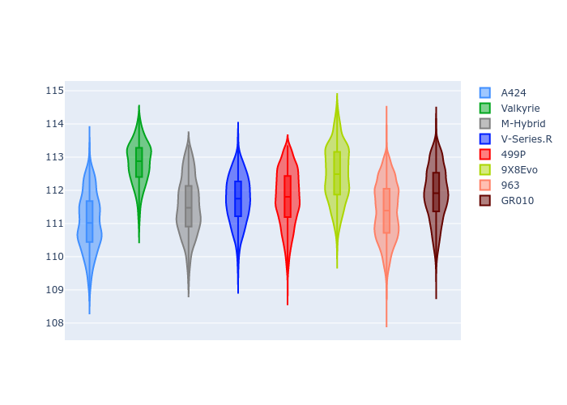
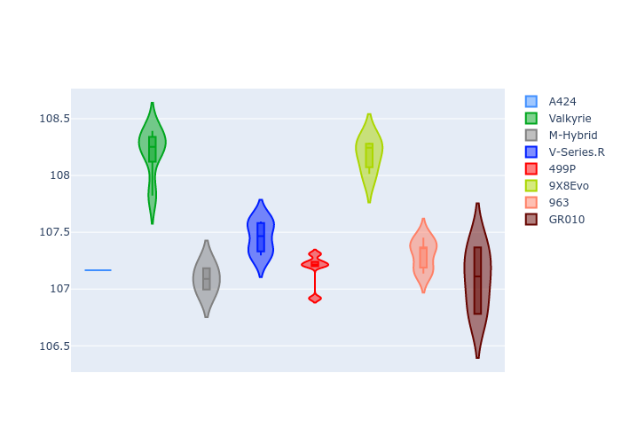
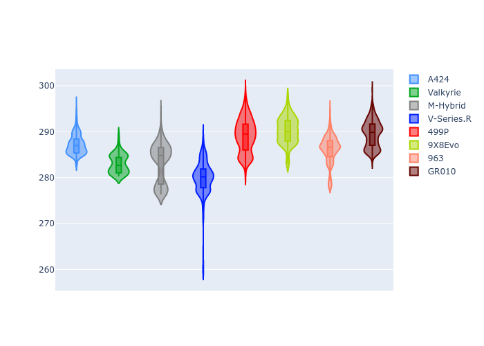
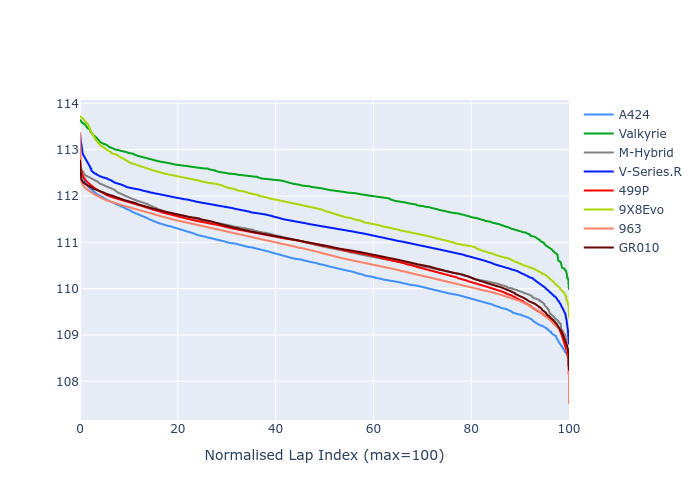

# Combined Plots

## Metadata

- BoP Accuracy: 98.78%
- Overall BoP Grade: A1
- Track: BAHRAIN
- Threshhold: 210.0kph

## BoP Table
| Manufacturer   | Car        | Weight   | Power   | PINC   | E/Stint   | FDS    | RDP    | QDP    | TDP    |
|:---------------|:-----------|:---------|:--------|:-------|:----------|:-------|:-------|:-------|:-------|
| Alpine         | A424       | 1047kg   | 520.0kw | -      | 921MJ     | -      | 52.35% | 61.85% | 27.84% |
| Aston Martin   | Valkyrie   | 1042kg   | 504.0kw | +0.40% | 899MJ     | -      | 53.59% | 53.33% | 21.51% |
| BMW            | M-Hybrid   | 1041kg   | 512.0kw | -      | 909MJ     | -      | 53.26% | 57.23% | 34.54% |
| Cadillac       | V-Series.R | 1034kg   | 510.0kw | -      | 901MJ     | -      | 47.80% | 56.73% | 19.63% |
| Ferrari        | 499P       | 1063kg   | 508.0kw | -      | 907MJ     | 190kph | 53.02% | 42.32% | 9.88%  |
| Peugeot        | 9X8Evo     | 1050kg   | 510.0kw | -      | 910MJ     | 190kph | 48.47% | 51.26% | 16.02% |
| Porsche        | 963        | 1047kg   | 516.0kw | -      | 911MJ     | -      | 50.87% | 45.25% | 30.77% |
| Toyota         | GR010      | 1080kg   | 512.0kw | -      | 910MJ     | 190kph | 52.43% | 57.12% | 12.82% |

## Performance Table
| Manufacturer   | Car        | RP      | QP      | Vavg      |   RDLC | BOP-Grade   | Match   |
|:---------------|:-----------|:--------|:--------|:----------|-------:|:------------|:--------|
| Alpine         | A424       | 1:51.03 | 1:46.66 | 291.97kph |   1.04 | ~A1         | 98.63%  |
| Aston Martin   | Valkyrie   | 1:52.83 | 1:47.70 | 288.74kph |   1.05 | ~A1         | 97.49%  |
| BMW            | M-Hybrid   | 1:51.49 | 1:46.71 | 290.05kph |   1.04 | ~A1         | 99.60%  |
| Cadillac       | V-Series.R | 1:51.71 | 1:46.95 | 286.94kph |   1.04 | ~A1         | 99.96%  |
| Ferrari        | 499P       | 1:51.77 | 1:46.47 | 290.55kph |   1.05 | ~A1         | 99.81%  |
| Peugeot        | 9X8Evo     | 1:52.46 | 1:47.79 | 291.64kph |   1.04 | ~A1         | 95.31%  |
| Porsche        | 963        | 1:51.36 | 1:46.66 | 290.83kph |   1.04 | ~A1         | 99.71%  |
| Toyota         | GR010      | 1:51.90 | 1:46.48 | 290.69kph |   1.05 | ~A1         | 99.76%  |

## Race Laptimes

## Quali Laptimes

## Topspeeds

## Laptimes Lineplot

