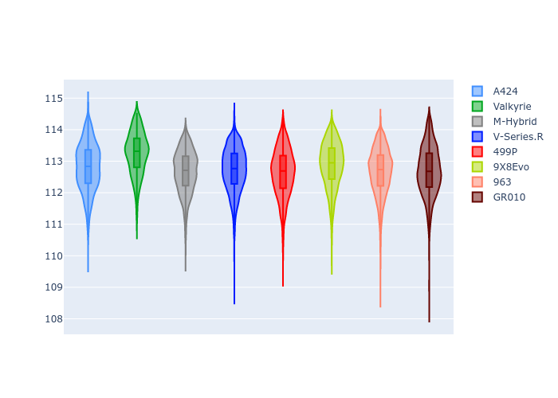
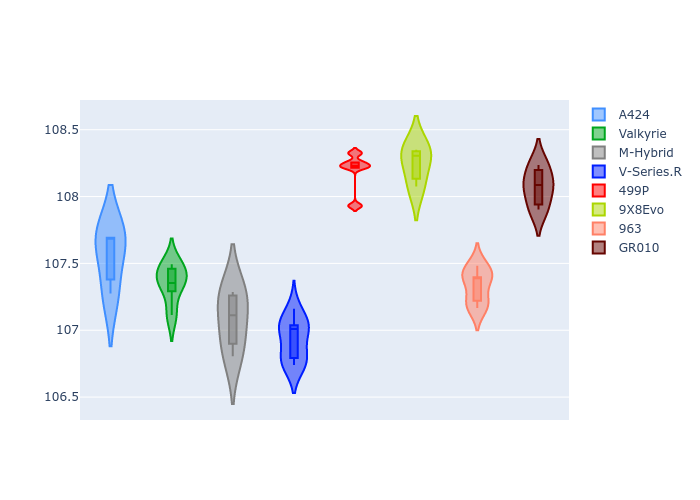
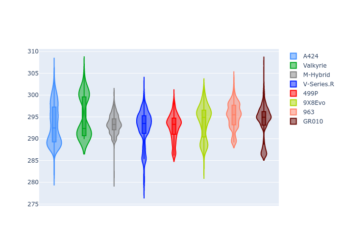
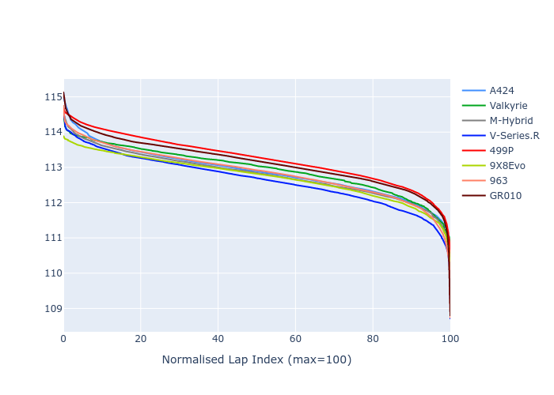

# Combined Plots

## Metadata

- BoP Accuracy: 99.78%
- Overall BoP Grade: A1
- Track: BAHRAIN
- Threshhold: 250.0kph
- Average Laptime: 1:52.79
- Average Quali Laptime: 1:47.58
- Laptime Std Dev: 0.19 seconds
- Filtered Average Topspeed: 293.85kph

## BoP Table
| Manufacturer   | Car        | Weight   | Power   | PINC   | E/Stint   | FDS    | RDP    | QDP    | TDP    |
|:---------------|:-----------|:---------|:--------|:-------|:----------|:-------|:-------|:-------|:-------|
| Alpine         | A424       | 1046kg   | 511.0kw | +0.50% | 915MJ     | -      | 51.45% | 55.09% | 24.89% |
| Aston Martin   | Valkyrie   | 1030kg   | 520.0kw | -      | 911MJ     | -      | 53.07% | 48.70% | 24.00% |
| BMW            | M-Hybrid   | 1040kg   | 513.0kw | -      | 910MJ     | -      | 52.63% | 52.34% | 34.06% |
| Cadillac       | V-Series.R | 1037kg   | 519.0kw | -      | 909MJ     | -      | 48.80% | 57.26% | 18.10% |
| Ferrari        | 499P       | 1052kg   | 503.0kw | -0.60% | 899MJ     | 190kph | 51.39% | 44.34% | 9.89%  |
| Peugeot        | 9X8Evo     | 1042kg   | 518.0kw | -      | 917MJ     | 190kph | 49.16% | 50.25% | 18.00% |
| Porsche        | 963        | 1046kg   | 511.0kw | +0.60% | 908MJ     | -      | 50.61% | 41.90% | 27.68% |
| Toyota         | GR010      | 1061kg   | 502.0kw | +1.50% | 903MJ     | 190kph | 51.33% | 51.71% | 14.89% |

## Performance Table
| Manufacturer   | Car        | RP      | QP      | Vavg      |   RDLC | BOP-Grade   | Match   |
|:---------------|:-----------|:--------|:--------|:----------|-------:|:------------|:--------|
| Alpine         | A424       | 1:52.81 | 1:47.78 | 292.57kph |   1.05 | ~A1         | 99.88%  |
| Aston Martin   | Valkyrie   | 1:53.25 | 1:48.37 | 294.21kph |   1.05 | ~A1         | 98.64%  |
| BMW            | M-Hybrid   | 1:52.67 | 1:47.38 | 292.64kph |   1.05 | ~A1         | 100.00% |
| Cadillac       | V-Series.R | 1:52.72 | 1:47.40 | 292.12kph |   1.05 | ~A1         | 99.95%  |
| Ferrari        | 499P       | 1:52.63 | 1:47.21 | 294.06kph |   1.05 | ~A1         | 99.98%  |
| Peugeot        | 9X8Evo     | 1:52.87 | 1:47.82 | 295.73kph |   1.05 | ~A1         | 100.00% |
| Porsche        | 963        | 1:52.67 | 1:47.65 | 294.55kph |   1.05 | ~A1         | 99.94%  |
| Toyota         | GR010      | 1:52.69 | 1:47.05 | 294.93kph |   1.05 | ~A1         | 99.82%  |

## Race Laptimes

## Quali Laptimes

## Topspeeds

## Laptimes Lineplot

