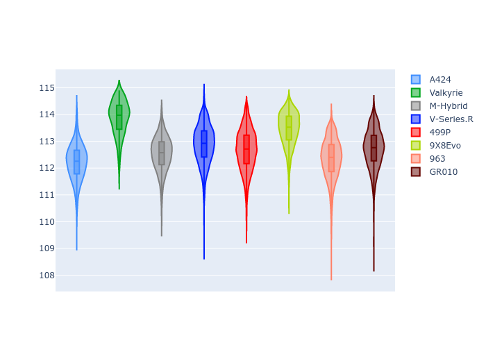
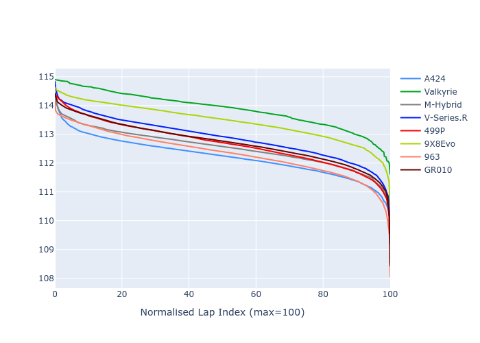

# Combined Plots

## Metadata

- BoP Accuracy: 97.77%
- Overall BoP Grade: A1
- Track: BAHRAIN
- Threshhold: 210.0kph
- Average Laptime: 1:52.84
- Average Quali Laptime: 1:47.46
- Average Topspeed: 292.96kph

## BoP Table
| Manufacturer   | Car        | Weight   | Power   | PINC   | E/Stint   | FDS    | RDP    | QDP    | TDP    |
|:---------------|:-----------|:---------|:--------|:-------|:----------|:-------|:-------|:-------|:-------|
| Alpine         | A424       | 1047kg   | 520.0kw | -      | 922MJ     | -      | 51.64% | 59.31% | 26.80% |
| Aston Martin   | Valkyrie   | 1042kg   | 504.0kw | +0.40% | 899MJ     | -      | 53.50% | 53.33% | 21.51% |
| BMW            | M-Hybrid   | 1041kg   | 512.0kw | -      | 909MJ     | -      | 52.89% | 56.22% | 33.41% |
| Cadillac       | V-Series.R | 1034kg   | 510.0kw | -      | 901MJ     | -      | 48.63% | 60.80% | 19.01% |
| Ferrari        | 499P       | 1063kg   | 508.0kw | -      | 907MJ     | 190kph | 51.38% | 44.98% | 9.83%  |
| Peugeot        | 9X8Evo     | 1050kg   | 510.0kw | -      | 911MJ     | 190kph | 48.87% | 52.78% | 15.41% |
| Porsche        | 963        | 1047kg   | 516.0kw | -      | 911MJ     | -      | 50.70% | 44.30% | 29.51% |
| Toyota         | GR010      | 1080kg   | 512.0kw | -      | 910MJ     | 190kph | 51.09% | 52.71% | 11.46% |

## Performance Table
| Manufacturer   | Car        | RP      | QP      | Vavg      |   RDLC | BOP-Grade   | Match   |
|:---------------|:-----------|:--------|:--------|:----------|-------:|:------------|:--------|
| Alpine         | A424       | 1:52.21 | 1:47.17 | 293.79kph |   1.05 | ~A1         | 99.97%  |
| Aston Martin   | Valkyrie   | 1:53.87 | 1:48.20 | 290.81kph |   1.05 | +B2         | 84.14%  |
| BMW            | M-Hybrid   | 1:52.53 | 1:47.09 | 292.19kph |   1.05 | ~A1         | 100.00% |
| Cadillac       | V-Series.R | 1:52.88 | 1:47.46 | 290.08kph |   1.05 | ~A1         | 99.56%  |
| Ferrari        | 499P       | 1:52.67 | 1:47.18 | 294.47kph |   1.05 | ~A1         | 99.98%  |
| Peugeot        | 9X8Evo     | 1:53.45 | 1:48.18 | 293.08kph |   1.05 | ~A1         | 98.94%  |
| Porsche        | 963        | 1:52.34 | 1:47.30 | 294.97kph |   1.05 | ~A1         | 99.79%  |
| Toyota         | GR010      | 1:52.73 | 1:47.09 | 294.33kph |   1.05 | ~A1         | 99.79%  |

## Race Laptimes

## Quali Laptimes

## Topspeeds

## Laptimes Lineplot

