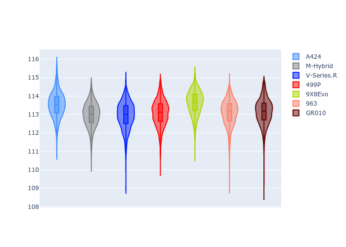
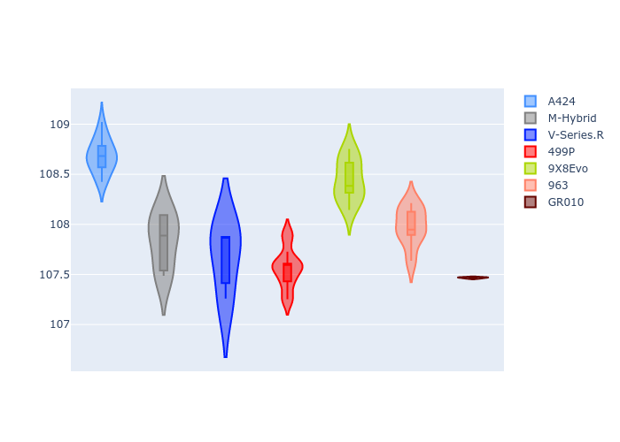
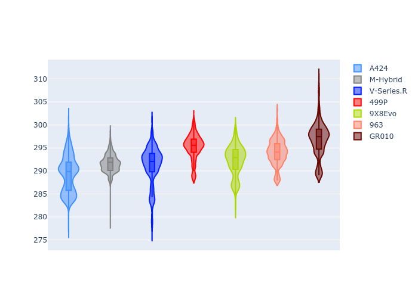
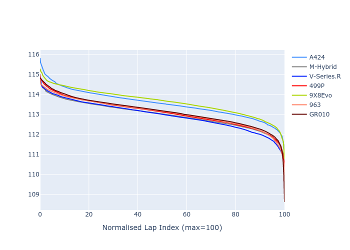

# Combined Plots

## Metadata

- BoP Accuracy: 99.50%
- Overall BoP Grade: A1
- Track: BAHRAIN
- Threshhold: 250.0kph
- Average Laptime: 1:53.10
- Average Quali Laptime: 1:47.81
- Laptime Std Dev: 0.24 seconds
- Filtered Average Topspeed: 292.90kph

## BoP Table
| Manufacturer   | Car        | Weight   | Power   | PINC   | E/Stint   | FDS    | RDP    | QDP    | TDP    |
|:---------------|:-----------|:---------|:--------|:-------|:----------|:-------|:-------|:-------|:-------|
| Alpine         | A424       | 1046kg   | 517.0kw | -4.30% | 907MJ     | -      | 51.38% | 57.54% | 26.10% |
| BMW            | M-Hybrid   | 1036kg   | 514.0kw | -1.80% | 905MJ     | -      | 52.62% | 53.36% | 32.99% |
| Cadillac       | V-Series.R | 1038kg   | 517.0kw | -0.60% | 906MJ     | -      | 48.29% | 59.47% | 18.65% |
| Ferrari        | 499P       | 1053kg   | 510.0kw | -0.90% | 905MJ     | 190kph | 51.25% | 43.28% | 10.17% |
| Peugeot        | 9X8Evo     | 1031kg   | 520.0kw | -5.20% | 903MJ     | 190kph | 48.70% | 50.83% | 18.68% |
| Porsche        | 963        | 1056kg   | 514.0kw | +0.20% | 911MJ     | -      | 50.57% | 42.80% | 29.05% |
| Toyota         | GR010      | 1065kg   | 499.0kw | +4.20% | 908MJ     | 190kph | 51.03% | 51.78% | 14.64% |

## Performance Table
| Manufacturer   | Car        | RP      | QP      | Vavg      |   RDLC | BOP-Grade   | Match   |
|:---------------|:-----------|:--------|:--------|:----------|-------:|:------------|:--------|
| Alpine         | A424       | 1:53.52 | 1:48.58 | 289.63kph |   1.05 | ~A1         | 96.89%  |
| BMW            | M-Hybrid   | 1:53.00 | 1:47.74 | 291.71kph |   1.05 | ~A1         | 100.00% |
| Cadillac       | V-Series.R | 1:52.96 | 1:47.66 | 290.94kph |   1.05 | ~A1         | 99.93%  |
| Ferrari        | 499P       | 1:52.82 | 1:47.26 | 295.13kph |   1.05 | ~A1         | 100.00% |
| Peugeot        | 9X8Evo     | 1:53.38 | 1:48.35 | 292.56kph |   1.05 | ~A1         | 100.00% |
| Porsche        | 963        | 1:53.09 | 1:47.78 | 293.88kph |   1.05 | ~A1         | 99.93%  |
| Toyota         | GR010      | 1:52.90 | 1:47.31 | 296.43kph |   1.05 | ~A1         | 99.76%  |

## Race Laptimes

## Quali Laptimes

## Topspeeds

## Laptimes Lineplot

