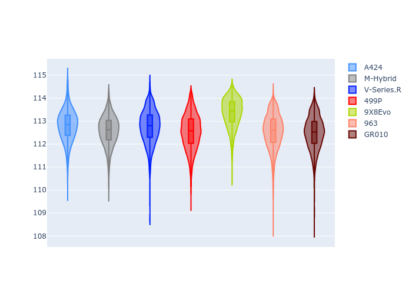

# Combined Plots

## Metadata

- BoP Accuracy: 99.56%
- Overall BoP Grade: A1
- Track: BAHRAIN
- Threshhold: 250.0kph

## BoP Table
| Manufacturer   | Car        | Weight   | Power   | PINC   | E/Stint   | FDS    | RDP    | QDP    | TDP    |
|:---------------|:-----------|:---------|:--------|:-------|:----------|:-------|:-------|:-------|:-------|
| Alpine         | A424       | 1046kg   | 517.0kw | -4.30% | 907MJ     | -      | 52.35% | 61.85% | 27.84% |
| BMW            | M-Hybrid   | 1036kg   | 514.0kw | -1.80% | 905MJ     | -      | 53.26% | 57.23% | 34.54% |
| Cadillac       | V-Series.R | 1038kg   | 517.0kw | -0.60% | 906MJ     | -      | 47.80% | 56.73% | 19.63% |
| Ferrari        | 499P       | 1053kg   | 510.0kw | -0.90% | 905MJ     | 190kph | 53.02% | 42.32% | 9.88%  |
| Peugeot        | 9X8Evo     | 1031kg   | 520.0kw | -5.20% | 903MJ     | 190kph | 48.47% | 51.26% | 16.02% |
| Porsche        | 963        | 1056kg   | 514.0kw | +0.20% | 911MJ     | -      | 50.87% | 45.25% | 30.77% |
| Toyota         | GR010      | 1065kg   | 499.0kw | +4.20% | 908MJ     | 190kph | 52.43% | 57.12% | 12.82% |

## Performance Table
| Manufacturer   | Car        | RP      | QP      | Vavg      |   RDLC | BOP-Grade   | Match   |
|:---------------|:-----------|:--------|:--------|:----------|-------:|:------------|:--------|
| Alpine         | A424       | 1:52.13 | 1:47.69 | 287.82kph |   1.04 | ~A1         | 99.01%  |
| BMW            | M-Hybrid   | 1:51.55 | 1:46.77 | 289.45kph |   1.04 | ~A1         | 100.00% |
| Cadillac       | V-Series.R | 1:51.48 | 1:46.73 | 287.46kph |   1.04 | ~A1         | 99.96%  |
| Ferrari        | 499P       | 1:51.48 | 1:46.21 | 291.21kph |   1.05 | ~A1         | 99.79%  |
| Peugeot        | 9X8Evo     | 1:52.19 | 1:47.54 | 291.18kph |   1.04 | ~A1         | 98.41%  |
| Porsche        | 963        | 1:51.78 | 1:47.04 | 289.68kph |   1.04 | ~A1         | 99.90%  |
| Toyota         | GR010      | 1:51.45 | 1:46.07 | 292.91kph |   1.05 | ~A1         | 99.87%  |

## Race Laptimes

## Quali Laptimes

## Topspeeds

## Laptimes Lineplot

