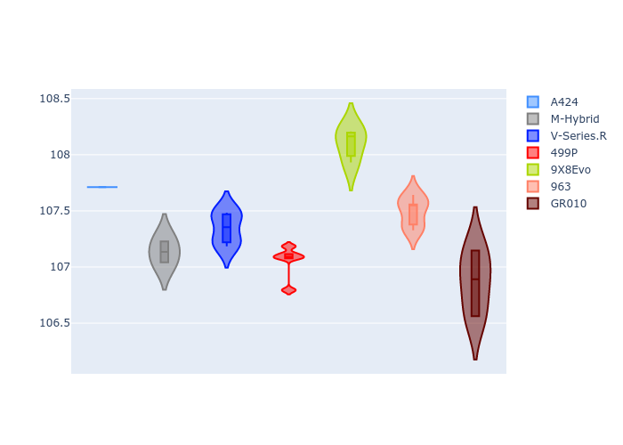

# Combined Plots

## Metadata

- BoP Accuracy: 99.76%
- Overall BoP Grade: A1
- Track: BAHRAIN
- Threshhold: 250.0kph
- Average Laptime: 1:52.72
- Average Quali Laptime: 1:47.38
- Average Topspeed: 292.84kph

## BoP Table
| Manufacturer   | Car        | Weight   | Power   | PINC   | E/Stint   | FDS    | RDP    | QDP    | TDP    |
|:---------------|:-----------|:---------|:--------|:-------|:----------|:-------|:-------|:-------|:-------|
| Alpine         | A424       | 1046kg   | 517.0kw | -4.30% | 907MJ     | -      | 51.64% | 59.31% | 26.80% |
| BMW            | M-Hybrid   | 1036kg   | 514.0kw | -1.80% | 905MJ     | -      | 52.89% | 56.22% | 33.41% |
| Cadillac       | V-Series.R | 1038kg   | 517.0kw | -0.60% | 906MJ     | -      | 48.63% | 60.80% | 19.01% |
| Ferrari        | 499P       | 1053kg   | 510.0kw | -0.90% | 905MJ     | 190kph | 51.38% | 44.98% | 9.83%  |
| Peugeot        | 9X8Evo     | 1031kg   | 520.0kw | -5.20% | 903MJ     | 190kph | 48.87% | 52.78% | 15.41% |
| Porsche        | 963        | 1056kg   | 514.0kw | +0.20% | 911MJ     | -      | 50.70% | 44.30% | 29.51% |
| Toyota         | GR010      | 1065kg   | 499.0kw | +4.20% | 908MJ     | 190kph | 51.09% | 52.71% | 11.46% |

## Performance Table
| Manufacturer   | Car        | RP      | QP      | Vavg      |   RDLC | BOP-Grade   | Match   |
|:---------------|:-----------|:--------|:--------|:----------|-------:|:------------|:--------|
| Alpine         | A424       | 1:52.80 | 1:47.71 | 289.57kph |   1.05 | ~A1         | 98.99%  |
| BMW            | M-Hybrid   | 1:52.58 | 1:47.13 | 291.57kph |   1.05 | ~A1         | 100.00% |
| Cadillac       | V-Series.R | 1:52.75 | 1:47.34 | 290.60kph |   1.05 | ~A1         | 99.79%  |
| Ferrari        | 499P       | 1:52.53 | 1:47.05 | 295.12kph |   1.05 | ~A1         | 100.00% |
| Peugeot        | 9X8Evo     | 1:53.36 | 1:48.10 | 292.55kph |   1.05 | ~A1         | 99.82%  |
| Porsche        | 963        | 1:52.55 | 1:47.49 | 293.82kph |   1.05 | ~A1         | 99.90%  |
| Toyota         | GR010      | 1:52.49 | 1:46.87 | 296.63kph |   1.05 | ~A1         | 99.79%  |

## Race Laptimes

## Quali Laptimes

## Topspeeds

## Laptimes Lineplot

