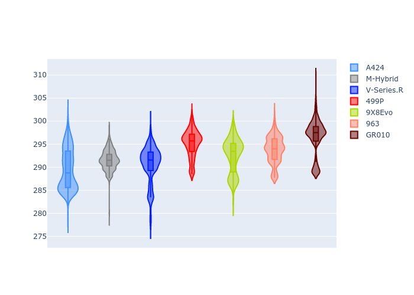
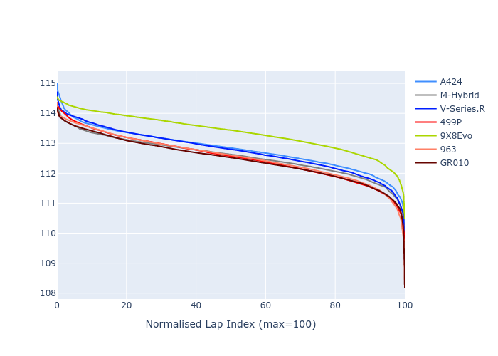

# Combined Plots

## Metadata

- BoP Accuracy: 99.20%
- Overall BoP Grade: A1
- Track: BAHRAIN
- Threshhold: 250.0kph

## BoP Table
| Manufacturer   | Car        | Weight   | Power   | PINC   | E/Stint   | FDS    |
|:---------------|:-----------|:---------|:--------|:-------|:----------|:-------|
| Alpine         | A424       | 1046kg   | 517.0kw | -4.30% | 907MJ     | -      |
| BMW            | M-Hybrid   | 1036kg   | 514.0kw | -1.80% | 905MJ     | -      |
| Cadillac       | V-Series.R | 1038kg   | 517.0kw | -0.60% | 906MJ     | -      |
| Ferrari        | 499P       | 1053kg   | 510.0kw | -0.90% | 905MJ     | 190kph |
| Peugeot        | 9X8Evo     | 1031kg   | 520.0kw | -5.20% | 903MJ     | 190kph |
| Porsche        | 963        | 1056kg   | 514.0kw | +0.20% | 911MJ     | -      |
| Toyota         | GR010      | 1065kg   | 499.0kw | +4.20% | 908MJ     | 190kph |

## Performance Table
| Manufacturer   | Car        | RP      | QP      | Vavg      |   RDLC | BOP-Grade   | Match   |
|:---------------|:-----------|:--------|:--------|:----------|-------:|:------------|:--------|
| Alpine         | A424       | 1:51.20 | 1:46.96 | 288.02kph |   1.04 | ~A1         | 99.39%  |
| BMW            | M-Hybrid   | 1:51.01 | 1:46.44 | 289.50kph |   1.04 | ~A1         | 100.00% |
| Cadillac       | V-Series.R | 1:51.10 | 1:46.62 | 287.69kph |   1.04 | ~A1         | 99.96%  |
| Ferrari        | 499P       | 1:50.77 | 1:46.14 | 291.28kph |   1.04 | ~A1         | 99.83%  |
| Peugeot        | 9X8Evo     | 1:51.67 | 1:47.08 | 291.18kph |   1.04 | ~A1         | 95.44%  |
| Porsche        | 963        | 1:50.90 | 1:46.41 | 289.33kph |   1.04 | ~A1         | 99.92%  |
| Toyota         | GR010      | 1:50.77 | 1:46.04 | 292.50kph |   1.04 | ~A1         | 99.88%  |

## Race Laptimes

## Quali Laptimes

## Topspeeds

## Laptimes Lineplot

