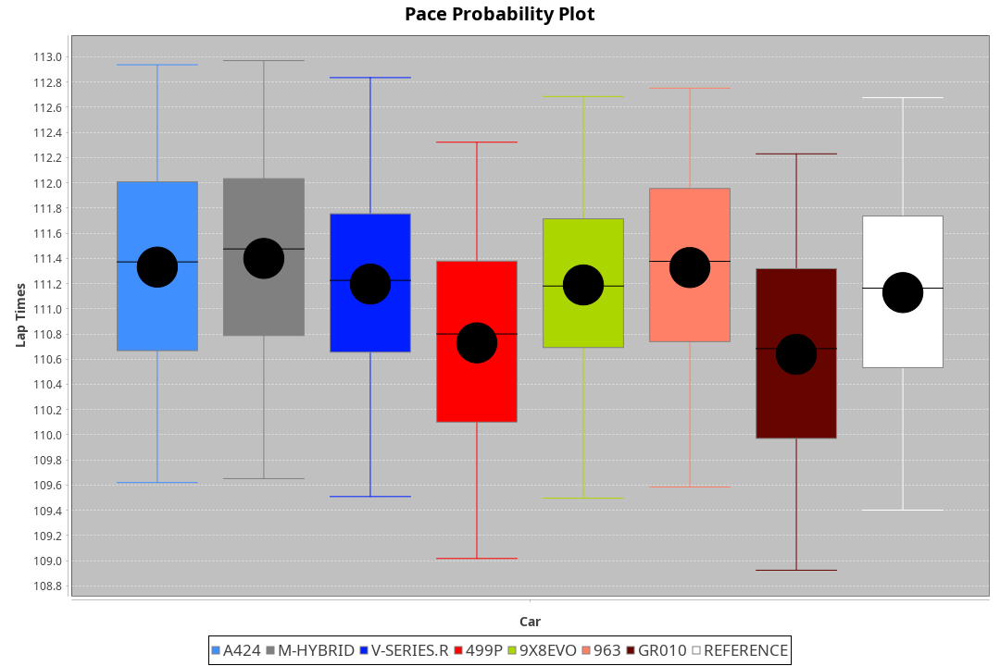
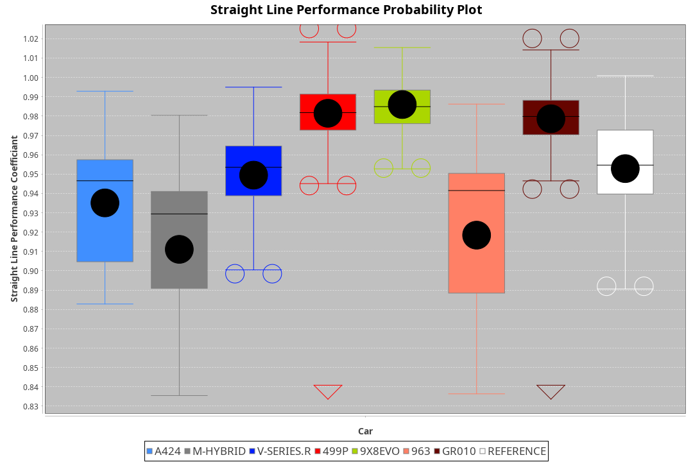
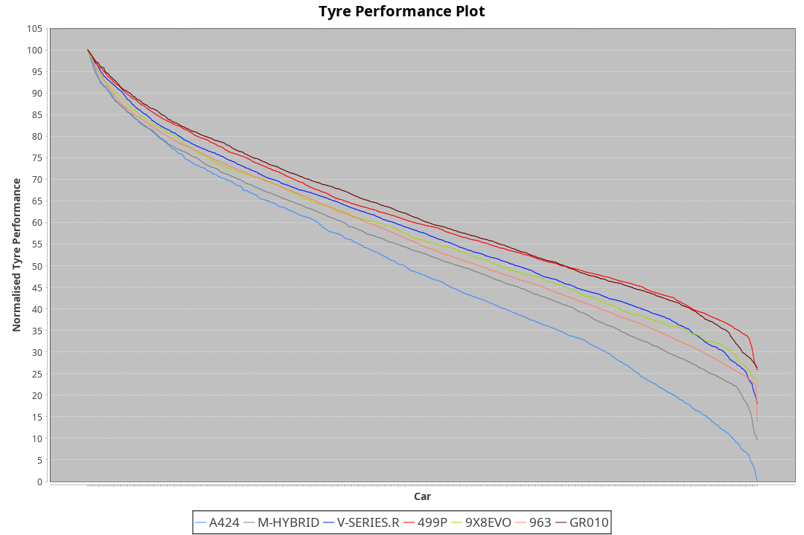

| Manufacturer | Car        | Weight | Power   | PINC   | E/Stint | FDS     |
|:-|:-|:-|:-|:-|:-|:-|
| Alpine       | A424       | 1046kg | 517.0kw | -4.30% | 907MJ   |    -    |
| BMW          | M-Hybrid   | 1036kg | 514.0kw | -1.80% | 905MJ   |    -    |
| Cadillac     | V-Series.R | 1038kg | 517.0kw | -0.60% | 906MJ   |    -    |
| Ferrari      | 499P       | 1053kg | 510.0kw | -0.90% | 905MJ   | 190kph  |
| Peugeot      | 9X8Evo     | 1031kg | 520.0kw | -5.20% | 903MJ   | 190kph  |
| Porsche      | 963        | 1056kg | 514.0kw | 0.20%  | 911MJ   |    -    |
| Toyota       | GR010      | 1065kg | 499.0kw | 4.20%  | 908MJ   | 190kph  |

### BoP Accuracy: 84.07%; Overall BoP Grade: B2
| Manufacturer | Car        | Type  | RP      | QP      | Weight | Power¹  | Threshhold | PINC   | Power²   | E/Stint | AVG Vmax  | FDS     | RDLC | L/Stint | BOP-Grade | Model Accuracy | Model Points | Match%  | SimDiff |
|:-|:-|:-|:-|:-|:-|:-|:-|:-|:-|:-|:-|:-|:-|:-|:-|:-|:-|:-|:-|
| Alpine       | A424       | LMDH  | 1:51.37 | 1:46.91 | 1046kg | 517.0kw | 250.0kph   | -4.30% | 494.80kw |  907MJ  | 276.27kph |    -    | 1.03 | 34      | +C1       | 98.45%         | 2220         | 75.98%  | -0.42   |
| BMW          | M-Hybrid   | LMDH  | 1:51.23 | 1:46.45 | 1036kg | 514.0kw | 250.0kph   | -1.80% | 504.70kw |  905MJ  | 280.42kph |    -    | 1.04 | 34      | +B1       | 100.00%        | 3339         | 88.20%  | -0.37   |
| Cadillac     | V-Series.R | LMDH  | 1:51.11 | 1:46.27 | 1038kg | 517.0kw | 250.0kph   | -0.60% | 513.90kw |  906MJ  | 283.20kph |    -    | 1.03 | 34      | +B1       | 99.03%         | 6041         | 88.91%  | -0.01   |
| Ferrari      | 499P       | LMHHU | 1:50.41 | 1:45.53 | 1053kg | 510.0kw | 250.0kph   | -0.90% | 505.40kw |  905MJ  | 281.30kph | 190kph  | 1.06 | 34      | -C1       | 99.97%         | 7286         | 76.15%  | +0.45   |
| Peugeot      | 9X8Evo     | LMHHU | 1:50.99 | 1:46.37 | 1031kg | 520.0kw | 250.0kph   | -5.20% | 493.00kw |  903MJ  | 288.10kph | 190kph  | 1.03 | 34      | +B2       | 100.00%        | 1890         | 83.95%  | +0.20   |
| Porsche      | 963        | LMDH  | 1:51.10 | 1:46.31 | 1056kg | 514.0kw | 250.0kph   | 0.20%  | 515.00kw |  911MJ  | 280.00kph |    -    | 1.02 | 34      | ~A1       | 99.89%         | 15174        | 100.00% | -0.23   |
| Toyota       | GR010      | LMHHU | 1:50.40 | 1:45.61 | 1065kg | 499.0kw | 250.0kph   | 4.20%  | 520.00kw |  908MJ  | 281.05kph | 190kph  | 1.04 | 34      | -C1       | 99.82%         | 5457         | 75.28%  | +0.38   |

## Power below Threshhold
| N/Nmax    | A424    | M-HYBRID | V-SERIES.R | 499P    | 9X8EVO  | 963     | GR010   |
|:-|:-|:-|:-|:-|:-|:-|:-|
|  0.550    |  255    |  253     |  255       |  251    |  256    |  253    |  246    |
|  0.575    |  278    |  276     |  278       |  274    |  279    |  276    |  268    |
|  0.600    |  298    |  297     |  298       |  295    |  300    |  297    |  288    |
|  0.625    |  320    |  318     |  320       |  316    |  322    |  318    |  308    |
|  0.650    |  341    |  339     |  341       |  337    |  343    |  339    |  329    |
|  0.675    |  363    |  361     |  363       |  358    |  365    |  361    |  350    |
|  0.700    |  385    |  383     |  385       |  380    |  387    |  383    |  371    |
|  0.725    |  407    |  404     |  407       |  401    |  409    |  404    |  392    |
|  0.750    |  427    |  425     |  427       |  422    |  430    |  425    |  412    |
|  0.775    |  446    |  444     |  446       |  441    |  449    |  444    |  431    |
|  0.800    |  464    |  462     |  464       |  458    |  467    |  462    |  448    |
|  0.825    |  479    |  477     |  479       |  473    |  482    |  477    |  463    |
|  0.850    |  491    |  488     |  491       |  485    |  494    |  488    |  474    |
|  0.875    |  502    |  499     |  502       |  495    |  505    |  499    |  484    |
|  0.900    |  509    |  506     |  509       |  502    |  512    |  506    |  491    |
|  0.925    |  514    |  511     |  514       |  507    |  517    |  511    |  496    |
| **0.950** | **517** | **514**  | **517**    | **510** | **520** | **514** | **499** |
|  0.975    |  515    |  512     |  515       |  508    |  518    |  512    |  497    |
|  1.000    |  511    |  508     |  511       |  505    |  514    |  508    |  494    |
|  1.025    |  441    |  439     |  441       |  436    |  444    |  439    |  426    |

## Power above Threshhold
| N/Nmax    | A424       | M-HYBRID   | V-SERIES.R | 499P       | 9X8EVO     | 963        | GR010      |
|:-|:-|:-|:-|:-|:-|:-|:-|
|  0.550    |  243.38    |  248.37    |  253.44    |  249.20    |  242.47    |  254.01    |  256.47    |
|  0.575    |  266.41    |  271.40    |  276.48    |  272.22    |  265.52    |  277.02    |  279.51    |
|  0.600    |  285.44    |  291.43    |  296.52    |  292.24    |  284.55    |  297.02    |  299.55    |
|  0.625    |  305.47    |  312.46    |  317.55    |  312.25    |  304.59    |  319.02    |  321.59    |
|  0.650    |  326.51    |  333.49    |  338.59    |  333.27    |  325.63    |  340.02    |  342.63    |
|  0.675    |  347.54    |  354.53    |  360.63    |  355.29    |  345.67    |  362.02    |  364.67    |
|  0.700    |  368.57    |  375.56    |  382.67    |  376.31    |  366.71    |  383.02    |  386.71    |
|  0.725    |  389.61    |  396.59    |  403.71    |  397.32    |  387.76    |  405.02    |  408.75    |
|  0.750    |  408.64    |  416.62    |  424.74    |  417.34    |  407.79    |  426.02    |  429.79    |
|  0.775    |  427.66    |  435.65    |  443.78    |  436.35    |  425.83    |  445.02    |  448.83    |
|  0.800    |  444.69    |  453.67    |  461.81    |  454.37    |  442.86    |  463.03    |  466.86    |
|  0.825    |  458.71    |  468.69    |  476.83    |  469.38    |  456.89    |  478.03    |  481.89    |
|  0.850    |  469.73    |  479.71    |  487.85    |  480.39    |  467.91    |  489.03    |  493.91    |
|  0.875    |  479.75    |  489.73    |  498.87    |  490.40    |  477.93    |  500.03    |  504.93    |
|  0.900    |  486.76    |  496.74    |  505.88    |  497.40    |  484.94    |  507.03    |  511.94    |
|  0.925    |  491.76    |  501.74    |  510.89    |  502.41    |  489.95    |  512.03    |  516.95    |
| **0.950** | **494.77** | **504.75** | **513.90** | **505.41** | **492.96** | **515.03** | **519.96** |
|  0.975    |  492.77    |  502.75    |  511.89    |  503.41    |  490.96    |  513.03    |  517.95    |
|  1.000    |  489.76    |  499.74    |  507.89    |  500.41    |  487.95    |  509.03    |  513.95    |
|  1.025    |  422.66    |  430.64    |  438.77    |  431.35    |  420.82    |  440.02    |  443.82    |
