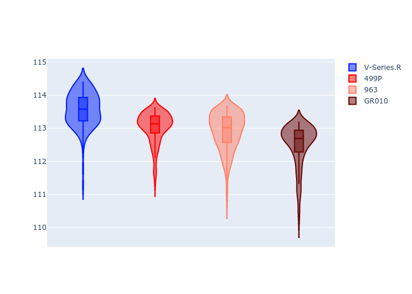
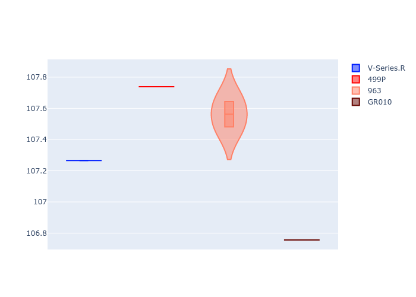
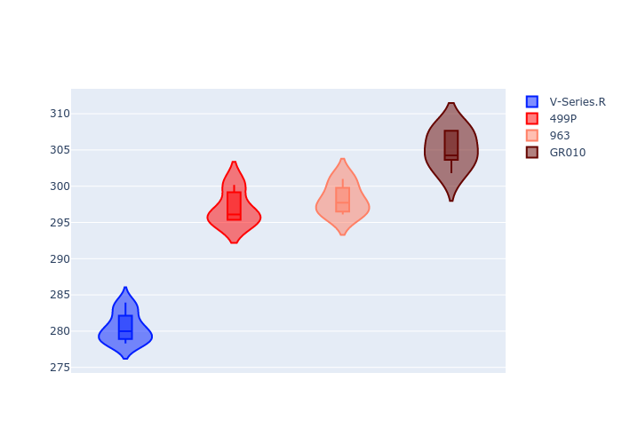
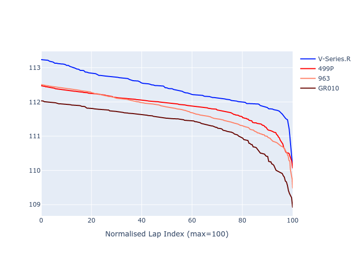

# Combined Plots

## Metadata

- BoP Accuracy: 89.45%
- Overall BoP Grade: B1
- Track: BAHRAIN
- Threshhold: 0.0kph
- Average Laptime: 1:53.00
- Average Quali Laptime: 1:47.44
- Average Topspeed: 295.16kph

## BoP Table
| Manufacturer   | Car        | Weight   | Power   | PINC   | E/Stint   | FDS    | RDP    | QDP    | TDP    |
|:---------------|:-----------|:---------|:--------|:-------|:----------|:-------|:-------|:-------|:-------|
| Cadillac       | V-Series.R | 1037kg   | 504.0kw | -      | 895MJ     | -      | 60.57% | 33.33% | 10.98% |
| Ferrari        | 499P       | 1075kg   | 509.0kw | -      | 901MJ     | 190kph | 57.14% | 33.33% | 1.36%  |
| Porsche        | 963        | 1053kg   | 514.0kw | -      | 909MJ     | -      | 55.50% | 40.00% | 0.77%  |
| Toyota         | GR010      | 1080kg   | 514.0kw | -      | 912MJ     | 190kph | 49.60% | 25.00% | 0.99%  |

## Performance Table
| Manufacturer   | Car        | RP      | QP      | Vavg      |   RDLC | BOP-Grade   | Match   |
|:---------------|:-----------|:--------|:--------|:----------|-------:|:------------|:--------|
| Cadillac       | V-Series.R | 1:53.57 | 1:47.39 | 280.45kph |   1.06 | +D2         | 60.40%  |
| Ferrari        | 499P       | 1:53.03 | 1:47.80 | 296.95kph |   1.05 | ~A1         | 100.00% |
| Porsche        | 963        | 1:52.91 | 1:47.80 | 298.13kph |   1.05 | ~A1         | 99.82%  |
| Toyota         | GR010      | 1:52.50 | 1:46.77 | 305.12kph |   1.05 | ~A1         | 97.57%  |

## Race Laptimes

## Quali Laptimes

## Topspeeds

## Laptimes Lineplot

