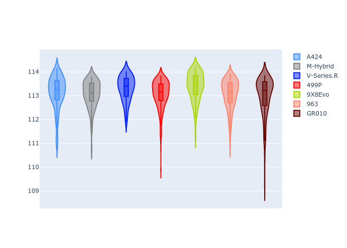
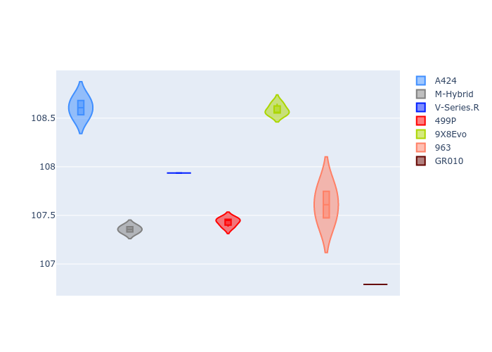
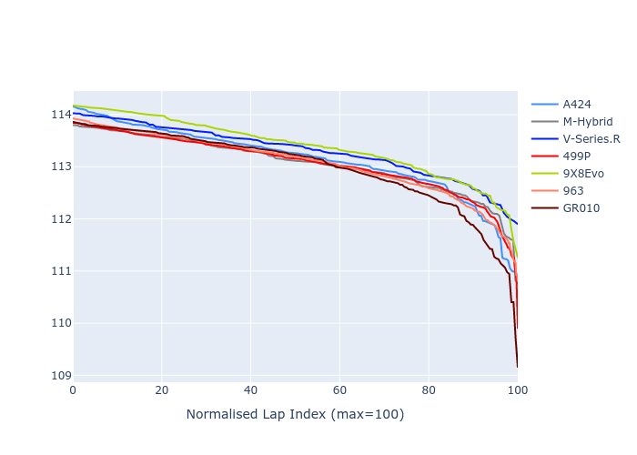

# Combined Plots

## Metadata

- BoP Accuracy: 94.75%
- Overall BoP Grade: A2
- Track: BAHRAIN
- Threshhold: 250.0kph
- Average Laptime: 1:53.14
- Average Quali Laptime: 1:47.41
- Average Topspeed: 292.17kph

## BoP Table
| Manufacturer   | Car        | Weight   | Power   | PINC   | E/Stint   | FDS    | RDP    | QDP     | TDP   |
|:---------------|:-----------|:---------|:--------|:-------|:----------|:-------|:-------|:--------|:------|
| Alpine         | A424       | 1046kg   | 517.0kw | -4.30% | 907MJ     | -      | 49.36% | 50.00%  | 1.83% |
| BMW            | M-Hybrid   | 1036kg   | 514.0kw | -1.80% | 905MJ     | -      | 56.07% | 66.67%  | 2.08% |
| Cadillac       | V-Series.R | 1038kg   | 517.0kw | -0.60% | 906MJ     | -      | 54.89% | 100.00% | 2.44% |
| Ferrari        | 499P       | 1053kg   | 510.0kw | -0.90% | 905MJ     | 190kph | 51.49% | 60.00%  | 0.79% |
| Peugeot        | 9X8Evo     | 1031kg   | 520.0kw | -5.20% | 903MJ     | 190kph | 50.72% | 100.00% | 1.40% |
| Porsche        | 963        | 1056kg   | 514.0kw | +0.20% | 911MJ     | -      | 50.90% | 22.22%  | 1.58% |
| Toyota         | GR010      | 1065kg   | 499.0kw | +4.20% | 908MJ     | 190kph | 50.98% | 20.00%  | 3.14% |

## Performance Table
| Manufacturer   | Car        | RP      | QP      | Vavg      |   RDLC | BOP-Grade   | Match   |
|:---------------|:-----------|:--------|:--------|:----------|-------:|:------------|:--------|
| Alpine         | A424       | 1:53.14 | 1:48.31 | 287.94kph |   1.04 | +A2         | 91.81%  |
| BMW            | M-Hybrid   | 1:53.06 | 1:47.05 | 290.11kph |   1.06 | ~A1         | 100.00% |
| Cadillac       | V-Series.R | 1:53.30 | 1:47.61 | 289.75kph |   1.05 | +A2         | 94.57%  |
| Ferrari        | 499P       | 1:53.06 | 1:47.04 | 292.35kph |   1.06 | ~A1         | 99.72%  |
| Peugeot        | 9X8Evo     | 1:53.38 | 1:48.25 | 289.99kph |   1.05 | +C1         | 79.05%  |
| Porsche        | 963        | 1:53.07 | 1:47.20 | 296.41kph |   1.05 | ~A1         | 100.00% |
| Toyota         | GR010      | 1:52.97 | 1:46.42 | 298.62kph |   1.06 | ~A1         | 98.09%  |

## Race Laptimes

## Quali Laptimes

## Topspeeds

## Laptimes Lineplot

