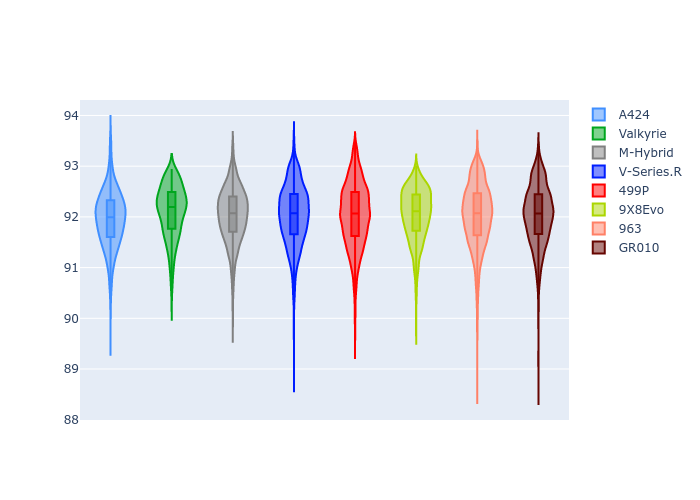
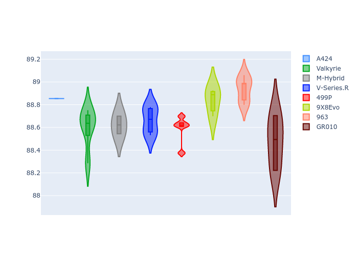

# Combined Plots

## Metadata

- BoP Accuracy: 99.73%
- Overall BoP Grade: A1
- Track: FUJI
- Threshhold: 250.0kph
- Average Laptime: 1:32.03
- Average Quali Laptime: 1:28.70
- Average Topspeed: 311.54kph

## BoP Table
| Manufacturer   | Car        | Weight   | Power   | PINC   | E/Stint   | FDS    | RDP    | QDP    | TDP    |
|:---------------|:-----------|:---------|:--------|:-------|:----------|:-------|:-------|:-------|:-------|
| Alpine         | A424       | 1067kg   | 520.0kw | -0.10% | 922MJ     | -      | 51.64% | 59.31% | 26.80% |
| Aston Martin   | Valkyrie   | 1030kg   | 520.0kw | -      | 911MJ     | -      | 53.50% | 53.33% | 21.51% |
| BMW            | M-Hybrid   | 1051kg   | 512.0kw | +0.10% | 909MJ     | -      | 52.89% | 56.22% | 33.41% |
| Cadillac       | V-Series.R | 1034kg   | 511.0kw | +0.10% | 903MJ     | -      | 48.63% | 60.80% | 19.01% |
| Ferrari        | 499P       | 1083kg   | 508.0kw | -0.10% | 907MJ     | 190kph | 51.38% | 44.98% | 9.83%  |
| Peugeot        | 9X8Evo     | 1048kg   | 511.0kw | -      | 917MJ     | 190kph | 48.87% | 52.78% | 15.41% |
| Porsche        | 963        | 1063kg   | 516.0kw | -0.10% | 912MJ     | -      | 50.70% | 44.30% | 29.51% |
| Toyota         | GR010      | 1095kg   | 512.0kw | -0.10% | 913MJ     | 190kph | 51.09% | 52.71% | 11.46% |

## Performance Table
| Manufacturer   | Car        | RP      | QP      | Vavg      |   RDLC | BOP-Grade   | Match   |
|:---------------|:-----------|:--------|:--------|:----------|-------:|:------------|:--------|
| Alpine         | A424       | 1:31.95 | 1:28.85 | 310.65kph |   1.03 | ~A1         | 99.33%  |
| Aston Martin   | Valkyrie   | 1:32.11 | 1:28.60 | 314.17kph |   1.04 | ~A1         | 100.00% |
| BMW            | M-Hybrid   | 1:32.03 | 1:28.62 | 310.18kph |   1.04 | ~A1         | 99.81%  |
| Cadillac       | V-Series.R | 1:32.03 | 1:28.66 | 309.23kph |   1.04 | ~A1         | 99.65%  |
| Ferrari        | 499P       | 1:32.03 | 1:28.59 | 311.39kph |   1.04 | ~A1         | 99.52%  |
| Peugeot        | 9X8Evo     | 1:32.04 | 1:28.84 | 312.56kph |   1.04 | ~A1         | 100.00% |
| Porsche        | 963        | 1:32.03 | 1:28.94 | 312.32kph |   1.03 | ~A1         | 99.85%  |
| Toyota         | GR010      | 1:32.04 | 1:28.47 | 311.79kph |   1.04 | ~A1         | 99.71%  |

## Race Laptimes

## Quali Laptimes

## Topspeeds

## Laptimes Lineplot

