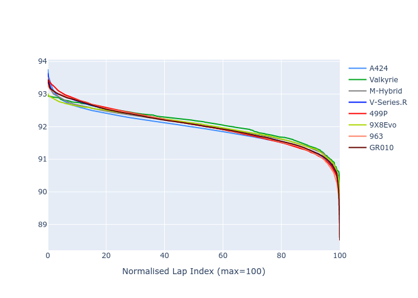

# Combined Plots

## Metadata

- BoP Accuracy: 99.69%
- Overall BoP Grade: A1
- Track: FUJI
- Threshhold: 250.0kph

## BoP Table
| Manufacturer   | Car        | Weight   | Power   | PINC   | E/Stint   | FDS    | RDP    | QDP    | TDP    |
|:---------------|:-----------|:---------|:--------|:-------|:----------|:-------|:-------|:-------|:-------|
| Alpine         | A424       | 1067kg   | 520.0kw | -0.10% | 921MJ     | -      | 52.35% | 61.85% | 27.84% |
| Aston Martin   | Valkyrie   | 1040kg   | 506.0kw | +0.40% | 901MJ     | -      | 53.59% | 53.33% | 21.51% |
| BMW            | M-Hybrid   | 1061kg   | 512.0kw | +0.10% | 910MJ     | -      | 53.26% | 57.23% | 34.54% |
| Cadillac       | V-Series.R | 1054kg   | 510.0kw | +0.10% | 904MJ     | -      | 47.80% | 56.73% | 19.63% |
| Ferrari        | 499P       | 1083kg   | 508.0kw | -0.10% | 908MJ     | 190kph | 53.02% | 42.32% | 9.88%  |
| Peugeot        | 9X8Evo     | 1059kg   | 510.0kw | -0.10% | 917MJ     | 190kph | 48.47% | 51.26% | 16.02% |
| Porsche        | 963        | 1067kg   | 516.0kw | -0.10% | 913MJ     | -      | 50.87% | 45.25% | 30.77% |
| Toyota         | GR010      | 1100kg   | 512.0kw | -0.10% | 914MJ     | 190kph | 52.43% | 57.12% | 12.82% |

## Performance Table
| Manufacturer   | Car        | RP      | QP      | Vavg      |   RDLC | BOP-Grade   | Match   |
|:---------------|:-----------|:--------|:--------|:----------|-------:|:------------|:--------|
| Alpine         | A424       | 1:30.31 | 1:28.80 | 308.72kph |   1.02 | ~A1         | 99.79%  |
| Aston Martin   | Valkyrie   | 1:30.99 | 1:28.92 | 308.15kph |   1.02 | ~A1         | 100.00% |
| BMW            | M-Hybrid   | 1:30.63 | 1:28.79 | 306.85kph |   1.02 | ~A1         | 100.00% |
| Cadillac       | V-Series.R | 1:30.82 | 1:28.99 | 303.55kph |   1.02 | ~A1         | 99.96%  |
| Ferrari        | 499P       | 1:30.72 | 1:28.46 | 307.25kph |   1.03 | ~A1         | 99.81%  |
| Peugeot        | 9X8Evo     | 1:31.03 | 1:29.32 | 309.54kph |   1.02 | ~A1         | 98.41%  |
| Porsche        | 963        | 1:30.56 | 1:28.78 | 307.51kph |   1.02 | ~A1         | 99.81%  |
| Toyota         | GR010      | 1:30.82 | 1:28.46 | 307.43kph |   1.03 | ~A1         | 99.76%  |

## Race Laptimes

## Quali Laptimes

## Topspeeds

## Laptimes Lineplot

