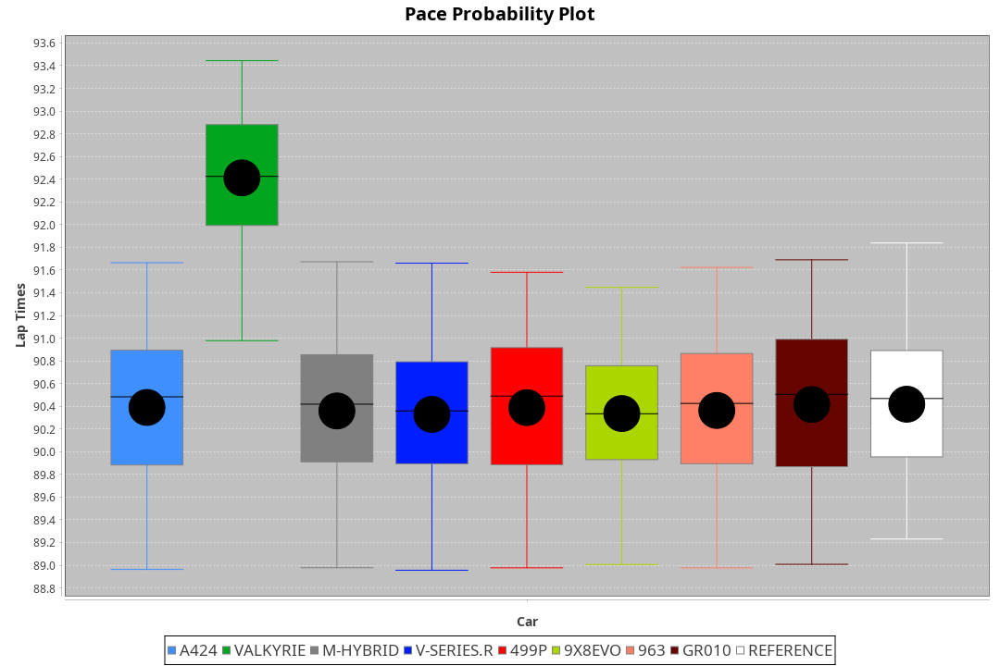
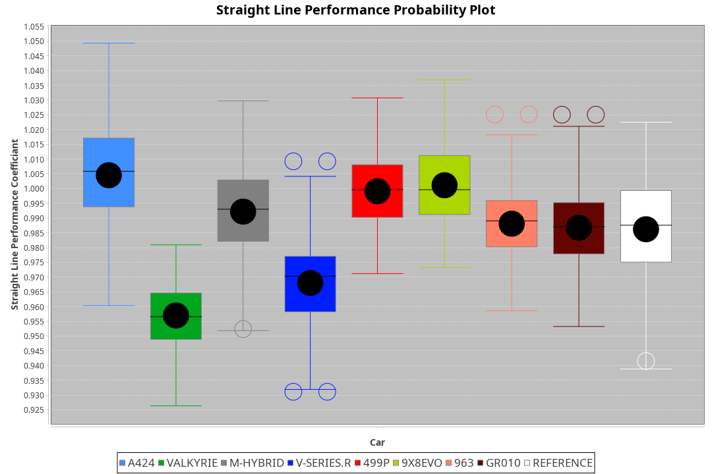
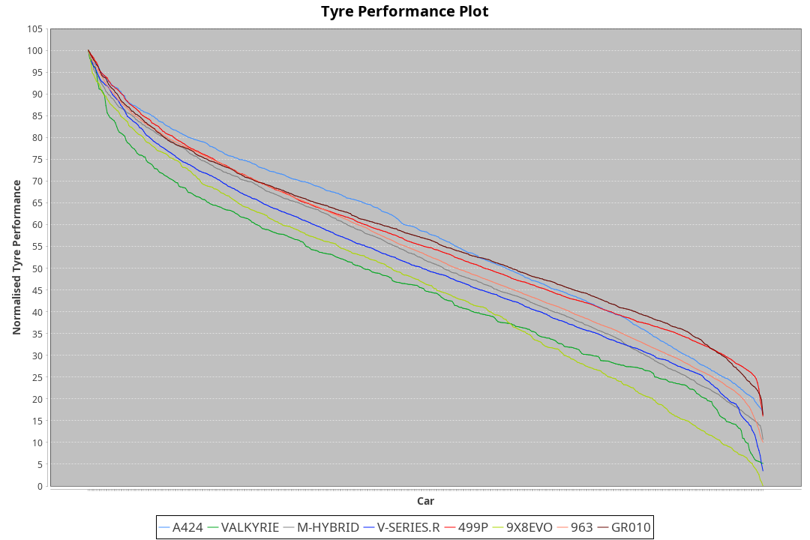

| Manufacturer | Car        | Weight | Power   | PINC    | E/Stint | FDS     |
|:-|:-|:-|:-|:-|:-|:-|
| Alpine       | A424       | 1049kg | 517.0kw |    -    | 917MJ   |    -    |
| Aston Martin | Valkyrie   | 1032kg | 520.0kw |    -    | 911MJ   |    -    |
| BMW          | M-Hybrid   | 1042kg | 512.0kw |    -    | 908MJ   |    -    |
| Cadillac     | V-Series.R | 1043kg | 507.0kw |    -    | 900MJ   |    -    |
| Ferrari      | 499P       | 1063kg | 505.0kw |    -    | 903MJ   | 190kph  |
| Peugeot      | 9X8Evo     | 1048kg | 510.0kw |    -    | 916MJ   | 190kph  |
| Porsche      | 963        | 1056kg | 513.0kw |    -    | 909MJ   |    -    |
| Toyota       | GR010      | 1080kg | 512.0kw |    -    | 912MJ   | 190kph  |

### BoP Accuracy: 77.38%; Overall BoP Grade: C1
| Manufacturer | Car        | Type  | RP      | QP      | Weight | Power¹  | Threshhold | PINC    | Power²   | E/Stint | AVG Vmax  | FDS     | RDLC | L/Stint | BOP-Grade | Model Accuracy | Model Points | Match% | SimDiff |
|:-|:-|:-|:-|:-|:-|:-|:-|:-|:-|:-|:-|:-|:-|:-|:-|:-|:-|:-|:-|
| Alpine       | A424       | LMDH  | 1:30.31 | 1:29.22 | 1049kg | 517.0kw | 210.0kph   |    -    | 517.00kw |  917MJ  | 325.75kph |    -    | 1.00 | 40      | -B1       | 99.49%         | 1360         | 87.36% | -0.08   |
| Aston Martin | Valkyrie   | LMHNH | 1:32.35 | 1:30.55 | 1032kg | 520.0kw | 210.0kph   |    -    | 520.00kw |  911MJ  | 317.85kph |    -    | 1.03 | 40      | +Ω1       | 100.00%        | 312          | 12.89% | #       |
| BMW          | M-Hybrid   | LMDH  | 1:30.33 | 1:28.46 | 1042kg | 512.0kw | 210.0kph   |    -    | 512.00kw |  908MJ  | 324.03kph |    -    | 1.02 | 40      | -B1       | 98.62%         | 2363         | 88.49% | +0.19   |
| Cadillac     | V-Series.R | LMDH  | 1:30.31 | 1:28.75 | 1043kg | 507.0kw | 210.0kph   |    -    | 507.00kw |  900MJ  | 317.92kph |    -    | 1.02 | 40      | -B1       | 98.50%         | 4201         | 87.65% | +0.52   |
| Ferrari      | 499P       | LMHHU | 1:30.33 | 1:28.64 | 1063kg | 505.0kw | 210.0kph   |    -    | 505.00kw |  903MJ  | 322.24kph | 190kph  | 1.02 | 40      | -B1       | 100.00%        | 4441         | 85.37% | +0.56   |
| Peugeot      | 9X8Evo     | LMHHU | 1:30.32 | 1:28.96 | 1048kg | 510.0kw | 210.0kph   |    -    | 510.00kw |  916MJ  | 324.68kph | 190kph  | 1.00 | 40      | -B2       | 100.00%        | 808          | 81.29% | +0.30   |
| Porsche      | 963        | LMDH  | 1:30.33 | 1:28.43 | 1056kg | 513.0kw | 210.0kph   |    -    | 513.00kw |  909MJ  | 321.54kph |    -    | 1.01 | 40      | -B1       | 99.87%         | 12613        | 86.60% | +0.36   |
| Toyota       | GR010      | LMHHU | 1:30.36 | 1:28.50 | 1080kg | 512.0kw | 210.0kph   |    -    | 512.00kw |  912MJ  | 319.33kph | 190kph  | 1.01 | 40      | -B1       | 99.73%         | 2956         | 89.40% | +0.12   |

## Power below Threshhold
| N/Nmax    | A424    | VALKYRIE | M-HYBRID | V-SERIES.R | 499P    | 9X8EVO  | 963     | GR010   |
|:-|:-|:-|:-|:-|:-|:-|:-|:-|
|  0.550    |  255    |  256     |  252     |  250       |  249    |  251    |  253    |  252    |
|  0.575    |  278    |  279     |  275     |  273       |  272    |  274    |  276    |  275    |
|  0.600    |  298    |  300     |  296     |  293       |  292    |  295    |  296    |  296    |
|  0.625    |  320    |  322     |  317     |  314       |  312    |  316    |  317    |  317    |
|  0.650    |  341    |  343     |  338     |  335       |  333    |  337    |  338    |  338    |
|  0.675    |  363    |  365     |  359     |  356       |  355    |  358    |  360    |  359    |
|  0.700    |  385    |  387     |  381     |  377       |  376    |  380    |  382    |  381    |
|  0.725    |  407    |  409     |  403     |  399       |  397    |  401    |  403    |  403    |
|  0.750    |  427    |  430     |  423     |  419       |  417    |  422    |  424    |  423    |
|  0.775    |  446    |  449     |  442     |  438       |  436    |  441    |  443    |  442    |
|  0.800    |  464    |  467     |  460     |  455       |  454    |  458    |  461    |  460    |
|  0.825    |  479    |  482     |  475     |  470       |  469    |  473    |  476    |  475    |
|  0.850    |  491    |  494     |  486     |  482       |  480    |  485    |  487    |  486    |
|  0.875    |  502    |  505     |  497     |  492       |  490    |  495    |  498    |  497    |
|  0.900    |  509    |  512     |  504     |  499       |  497    |  502    |  505    |  504    |
|  0.925    |  514    |  517     |  509     |  504       |  502    |  507    |  510    |  509    |
| **0.950** | **517** | **520**  | **512**  | **507**    | **505** | **510** | **513** | **512** |
|  0.975    |  515    |  518     |  510     |  505       |  503    |  508    |  511    |  510    |
|  1.000    |  511    |  514     |  506     |  502       |  500    |  505    |  507    |  506    |
|  1.025    |  441    |  444     |  437     |  433       |  431    |  436    |  438    |  437    |

## Power above Threshhold
| N/Nmax    | A424    | VALKYRIE | M-HYBRID | V-SERIES.R | 499P    | 9X8EVO  | 963     | GR010   |
|:-|:-|:-|:-|:-|:-|:-|:-|:-|
|  0.550    |  255    |  256     |  252     |  250       |  249    |  251    |  253    |  252    |
|  0.575    |  278    |  279     |  275     |  273       |  272    |  274    |  276    |  275    |
|  0.600    |  298    |  300     |  296     |  293       |  292    |  295    |  296    |  296    |
|  0.625    |  320    |  322     |  317     |  314       |  312    |  316    |  317    |  317    |
|  0.650    |  341    |  343     |  338     |  335       |  333    |  337    |  338    |  338    |
|  0.675    |  363    |  365     |  359     |  356       |  355    |  358    |  360    |  359    |
|  0.700    |  385    |  387     |  381     |  377       |  376    |  380    |  382    |  381    |
|  0.725    |  407    |  409     |  403     |  399       |  397    |  401    |  403    |  403    |
|  0.750    |  427    |  430     |  423     |  419       |  417    |  422    |  424    |  423    |
|  0.775    |  446    |  449     |  442     |  438       |  436    |  441    |  443    |  442    |
|  0.800    |  464    |  467     |  460     |  455       |  454    |  458    |  461    |  460    |
|  0.825    |  479    |  482     |  475     |  470       |  469    |  473    |  476    |  475    |
|  0.850    |  491    |  494     |  486     |  482       |  480    |  485    |  487    |  486    |
|  0.875    |  502    |  505     |  497     |  492       |  490    |  495    |  498    |  497    |
|  0.900    |  509    |  512     |  504     |  499       |  497    |  502    |  505    |  504    |
|  0.925    |  514    |  517     |  509     |  504       |  502    |  507    |  510    |  509    |
| **0.950** | **517** | **520**  | **512**  | **507**    | **505** | **510** | **513** | **512** |
|  0.975    |  515    |  518     |  510     |  505       |  503    |  508    |  511    |  510    |
|  1.000    |  511    |  514     |  506     |  502       |  500    |  505    |  507    |  506    |
|  1.025    |  441    |  444     |  437     |  433       |  431    |  436    |  438    |  437    |
