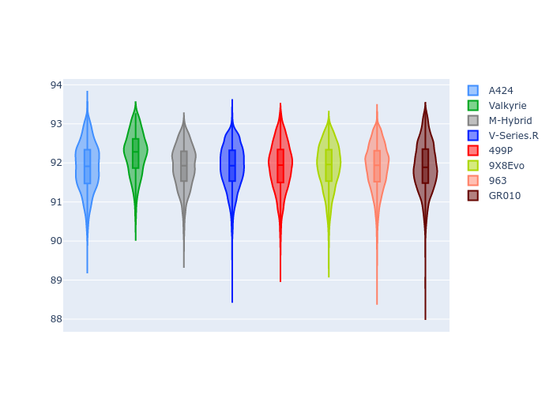
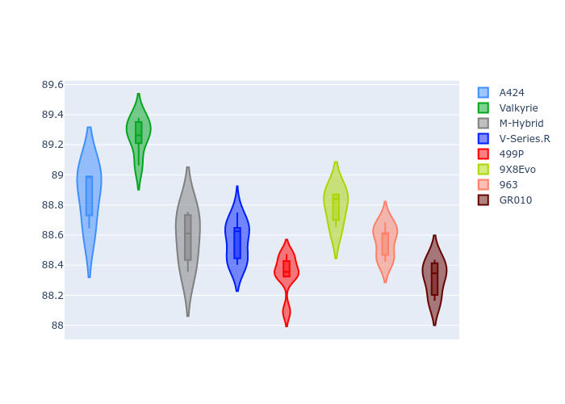
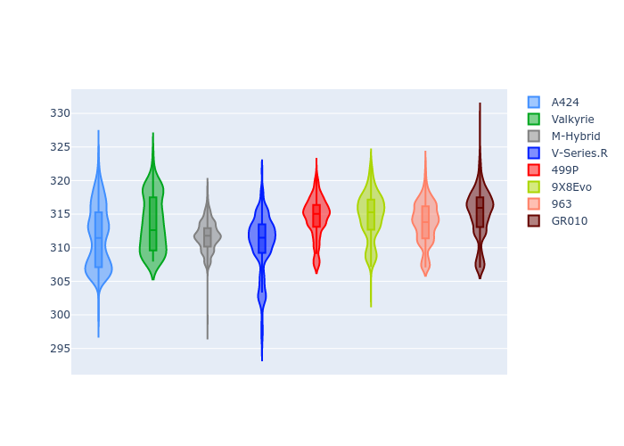
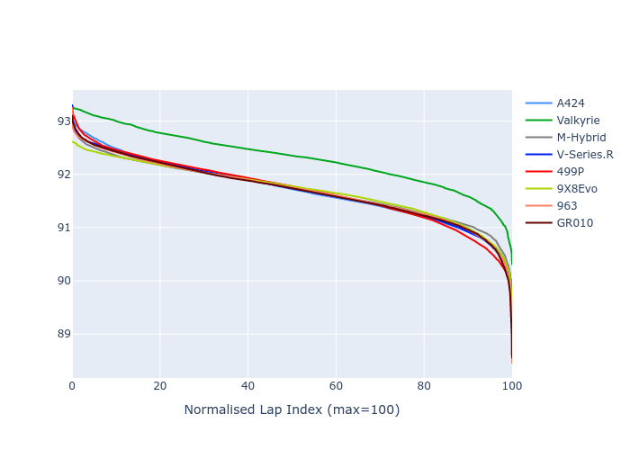

# Combined Plots

## Metadata

- BoP Accuracy: 99.76%
- Overall BoP Grade: A1
- Track: FUJI
- Threshhold: 0.0kph
- Average Laptime: 1:31.83
- Average Quali Laptime: 1:28.66
- Laptime Std Dev: 0.06 seconds
- Filtered Average Topspeed: 313.18kph

## BoP Table
| Manufacturer   | Car        | Weight   | Power   | PINC   | E/Stint   | FDS    | RDP    | QDP    | TDP    |
|:---------------|:-----------|:---------|:--------|:-------|:----------|:-------|:-------|:-------|:-------|
| Alpine         | A424       | 1037kg   | 509.0kw | -      | 909MJ     | -      | 51.38% | 57.54% | 26.10% |
| Aston Martin   | Valkyrie   | 1030kg   | 520.0kw | -      | 911MJ     | -      | 52.56% | 51.11% | 27.23% |
| BMW            | M-Hybrid   | 1037kg   | 512.0kw | -      | 908MJ     | -      | 52.62% | 53.36% | 32.99% |
| Cadillac       | V-Series.R | 1042kg   | 520.0kw | -      | 912MJ     | -      | 48.29% | 59.47% | 18.65% |
| Ferrari        | 499P       | 1059kg   | 510.0kw | -      | 907MJ     | 190kph | 51.25% | 43.28% | 10.17% |
| Peugeot        | 9X8Evo     | 1031kg   | 512.0kw | -      | 916MJ     | 200kph | 48.70% | 50.83% | 18.68% |
| Porsche        | 963        | 1033kg   | 507.0kw | -      | 901MJ     | -      | 50.57% | 42.80% | 29.05% |
| Toyota         | GR010      | 1057kg   | 509.0kw | -      | 907MJ     | 190kph | 51.03% | 51.78% | 14.64% |

## Performance Table
| Manufacturer   | Car        | RP      | QP      | Vavg      |   RDLC | BOP-Grade   | Match   |
|:---------------|:-----------|:--------|:--------|:----------|-------:|:------------|:--------|
| Alpine         | A424       | 1:31.80 | 1:28.87 | 311.61kph |   1.03 | ~A1         | 98.99%  |
| Aston Martin   | Valkyrie   | 1:31.99 | 1:29.26 | 313.62kph |   1.03 | ~A1         | 100.00% |
| BMW            | M-Hybrid   | 1:31.80 | 1:28.58 | 311.75kph |   1.04 | ~A1         | 100.00% |
| Cadillac       | V-Series.R | 1:31.81 | 1:28.56 | 310.60kph |   1.04 | ~A1         | 99.70%  |
| Ferrari        | 499P       | 1:31.82 | 1:28.34 | 314.48kph |   1.04 | ~A1         | 100.00% |
| Peugeot        | 9X8Evo     | 1:31.80 | 1:28.79 | 314.64kph |   1.03 | ~A1         | 100.00% |
| Porsche        | 963        | 1:31.81 | 1:28.56 | 313.73kph |   1.04 | ~A1         | 99.92%  |
| Toyota         | GR010      | 1:31.81 | 1:28.32 | 315.02kph |   1.04 | ~A1         | 99.45%  |

## Race Laptimes

## Quali Laptimes

## Topspeeds

## Laptimes Lineplot

