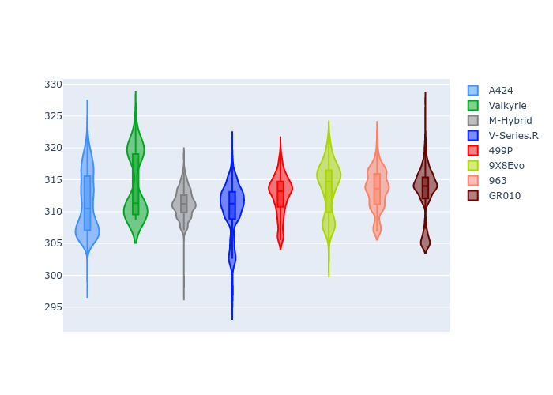

# Combined Plots

## Metadata

- BoP Accuracy: 99.79%
- Overall BoP Grade: A1
- Track: FUJI
- Threshhold: 0.0kph

## BoP Table
| Manufacturer   | Car        | Weight   | Power   | PINC   | E/Stint   | FDS    |
|:---------------|:-----------|:---------|:--------|:-------|:----------|:-------|
| Alpine         | A424       | 1040kg   | 497.0kw | -      | 898MJ     | -      |
| Aston Martin   | Valkyrie   | 1031kg   | 520.0kw | -      | 911MJ     | -      |
| BMW            | M-Hybrid   | 1043kg   | 502.0kw | -      | 899MJ     | -      |
| Cadillac       | V-Series.R | 1047kg   | 514.0kw | -      | 907MJ     | -      |
| Ferrari        | 499P       | 1066kg   | 487.0kw | -      | 887MJ     | 190kph |
| Peugeot        | 9X8Evo     | 1031kg   | 498.0kw | -      | 904MJ     | 190kph |
| Porsche        | 963        | 1040kg   | 499.0kw | -      | 895MJ     | -      |
| Toyota         | GR010      | 1065kg   | 488.0kw | -      | 889MJ     | 190kph |

## Performance Table
| Manufacturer   | Car        | RP      | QP      | Vavg      |   RDLC | BOP-Grade   | Match   |
|:---------------|:-----------|:--------|:--------|:----------|-------:|:------------|:--------|
| Alpine         | A424       | 1:30.02 | 1:28.64 | 306.83kph |   1.02 | ~A1         | 99.54%  |
| Aston Martin   | Valkyrie   | 1:30.01 | 1:28.02 | 311.84kph |   1.02 | ~A1         | 100.00% |
| BMW            | M-Hybrid   | 1:30.01 | 1:28.35 | 306.52kph |   1.02 | ~A1         | 99.96%  |
| Cadillac       | V-Series.R | 1:30.01 | 1:28.42 | 305.30kph |   1.02 | ~A1         | 99.96%  |
| Ferrari        | 499P       | 1:30.01 | 1:28.28 | 304.49kph |   1.02 | ~A1         | 99.94%  |
| Peugeot        | 9X8Evo     | 1:30.01 | 1:28.36 | 309.96kph |   1.02 | ~A1         | 99.08%  |
| Porsche        | 963        | 1:30.01 | 1:28.41 | 306.35kph |   1.02 | ~A1         | 99.89%  |
| Toyota         | GR010      | 1:30.01 | 1:28.19 | 305.35kph |   1.02 | ~A1         | 99.97%  |

## Race Laptimes

## Quali Laptimes

## Topspeeds

## Laptimes Lineplot

