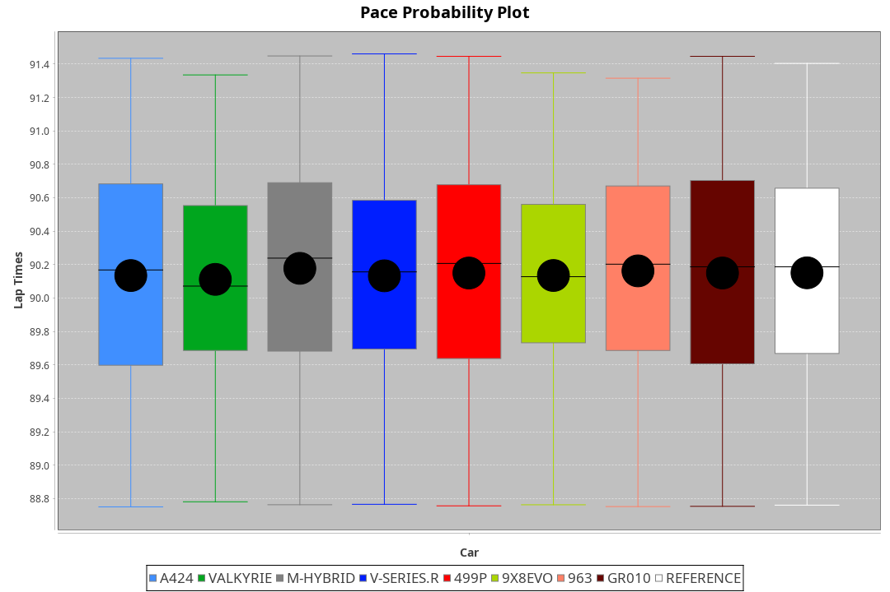
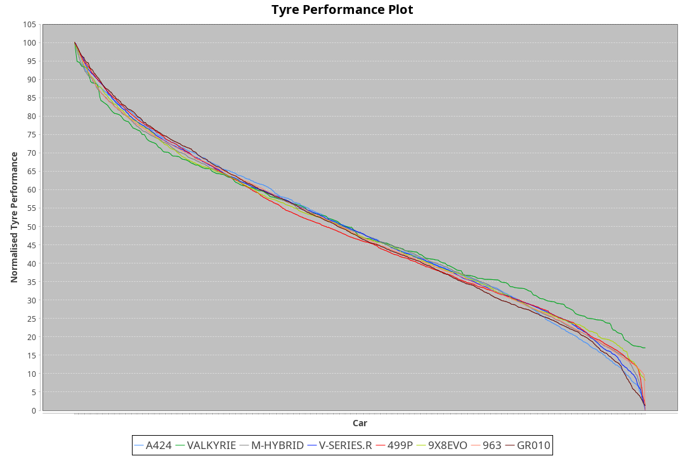

| Manufacturer | Car        | Weight | Power   | PINC    | E/Stint | FDS     |
|:-|:-|:-|:-|:-|:-|:-|
| Alpine       | A424       | 1051kg | 504.0kw |    -    | 905MJ   |    -    |
| Aston Martin | Valkyrie   | 1031kg | 509.0kw |    -    | 901MJ   |    -    |
| BMW          | M-Hybrid   | 1060kg | 520.0kw |    -    | 917MJ   |    -    |
| Cadillac     | V-Series.R | 1054kg | 512.0kw |    -    | 906MJ   |    -    |
| Ferrari      | 499P       | 1073kg | 497.0kw |    -    | 897MJ   | 190kph  |
| Peugeot      | 9X8Evo     | 1031kg | 484.0kw |    -    | 891MJ   | 190kph  |
| Porsche      | 963        | 1058kg | 511.0kw |    -    | 908MJ   |    -    |
| Toyota       | GR010      | 1076kg | 497.0kw |    -    | 898MJ   | 190kph  |

### BoP Accuracy: 95.04%; Overall BoP Grade: A1
| Manufacturer | Car        | Type  | RP      | QP      | Weight | Power¹  | Threshhold | PINC    | Power²   | E/Stint | AVG Vmax  | FDS     | RDLC | L/Stint | BOP-Grade | Model Accuracy | Model Points | Match%  | SimDiff |
|:-|:-|:-|:-|:-|:-|:-|:-|:-|:-|:-|:-|:-|:-|:-|:-|:-|:-|:-|:-|
| Alpine       | A424       | LMDH  | 1:30.55 | 1:28.79 | 1051kg | 504.0kw | 0.0kph     |    -    | 504.00kw |  905MJ  | 311.66kph |    -    | 1.01 | 40      | ~A1       | 99.58%         | 1429         | 98.62%  | +0.15   |
| Aston Martin | Valkyrie   | LMHNH | 1:30.55 | 1:28.72 | 1031kg | 509.0kw | 0.0kph     |    -    | 509.00kw |  901MJ  | 300.18kph |    -    | 1.06 | 40      | +C2       | 100.00%        | 247          | 72.68%  | #       |
| BMW          | M-Hybrid   | LMDH  | 1:30.53 | 1:28.67 | 1060kg | 520.0kw | 0.0kph     |    -    | 520.00kw |  917MJ  | 308.84kph |    -    | 1.02 | 40      | ~A1       | 99.97%         | 2912         | 100.00% | +0.13   |
| Cadillac     | V-Series.R | LMDH  | 1:30.54 | 1:28.82 | 1054kg | 512.0kw | 0.0kph     |    -    | 512.00kw |  906MJ  | 311.70kph |    -    | 1.02 | 40      | ~A1       | 99.49%         | 5225         | 95.03%  | +0.20   |
| Ferrari      | 499P       | LMHHU | 1:30.55 | 1:28.56 | 1073kg | 497.0kw | 0.0kph     |    -    | 497.00kw |  897MJ  | 313.71kph | 190kph  | 1.02 | 40      | ~A1       | 100.00%        | 5378         | 99.24%  | +0.77   |
| Peugeot      | 9X8Evo     | LMHHU | 1:30.55 | 1:28.84 | 1031kg | 484.0kw | 0.0kph     |    -    | 484.00kw |  891MJ  | 316.45kph | 190kph  | 1.02 | 40      | ~A1       | 100.00%        | 1459         | 95.55%  | +0.47   |
| Porsche      | 963        | LMDH  | 1:30.54 | 1:28.59 | 1058kg | 511.0kw | 0.0kph     |    -    | 511.00kw |  908MJ  | 308.51kph |    -    | 1.02 | 40      | ~A1       | 99.92%         | 14207        | 100.00% | +0.16   |
| Toyota       | GR010      | LMHHU | 1:30.56 | 1:28.46 | 1076kg | 497.0kw | 0.0kph     |    -    | 497.00kw |  898MJ  | 311.73kph | 190kph  | 1.02 | 40      | ~A1       | 99.86%         | 4280         | 99.19%  | +0.22   |

## Power below Threshhold
| N/Nmax    | A424    | VALKYRIE | M-HYBRID | V-SERIES.R | 499P    | 9X8EVO  | 963     | GR010   |
|:-|:-|:-|:-|:-|:-|:-|:-|:-|
|  0.550    |  248    |  251     |  256     |  252       |  245    |  238    |  252    |  245    |
|  0.575    |  271    |  274     |  279     |  275       |  267    |  260    |  275    |  267    |
|  0.600    |  291    |  294     |  300     |  296       |  287    |  279    |  295    |  287    |
|  0.625    |  312    |  315     |  322     |  317       |  307    |  299    |  316    |  307    |
|  0.650    |  333    |  336     |  343     |  338       |  328    |  320    |  337    |  328    |
|  0.675    |  354    |  357     |  365     |  359       |  349    |  340    |  359    |  349    |
|  0.700    |  375    |  379     |  387     |  381       |  370    |  361    |  380    |  370    |
|  0.725    |  396    |  400     |  409     |  403       |  391    |  381    |  402    |  391    |
|  0.750    |  416    |  421     |  430     |  423       |  411    |  400    |  422    |  411    |
|  0.775    |  435    |  440     |  449     |  442       |  429    |  418    |  441    |  429    |
|  0.800    |  453    |  457     |  467     |  460       |  446    |  435    |  459    |  446    |
|  0.825    |  468    |  472     |  482     |  475       |  461    |  449    |  474    |  461    |
|  0.850    |  479    |  484     |  494     |  486       |  472    |  460    |  485    |  472    |
|  0.875    |  489    |  494     |  505     |  497       |  482    |  470    |  496    |  482    |
|  0.900    |  496    |  501     |  512     |  504       |  489    |  476    |  503    |  489    |
|  0.925    |  501    |  506     |  517     |  509       |  494    |  481    |  508    |  494    |
| **0.950** | **504** | **509**  | **520**  | **512**    | **497** | **484** | **511** | **497** |
|  0.975    |  502    |  507     |  518     |  510       |  495    |  482    |  509    |  495    |
|  1.000    |  499    |  504     |  514     |  506       |  492    |  479    |  505    |  492    |
|  1.025    |  430    |  435     |  444     |  437       |  424    |  413    |  436    |  424    |

## Power above Threshhold
| N/Nmax    | A424    | VALKYRIE | M-HYBRID | V-SERIES.R | 499P    | 9X8EVO  | 963     | GR010   |
|:-|:-|:-|:-|:-|:-|:-|:-|:-|
|  0.550    |  248    |  251     |  256     |  252       |  245    |  238    |  252    |  245    |
|  0.575    |  271    |  274     |  279     |  275       |  267    |  260    |  275    |  267    |
|  0.600    |  291    |  294     |  300     |  296       |  287    |  279    |  295    |  287    |
|  0.625    |  312    |  315     |  322     |  317       |  307    |  299    |  316    |  307    |
|  0.650    |  333    |  336     |  343     |  338       |  328    |  320    |  337    |  328    |
|  0.675    |  354    |  357     |  365     |  359       |  349    |  340    |  359    |  349    |
|  0.700    |  375    |  379     |  387     |  381       |  370    |  361    |  380    |  370    |
|  0.725    |  396    |  400     |  409     |  403       |  391    |  381    |  402    |  391    |
|  0.750    |  416    |  421     |  430     |  423       |  411    |  400    |  422    |  411    |
|  0.775    |  435    |  440     |  449     |  442       |  429    |  418    |  441    |  429    |
|  0.800    |  453    |  457     |  467     |  460       |  446    |  435    |  459    |  446    |
|  0.825    |  468    |  472     |  482     |  475       |  461    |  449    |  474    |  461    |
|  0.850    |  479    |  484     |  494     |  486       |  472    |  460    |  485    |  472    |
|  0.875    |  489    |  494     |  505     |  497       |  482    |  470    |  496    |  482    |
|  0.900    |  496    |  501     |  512     |  504       |  489    |  476    |  503    |  489    |
|  0.925    |  501    |  506     |  517     |  509       |  494    |  481    |  508    |  494    |
| **0.950** | **504** | **509**  | **520**  | **512**    | **497** | **484** | **511** | **497** |
|  0.975    |  502    |  507     |  518     |  510       |  495    |  482    |  509    |  495    |
|  1.000    |  499    |  504     |  514     |  506       |  492    |  479    |  505    |  492    |
|  1.025    |  430    |  435     |  444     |  437       |  424    |  413    |  436    |  424    |
