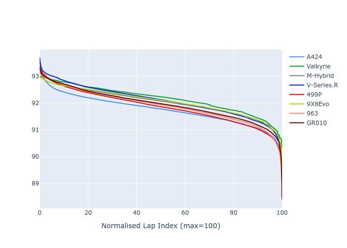

# Combined Plots

## Metadata

- BoP Accuracy: 99.06%
- Overall BoP Grade: A1
- Track: FUJI
- Threshhold: 210.0kph

## BoP Table
| Manufacturer   | Car        | Weight   | Power   | PINC   | E/Stint   | FDS    |
|:---------------|:-----------|:---------|:--------|:-------|:----------|:-------|
| Alpine         | A424       | 1057kg   | 520.0kw | -1.00% | 918MJ     | -      |
| Aston Martin   | Valkyrie   | 1040kg   | 505.0kw | +0.40% | 900MJ     | -      |
| BMW            | M-Hybrid   | 1051kg   | 512.0kw | +1.00% | 911MJ     | -      |
| Cadillac       | V-Series.R | 1044kg   | 510.0kw | +1.00% | 905MJ     | -      |
| Ferrari        | 499P       | 1073kg   | 508.0kw | -1.00% | 904MJ     | 190kph |
| Peugeot        | 9X8Evo     | 1060kg   | 510.0kw | -1.00% | 915MJ     | 190kph |
| Porsche        | 963        | 1057kg   | 516.0kw | -1.00% | 910MJ     | -      |
| Toyota         | GR010      | 1090kg   | 512.0kw | +1.00% | 916MJ     | 190kph |

## Performance Table
| Manufacturer   | Car        | RP      | QP      | Vavg      |   RDLC | BOP-Grade   | Match   |
|:---------------|:-----------|:--------|:--------|:----------|-------:|:------------|:--------|
| Alpine         | A424       | 1:29.64 | 1:28.28 | 309.23kph |   1.02 | ~A1         | 100.00% |
| Aston Martin   | Valkyrie   | 1:30.56 | 1:28.54 | 307.91kph |   1.02 | ~A1         | 96.55%  |
| BMW            | M-Hybrid   | 1:29.75 | 1:28.10 | 308.69kph |   1.02 | ~A1         | 99.96%  |
| Cadillac       | V-Series.R | 1:30.01 | 1:28.42 | 305.57kph |   1.02 | ~A1         | 99.75%  |
| Ferrari        | 499P       | 1:29.53 | 1:27.82 | 307.62kph |   1.02 | ~A1         | 99.46%  |
| Peugeot        | 9X8Evo     | 1:30.11 | 1:28.46 | 308.68kph |   1.02 | ~A1         | 97.28%  |
| Porsche        | 963        | 1:29.81 | 1:28.22 | 307.44kph |   1.02 | ~A1         | 99.90%  |
| Toyota         | GR010      | 1:29.52 | 1:27.73 | 308.94kph |   1.02 | ~A1         | 99.61%  |

## Race Laptimes

## Quali Laptimes

## Topspeeds

## Laptimes Lineplot

