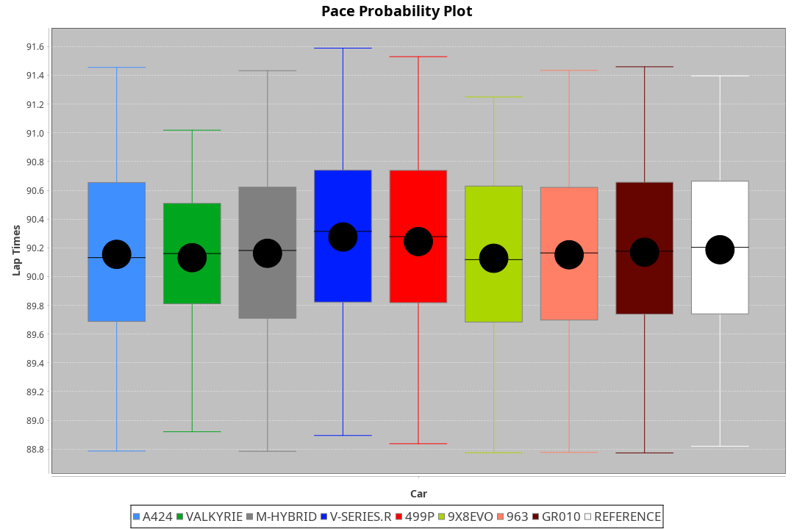
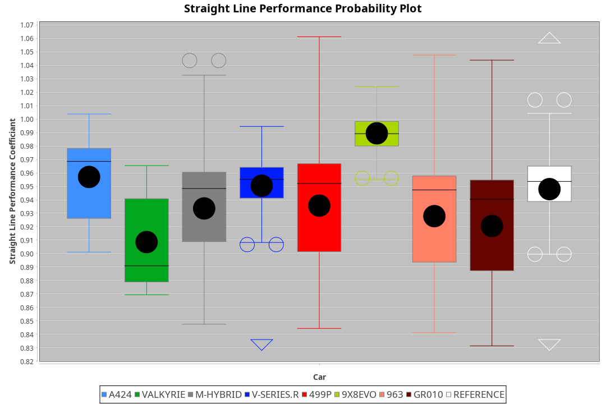
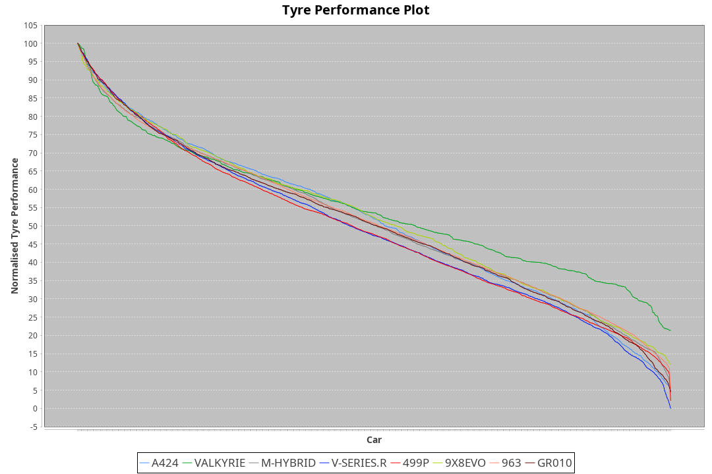

| Manufacturer | Car        | Weight | Power   | PINC    | E/Stint | FDS     |
|:-|:-|:-|:-|:-|:-|:-|
| Alpine       | A424       | 1066kg | 506.0kw | 2.70%   | 915MJ   |    -    |
| Aston Martin | Valkyrie   | 1034kg | 520.0kw |    -    | 911MJ   |    -    |
| BMW          | M-Hybrid   | 1062kg | 512.0kw | 1.50%   | 914MJ   |    -    |
| Cadillac     | V-Series.R | 1058kg | 516.0kw | -1.00%  | 908MJ   |    -    |
| Ferrari      | 499P       | 1086kg | 489.0kw | 6.30%   | 905MJ   | 200kph  |
| Peugeot      | 9X8Evo     | 1032kg | 520.0kw | -7.50%  | 906MJ   | 190kph  |
| Porsche      | 963        | 1061kg | 500.0kw | 4.00%   | 907MJ   |    -    |
| Toyota       | GR010      | 1086kg | 489.0kw | 6.50%   | 907MJ   | 200kph  |

### BoP Accuracy: 94.08%; Overall BoP Grade: A2
| Manufacturer | Car        | Type  | RP      | QP      | Weight | Power¹  | Threshhold | PINC    | Power²   | E/Stint | AVG Vmax  | FDS     | RDLC | L/Stint | BOP-Grade | Model Accuracy | Model Points | Match%  | SimDiff |
|:-|:-|:-|:-|:-|:-|:-|:-|:-|:-|:-|:-|:-|:-|:-|:-|:-|:-|:-|:-|
| Alpine       | A424       | LMDH  | 1:30.12 | 1:28.57 | 1066kg | 506.0kw | 210.0kph   | 2.70%   | 519.70kw |  915MJ  | 307.85kph |    -    | 1.01 | 40      | ~A1       | 98.45%         | 2220         | 99.30%  | +0.21   |
| Aston Martin | Valkyrie   | LMHNH | 1:30.12 | 1:28.09 | 1034kg | 520.0kw | 210.0kph   |    -    | 520.00kw |  911MJ  | 311.54kph |    -    | 1.04 | 40      | +C2       | 100.00%        | 466          | 72.99%  | #       |
| BMW          | M-Hybrid   | LMDH  | 1:30.13 | 1:28.30 | 1062kg | 512.0kw | 210.0kph   | 1.50%   | 519.70kw |  914MJ  | 310.52kph |    -    | 1.02 | 40      | ~A1       | 100.00%        | 3339         | 100.00% | +0.21   |
| Cadillac     | V-Series.R | LMDH  | 1:30.24 | 1:28.34 | 1058kg | 516.0kw | 210.0kph   | -1.00%  | 510.80kw |  908MJ  | 311.26kph |    -    | 1.02 | 40      | +A2       | 99.03%         | 6041         | 93.23%  | +0.11   |
| Ferrari      | 499P       | LMHHU | 1:30.19 | 1:28.21 | 1086kg | 489.0kw | 210.0kph   | 6.30%   | 519.80kw |  905MJ  | 309.66kph | 200kph  | 1.02 | 40      | ~A1       | 99.97%         | 7286         | 100.00% | +0.76   |
| Peugeot      | 9X8Evo     | LMHHU | 1:30.12 | 1:28.40 | 1032kg | 520.0kw | 210.0kph   | -7.50%  | 481.00kw |  906MJ  | 317.40kph | 190kph  | 1.02 | 40      | +B1       | 100.00%        | 1890         | 87.12%  | +0.19   |
| Porsche      | 963        | LMDH  | 1:30.13 | 1:28.27 | 1061kg | 500.0kw | 210.0kph   | 4.00%   | 520.00kw |  907MJ  | 309.94kph |    -    | 1.02 | 40      | ~A1       | 99.89%         | 15174        | 100.00% | +0.37   |
| Toyota       | GR010      | LMHHU | 1:30.12 | 1:28.23 | 1086kg | 489.0kw | 210.0kph   | 6.50%   | 520.80kw |  907MJ  | 308.81kph | 200kph  | 1.02 | 40      | ~A1       | 99.82%         | 5457         | 100.00% | +0.40   |

## Power below Threshhold
| N/Nmax    | A424    | VALKYRIE | M-HYBRID | V-SERIES.R | 499P    | 9X8EVO  | 963     | GR010   |
|:-|:-|:-|:-|:-|:-|:-|:-|:-|
|  0.550    |  249    |  256     |  252     |  254       |  241    |  256    |  246    |  241    |
|  0.575    |  272    |  279     |  275     |  277       |  263    |  279    |  269    |  263    |
|  0.600    |  292    |  300     |  296     |  298       |  282    |  300    |  289    |  282    |
|  0.625    |  313    |  322     |  317     |  319       |  302    |  322    |  309    |  302    |
|  0.650    |  334    |  343     |  338     |  340       |  323    |  343    |  330    |  323    |
|  0.675    |  355    |  365     |  359     |  362       |  343    |  365    |  351    |  343    |
|  0.700    |  377    |  387     |  381     |  384       |  364    |  387    |  372    |  364    |
|  0.725    |  398    |  409     |  403     |  406       |  385    |  409    |  393    |  385    |
|  0.750    |  418    |  430     |  423     |  427       |  404    |  430    |  413    |  404    |
|  0.775    |  437    |  449     |  442     |  446       |  423    |  449    |  432    |  423    |
|  0.800    |  454    |  467     |  460     |  463       |  439    |  467    |  449    |  439    |
|  0.825    |  469    |  482     |  475     |  478       |  454    |  482    |  464    |  454    |
|  0.850    |  481    |  494     |  486     |  490       |  465    |  494    |  475    |  465    |
|  0.875    |  491    |  505     |  497     |  501       |  475    |  505    |  485    |  475    |
|  0.900    |  498    |  512     |  504     |  508       |  481    |  512    |  492    |  481    |
|  0.925    |  503    |  517     |  509     |  513       |  486    |  517    |  497    |  486    |
| **0.950** | **506** | **520**  | **512**  | **516**    | **489** | **520** | **500** | **489** |
|  0.975    |  504    |  518     |  510     |  514       |  487    |  518    |  498    |  487    |
|  1.000    |  501    |  514     |  506     |  510       |  484    |  514    |  495    |  484    |
|  1.025    |  432    |  444     |  437     |  441       |  418    |  444    |  427    |  418    |

## Power above Threshhold
| N/Nmax    | A424       | VALKYRIE | M-HYBRID   | V-SERIES.R | 499P       | 9X8EVO  | 963     | GR010      |
|:-|:-|:-|:-|:-|:-|:-|:-|:-|
|  0.550    |  256.33    |  256     |  256.34    |  251.41    |  256.40    |  237    |  256    |  256.39    |
|  0.575    |  279.36    |  279     |  279.37    |  274.45    |  279.43    |  259    |  279    |  279.42    |
|  0.600    |  299.38    |  300     |  299.39    |  295.49    |  299.46    |  278    |  300    |  300.45    |
|  0.625    |  321.41    |  322     |  321.42    |  316.52    |  321.50    |  298    |  322    |  322.49    |
|  0.650    |  342.44    |  343     |  342.45    |  337.56    |  342.53    |  318    |  343    |  343.52    |
|  0.675    |  364.46    |  365     |  364.48    |  358.59    |  364.57    |  338    |  365    |  365.55    |
|  0.700    |  386.49    |  387     |  386.51    |  380.63    |  386.60    |  359    |  387    |  387.58    |
|  0.725    |  408.52    |  409     |  408.53    |  401.66    |  408.63    |  379    |  409    |  409.62    |
|  0.750    |  429.55    |  430     |  429.56    |  422.70    |  429.67    |  398    |  430    |  430.65    |
|  0.775    |  448.57    |  449     |  448.59    |  441.73    |  448.70    |  416    |  449    |  449.68    |
|  0.800    |  466.59    |  467     |  466.61    |  458.75    |  466.72    |  432    |  467    |  467.70    |
|  0.825    |  481.61    |  482     |  481.63    |  473.78    |  481.75    |  446    |  482    |  482.73    |
|  0.850    |  493.63    |  494     |  493.65    |  485.80    |  493.77    |  457    |  494    |  494.75    |
|  0.875    |  504.64    |  505     |  504.66    |  495.82    |  504.78    |  467    |  505    |  505.76    |
|  0.900    |  511.65    |  512     |  511.67    |  502.83    |  511.79    |  473    |  512    |  512.77    |
|  0.925    |  516.66    |  517     |  516.68    |  507.84    |  516.80    |  478    |  517    |  517.78    |
| **0.950** | **519.66** | **520**  | **519.68** | **510.84** | **519.81** | **481** | **520** | **520.79** |
|  0.975    |  517.66    |  518     |  517.68    |  508.84    |  517.80    |  479    |  518    |  518.78    |
|  1.000    |  513.65    |  514     |  513.67    |  505.83    |  513.80    |  476    |  514    |  514.78    |
|  1.025    |  443.57    |  444     |  443.58    |  436.72    |  443.69    |  411    |  444    |  444.67    |
