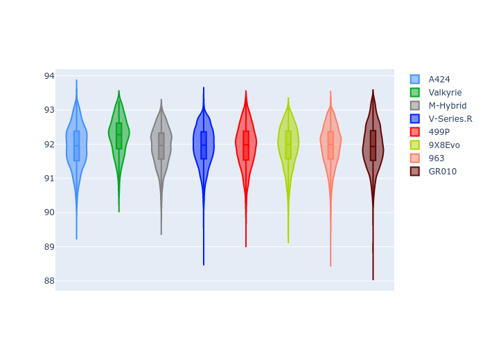
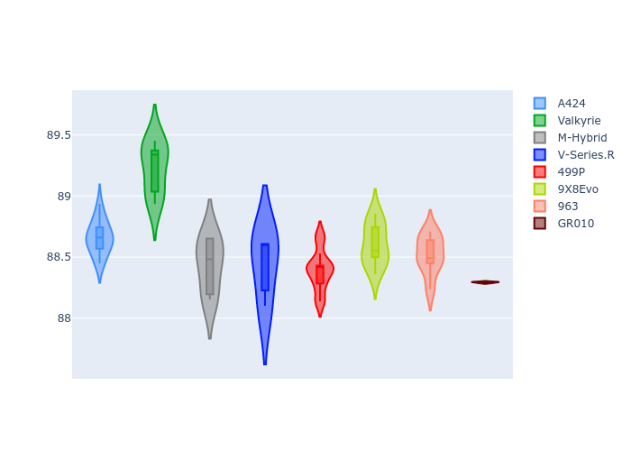
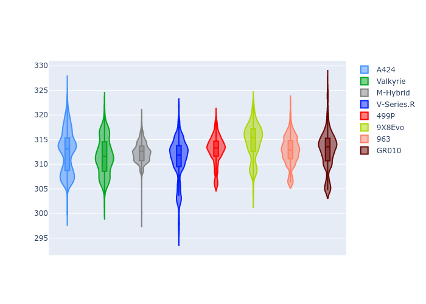
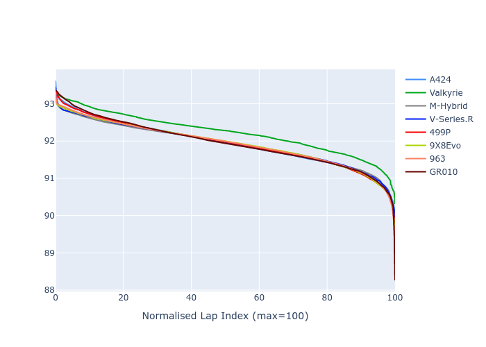

# Combined Plots

## Metadata

- BoP Accuracy: 99.88%
- Overall BoP Grade: A1
- Track: FUJI
- Threshhold: 250.0kph
- Average Laptime: 1:31.97
- Average Quali Laptime: 1:28.77
- Laptime Std Dev: 0.10 seconds
- Filtered Average Topspeed: 309.81kph

## BoP Table
| Manufacturer   | Car        | Weight   | Power   | PINC   | E/Stint   | FDS    | RDP    | QDP    | TDP    |
|:---------------|:-----------|:---------|:--------|:-------|:----------|:-------|:-------|:-------|:-------|
| Alpine         | A424       | 1039kg   | 480.0kw | +5.10% | 896MJ     | -      | 51.45% | 55.09% | 24.89% |
| Aston Martin   | Valkyrie   | 1030kg   | 520.0kw | -      | 911MJ     | -      | 53.07% | 48.70% | 24.00% |
| BMW            | M-Hybrid   | 1039kg   | 482.0kw | +5.40% | 895MJ     | -      | 52.63% | 52.34% | 34.06% |
| Cadillac       | V-Series.R | 1040kg   | 520.0kw | -0.90% | 909MJ     | -      | 48.80% | 57.26% | 18.10% |
| Ferrari        | 499P       | 1060kg   | 516.0kw | -6.80% | 893MJ     | 190kph | 51.39% | 44.34% | 9.89%  |
| Peugeot        | 9X8Evo     | 1030kg   | 519.0kw | -7.20% | 902MJ     | 200kph | 49.16% | 50.25% | 18.00% |
| Porsche        | 963        | 1035kg   | 480.0kw | +0.10% | 877MJ     | -      | 50.61% | 41.90% | 27.68% |
| Toyota         | GR010      | 1058kg   | 499.0kw | -3.00% | 890MJ     | 190kph | 51.33% | 51.71% | 14.89% |

## Performance Table
| Manufacturer   | Car        | RP      | QP      | Vavg      |   RDLC | BOP-Grade   | Match   |
|:---------------|:-----------|:--------|:--------|:----------|-------:|:------------|:--------|
| Alpine         | A424       | 1:31.94 | 1:28.88 | 309.34kph |   1.03 | ~A1         | 99.88%  |
| Aston Martin   | Valkyrie   | 1:32.23 | 1:29.31 | 313.32kph |   1.03 | ~A1         | 100.00% |
| BMW            | M-Hybrid   | 1:31.93 | 1:28.66 | 309.52kph |   1.04 | ~A1         | 100.00% |
| Cadillac       | V-Series.R | 1:31.93 | 1:28.64 | 310.17kph |   1.04 | ~A1         | 99.90%  |
| Ferrari        | 499P       | 1:31.94 | 1:28.55 | 309.40kph |   1.04 | ~A1         | 99.91%  |
| Peugeot        | 9X8Evo     | 1:31.93 | 1:28.87 | 309.73kph |   1.03 | ~A1         | 100.00% |
| Porsche        | 963        | 1:31.94 | 1:28.89 | 307.38kph |   1.03 | ~A1         | 99.93%  |
| Toyota         | GR010      | 1:31.94 | 1:28.38 | 309.62kph |   1.04 | ~A1         | 99.43%  |

## Race Laptimes

## Quali Laptimes

## Topspeeds

## Laptimes Lineplot

