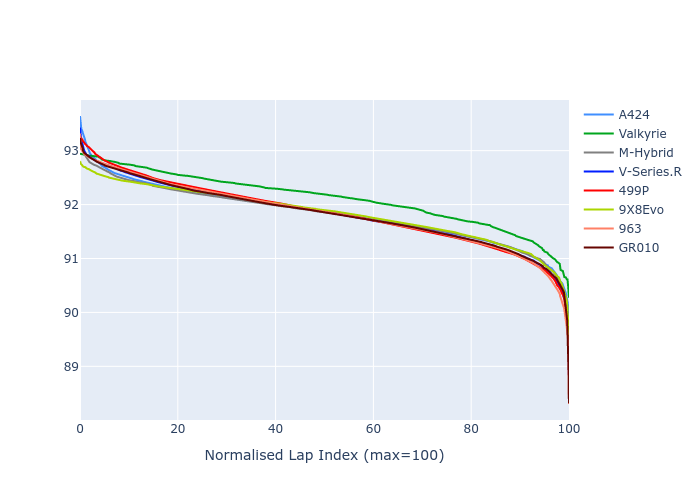

# Combined Plots

## Metadata

- BoP Accuracy: 99.80%
- Overall BoP Grade: A1
- Track: FUJI
- Threshhold: 210.0kph

## BoP Table
| Manufacturer   | Car        | Weight   | Power   | PINC   | E/Stint   | FDS    |
|:---------------|:-----------|:---------|:--------|:-------|:----------|:-------|
| Alpine         | A424       | 1042kg   | 497.0kw | +0.30% | 899MJ     | -      |
| Aston Martin   | Valkyrie   | 1030kg   | 520.0kw | -0.30% | 910MJ     | -      |
| BMW            | M-Hybrid   | 1043kg   | 497.0kw | +1.90% | 899MJ     | -      |
| Cadillac       | V-Series.R | 1049kg   | 509.0kw | +2.10% | 907MJ     | -      |
| Ferrari        | 499P       | 1069kg   | 480.0kw | +3.20% | 888MJ     | 190kph |
| Peugeot        | 9X8Evo     | 1031kg   | 514.0kw | -6.60% | 903MJ     | 190kph |
| Porsche        | 963        | 1043kg   | 495.0kw | +2.10% | 896MJ     | -      |
| Toyota         | GR010      | 1068kg   | 480.0kw | +3.60% | 890MJ     | 190kph |

## Performance Table
| Manufacturer   | Car        | RP      | QP      | Vavg      |   RDLC | BOP-Grade   | Match   |
|:---------------|:-----------|:--------|:--------|:----------|-------:|:------------|:--------|
| Alpine         | A424       | 1:30.02 | 1:28.65 | 306.86kph |   1.02 | ~A1         | 99.62%  |
| Aston Martin   | Valkyrie   | 1:30.02 | 1:28.03 | 311.70kph |   1.02 | ~A1         | 100.00% |
| BMW            | M-Hybrid   | 1:30.02 | 1:28.36 | 306.97kph |   1.02 | ~A1         | 99.96%  |
| Cadillac       | V-Series.R | 1:30.03 | 1:28.44 | 305.73kph |   1.02 | ~A1         | 99.96%  |
| Ferrari        | 499P       | 1:30.03 | 1:28.29 | 305.19kph |   1.02 | ~A1         | 99.98%  |
| Peugeot        | 9X8Evo     | 1:30.03 | 1:28.38 | 307.84kph |   1.02 | ~A1         | 99.00%  |
| Porsche        | 963        | 1:30.02 | 1:28.41 | 306.87kph |   1.02 | ~A1         | 99.89%  |
| Toyota         | GR010      | 1:30.03 | 1:28.21 | 306.14kph |   1.02 | ~A1         | 99.97%  |

## Race Laptimes

## Quali Laptimes

## Topspeeds

## Laptimes Lineplot

