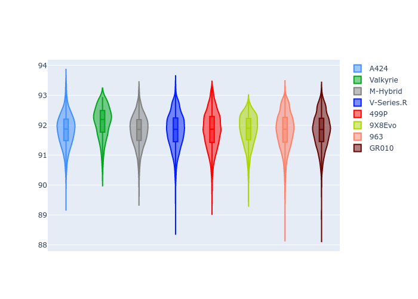

# Combined Plots

## Metadata

- BoP Accuracy: 99.91%
- Overall BoP Grade: A1
- Track: FUJI
- Threshhold: 250.0kph

## BoP Table
| Manufacturer   | Car        | Weight   | Power   | PINC   | E/Stint   | FDS    | RDP    | QDP    | TDP    |
|:---------------|:-----------|:---------|:--------|:-------|:----------|:-------|:-------|:-------|:-------|
| Alpine         | A424       | 1040kg   | 504.0kw | +1.80% | 909MJ     | -      | 52.35% | 61.85% | 27.84% |
| Aston Martin   | Valkyrie   | 1030kg   | 520.0kw | -0.80% | 909MJ     | -      | 53.59% | 53.33% | 21.51% |
| BMW            | M-Hybrid   | 1044kg   | 503.0kw | +3.30% | 909MJ     | -      | 53.26% | 57.23% | 34.54% |
| Cadillac       | V-Series.R | 1049kg   | 520.0kw | -      | 913MJ     | -      | 47.80% | 56.73% | 19.63% |
| Ferrari        | 499P       | 1068kg   | 511.0kw | -      | 909MJ     | 190kph | 53.02% | 42.32% | 9.88%  |
| Peugeot        | 9X8Evo     | 1030kg   | 520.0kw | -2.90% | 915MJ     | 190kph | 48.47% | 51.26% | 16.02% |
| Porsche        | 963        | 1043kg   | 506.0kw | +1.80% | 906MJ     | -      | 50.87% | 45.25% | 30.77% |
| Toyota         | GR010      | 1064kg   | 512.0kw | -1.70% | 906MJ     | 190kph | 52.43% | 57.12% | 12.82% |

## Performance Table
| Manufacturer   | Car        | RP      | QP      | Vavg      |   RDLC | BOP-Grade   | Match   |
|:---------------|:-----------|:--------|:--------|:----------|-------:|:------------|:--------|
| Alpine         | A424       | 1:30.14 | 1:28.64 | 309.75kph |   1.02 | ~A1         | 99.79%  |
| Aston Martin   | Valkyrie   | 1:30.14 | 1:28.12 | 311.24kph |   1.02 | ~A1         | 100.00% |
| BMW            | M-Hybrid   | 1:30.16 | 1:28.34 | 309.45kph |   1.02 | ~A1         | 100.00% |
| Cadillac       | V-Series.R | 1:30.15 | 1:28.36 | 306.13kph |   1.02 | ~A1         | 100.00% |
| Ferrari        | 499P       | 1:30.15 | 1:27.93 | 309.56kph |   1.03 | ~A1         | 99.83%  |
| Peugeot        | 9X8Evo     | 1:30.14 | 1:28.48 | 312.34kph |   1.02 | ~A1         | 100.00% |
| Porsche        | 963        | 1:30.15 | 1:28.39 | 309.53kph |   1.02 | ~A1         | 99.87%  |
| Toyota         | GR010      | 1:30.15 | 1:27.83 | 309.74kph |   1.03 | ~A1         | 99.76%  |

## Race Laptimes

## Quali Laptimes

## Topspeeds

## Laptimes Lineplot

