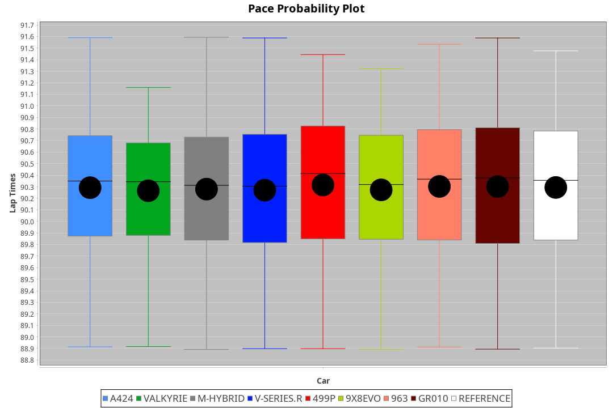
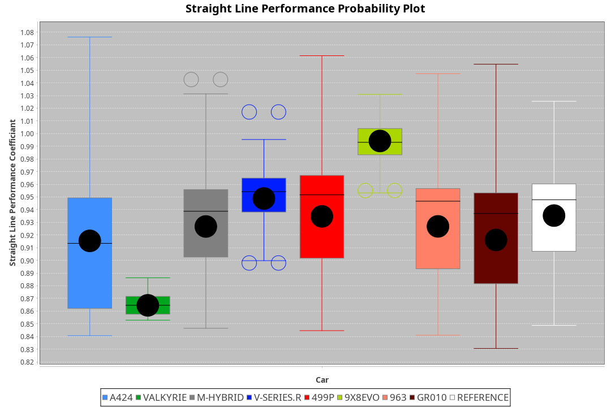
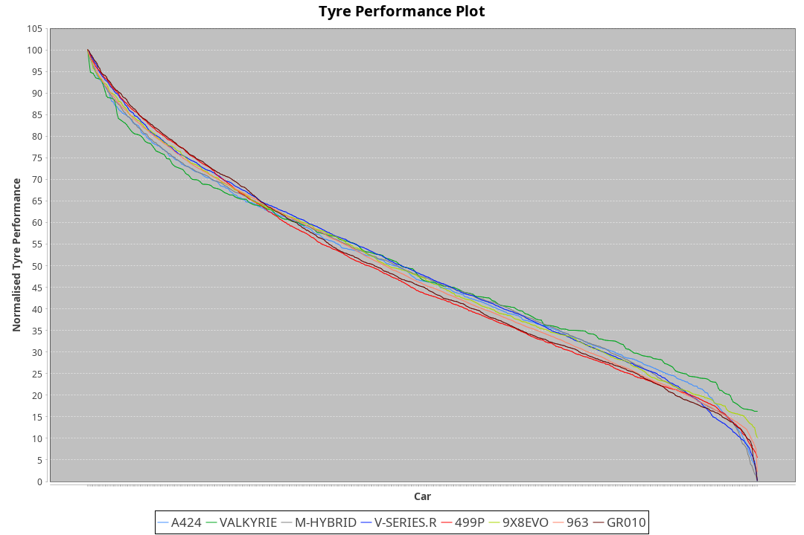

| Manufacturer | Car        | Weight | Power   | PINC    | E/Stint | FDS     |
|:-|:-|:-|:-|:-|:-|:-|
| Alpine       | A424       | 1033kg | 520.0kw | -0.80%  | 916MJ   |    -    |
| Aston Martin | Valkyrie   | 1030kg | 520.0kw |    -    | 911MJ   |    -    |
| BMW          | M-Hybrid   | 1036kg | 520.0kw | -0.20%  | 914MJ   |    -    |
| Cadillac     | V-Series.R | 1045kg | 518.0kw | 0.30%   | 911MJ   |    -    |
| Ferrari      | 499P       | 1063kg | 520.0kw | -1.20%  | 913MJ   | 190kph  |
| Peugeot      | 9X8Evo     | 1030kg | 520.0kw | -3.50%  | 914MJ   | 190kph  |
| Porsche      | 963        | 1039kg | 504.0kw | 3.10%   | 907MJ   |    -    |
| Toyota       | GR010      | 1069kg | 514.0kw | 1.10%   | 916MJ   | 190kph  |

### BoP Accuracy: 71.97%; Overall BoP Grade: C2
| Manufacturer | Car        | Type  | RP      | QP      | Weight | Power¹  | Threshhold | PINC    | Power²   | E/Stint | AVG Vmax  | FDS     | RDLC | L/Stint | BOP-Grade | Model Accuracy | Model Points | Match% | SimDiff |
|:-|:-|:-|:-|:-|:-|:-|:-|:-|:-|:-|:-|:-|:-|:-|:-|:-|:-|:-|:-|
| Alpine       | A424       | LMDH  | 1:29.83 | 1:28.76 | 1033kg | 520.0kw | 250.0kph   | -0.80%  | 515.80kw |  916MJ  | 327.50kph |    -    | 1.01 | 40      | -B2       | 99.49%         | 1360         | 84.72% | -0.08   |
| Aston Martin | Valkyrie   | LMHNH | 1:32.29 | 1:30.49 | 1030kg | 520.0kw | 0.0kph     |    -    | 520.00kw |  911MJ  | 318.07kph |    -    | 1.03 | 40      | +Ω2       | 100.00%        | 312          | -8.52% | #       |
| BMW          | M-Hybrid   | LMDH  | 1:29.84 | 1:28.00 | 1036kg | 520.0kw | 250.0kph   | -0.20%  | 519.00kw |  914MJ  | 326.35kph |    -    | 1.02 | 40      | -B1       | 98.62%         | 2363         | 85.20% | +0.19   |
| Cadillac     | V-Series.R | LMDH  | 1:29.85 | 1:28.31 | 1045kg | 518.0kw | 250.0kph   | 0.30%   | 519.60kw |  911MJ  | 320.45kph |    -    | 1.02 | 40      | -B1       | 98.50%         | 4201         | 85.91% | +0.52   |
| Ferrari      | 499P       | LMHHU | 1:29.83 | 1:28.17 | 1063kg | 520.0kw | 250.0kph   | -1.20%  | 513.80kw |  913MJ  | 324.55kph | 190kph  | 1.02 | 40      | -B2       | 100.00%        | 4441         | 81.59% | +0.56   |
| Peugeot      | 9X8Evo     | LMHHU | 1:29.84 | 1:28.50 | 1030kg | 520.0kw | 250.0kph   | -3.50%  | 501.80kw |  914MJ  | 325.70kph | 190kph  | 1.02 | 40      | -C1       | 100.00%        | 808          | 78.67% | +0.30   |
| Porsche      | 963        | LMDH  | 1:29.85 | 1:27.98 | 1039kg | 504.0kw | 250.0kph   | 3.10%   | 519.60kw |  907MJ  | 324.20kph |    -    | 1.02 | 40      | -B2       | 99.87%         | 12613        | 83.90% | +0.36   |
| Toyota       | GR010      | LMHHU | 1:29.84 | 1:28.01 | 1069kg | 514.0kw | 250.0kph   | 1.10%   | 519.70kw |  916MJ  | 321.98kph | 190kph  | 1.02 | 40      | -B2       | 99.73%         | 2956         | 84.27% | +0.12   |

## Power below Threshhold
| N/Nmax    | A424    | VALKYRIE | M-HYBRID | V-SERIES.R | 499P    | 9X8EVO  | 963     | GR010   |
|:-|:-|:-|:-|:-|:-|:-|:-|:-|
|  0.550    |  256    |  256     |  256     |  255       |  256    |  256    |  248    |  253    |
|  0.575    |  279    |  279     |  279     |  278       |  279    |  279    |  271    |  276    |
|  0.600    |  300    |  300     |  300     |  299       |  300    |  300    |  291    |  297    |
|  0.625    |  322    |  322     |  322     |  321       |  322    |  322    |  312    |  318    |
|  0.650    |  343    |  343     |  343     |  342       |  343    |  343    |  333    |  339    |
|  0.675    |  365    |  365     |  365     |  364       |  365    |  365    |  354    |  361    |
|  0.700    |  387    |  387     |  387     |  386       |  387    |  387    |  375    |  383    |
|  0.725    |  409    |  409     |  409     |  407       |  409    |  409    |  396    |  404    |
|  0.750    |  430    |  430     |  430     |  428       |  430    |  430    |  416    |  425    |
|  0.775    |  449    |  449     |  449     |  447       |  449    |  449    |  435    |  444    |
|  0.800    |  467    |  467     |  467     |  465       |  467    |  467    |  453    |  462    |
|  0.825    |  482    |  482     |  482     |  480       |  482    |  482    |  468    |  477    |
|  0.850    |  494    |  494     |  494     |  492       |  494    |  494    |  479    |  488    |
|  0.875    |  505    |  505     |  505     |  503       |  505    |  505    |  489    |  499    |
|  0.900    |  512    |  512     |  512     |  510       |  512    |  512    |  496    |  506    |
|  0.925    |  517    |  517     |  517     |  515       |  517    |  517    |  501    |  511    |
| **0.950** | **520** | **520**  | **520**  | **518**    | **520** | **520** | **504** | **514** |
|  0.975    |  518    |  518     |  518     |  516       |  518    |  518    |  502    |  512    |
|  1.000    |  514    |  514     |  514     |  512       |  514    |  514    |  499    |  508    |
|  1.025    |  444    |  444     |  444     |  442       |  444    |  444    |  430    |  439    |

## Power above Threshhold
| N/Nmax    | A424       | VALKYRIE | M-HYBRID   | V-SERIES.R | 499P       | 9X8EVO     | 963        | GR010      |
|:-|:-|:-|:-|:-|:-|:-|:-|:-|
|  0.550    |  254.41    |  256     |  255.47    |  256.27    |  253.37    |  247.39    |  256.31    |  256.32    |
|  0.575    |  277.45    |  279     |  278.52    |  279.30    |  276.41    |  270.43    |  279.34    |  279.35    |
|  0.600    |  297.48    |  300     |  299.55    |  299.32    |  296.44    |  290.46    |  299.36    |  299.38    |
|  0.625    |  319.52    |  322     |  321.59    |  321.34    |  317.47    |  310.50    |  321.39    |  321.40    |
|  0.650    |  340.55    |  343     |  342.63    |  342.37    |  338.50    |  331.53    |  342.41    |  342.43    |
|  0.675    |  362.59    |  365     |  364.67    |  364.39    |  360.53    |  352.56    |  364.44    |  364.46    |
|  0.700    |  383.62    |  387     |  386.72    |  386.41    |  382.57    |  373.60    |  386.46    |  386.49    |
|  0.725    |  405.66    |  409     |  407.75    |  408.44    |  403.60    |  394.63    |  408.49    |  408.51    |
|  0.750    |  426.69    |  430     |  428.79    |  429.46    |  424.63    |  414.66    |  429.52    |  429.54    |
|  0.775    |  445.73    |  449     |  447.83    |  448.48    |  443.66    |  433.69    |  448.54    |  448.56    |
|  0.800    |  463.76    |  467     |  465.86    |  466.50    |  461.68    |  450.72    |  466.56    |  466.59    |
|  0.825    |  478.78    |  482     |  480.89    |  481.51    |  476.71    |  465.74    |  481.58    |  481.61    |
|  0.850    |  489.80    |  494     |  492.91    |  493.53    |  487.72    |  476.76    |  493.59    |  493.62    |
|  0.875    |  500.82    |  505     |  503.93    |  504.54    |  498.74    |  486.78    |  504.61    |  504.64    |
|  0.900    |  507.83    |  512     |  510.95    |  511.55    |  505.75    |  493.79    |  511.61    |  511.64    |
|  0.925    |  512.84    |  517     |  515.95    |  516.55    |  510.76    |  498.80    |  516.62    |  516.65    |
| **0.950** | **515.84** | **520**  | **518.96** | **519.55** | **513.76** | **501.80** | **519.62** | **519.65** |
|  0.975    |  513.84    |  518     |  516.96    |  517.55    |  511.76    |  499.80    |  517.62    |  517.65    |
|  1.000    |  509.83    |  514     |  512.95    |  513.55    |  507.75    |  496.79    |  513.62    |  513.65    |
|  1.025    |  440.72    |  444     |  442.82    |  443.47    |  438.65    |  428.68    |  443.53    |  443.56    |
