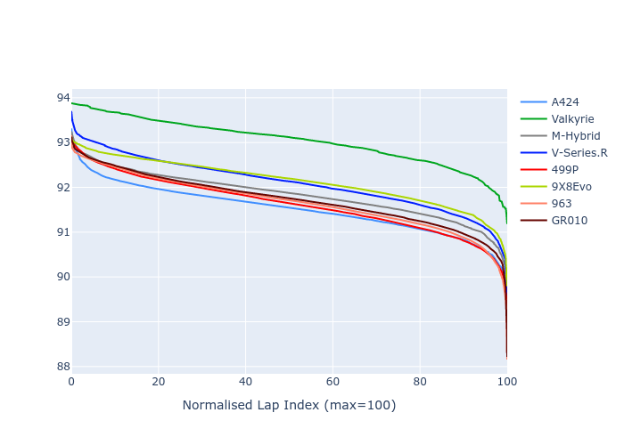

# Combined Plots

## Metadata

- BoP Accuracy: 98.67%
- Overall BoP Grade: A1
- Track: FUJI
- Threshhold: 210.0kph

## BoP Table
| Manufacturer   | Car        | Weight   | Power   | PINC   | E/Stint   | FDS    |
|:---------------|:-----------|:---------|:--------|:-------|:----------|:-------|
| Alpine         | A424       | 1047kg   | 520.0kw | -      | 919MJ     | -      |
| Aston Martin   | Valkyrie   | 1042kg   | 504.0kw | +0.40% | 899MJ     | -      |
| BMW            | M-Hybrid   | 1041kg   | 512.0kw | -      | 908MJ     | -      |
| Cadillac       | V-Series.R | 1034kg   | 510.0kw | -      | 902MJ     | -      |
| Ferrari        | 499P       | 1063kg   | 508.0kw | -      | 906MJ     | 190kph |
| Peugeot        | 9X8Evo     | 1050kg   | 510.0kw | -      | 916MJ     | 190kph |
| Porsche        | 963        | 1047kg   | 516.0kw | -      | 911MJ     | -      |
| Toyota         | GR010      | 1080kg   | 512.0kw | -      | 912MJ     | 190kph |

## Performance Table
| Manufacturer   | Car        | RP      | QP      | Vavg      |   RDLC | BOP-Grade   | Match   |
|:---------------|:-----------|:--------|:--------|:----------|-------:|:------------|:--------|
| Alpine         | A424       | 1:29.43 | 1:28.08 | 311.14kph |   1.02 | ~A1         | 99.81%  |
| Aston Martin   | Valkyrie   | 1:30.62 | 1:28.59 | 307.50kph |   1.02 | +A2         | 93.26%  |
| BMW            | M-Hybrid   | 1:29.68 | 1:28.04 | 308.93kph |   1.02 | ~A1         | 99.96%  |
| Cadillac       | V-Series.R | 1:29.95 | 1:28.36 | 305.82kph |   1.02 | ~A1         | 99.62%  |
| Ferrari        | 499P       | 1:29.32 | 1:27.63 | 309.50kph |   1.02 | ~A1         | 99.19%  |
| Peugeot        | 9X8Evo     | 1:29.90 | 1:28.26 | 310.58kph |   1.02 | ~A1         | 97.87%  |
| Porsche        | 963        | 1:29.60 | 1:28.02 | 309.34kph |   1.02 | ~A1         | 99.87%  |
| Toyota         | GR010      | 1:29.47 | 1:27.68 | 309.13kph |   1.02 | ~A1         | 99.80%  |

## Race Laptimes

## Quali Laptimes

## Topspeeds

## Laptimes Lineplot

