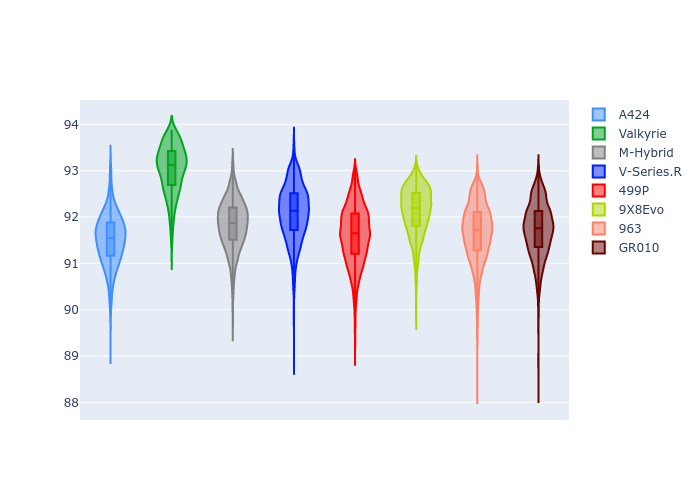

# Combined Plots

## Metadata

- BoP Accuracy: 95.89%
- Overall BoP Grade: A1
- Track: FUJI
- Threshhold: 210.0kph
- Average Laptime: 1:31.95
- Average Quali Laptime: 1:28.62
- Average Topspeed: 311.99kph

## BoP Table
| Manufacturer   | Car        | Weight   | Power   | PINC   | E/Stint   | FDS    | RDP    | QDP    | TDP    |
|:---------------|:-----------|:---------|:--------|:-------|:----------|:-------|:-------|:-------|:-------|
| Alpine         | A424       | 1047kg   | 520.0kw | -      | 920MJ     | -      | 51.64% | 59.31% | 26.80% |
| Aston Martin   | Valkyrie   | 1042kg   | 504.0kw | +0.40% | 899MJ     | -      | 53.50% | 53.33% | 21.51% |
| BMW            | M-Hybrid   | 1041kg   | 512.0kw | -      | 908MJ     | -      | 52.89% | 56.22% | 33.41% |
| Cadillac       | V-Series.R | 1034kg   | 510.0kw | -      | 902MJ     | -      | 48.63% | 60.80% | 19.01% |
| Ferrari        | 499P       | 1063kg   | 508.0kw | -      | 905MJ     | 190kph | 51.38% | 44.98% | 9.83%  |
| Peugeot        | 9X8Evo     | 1050kg   | 510.0kw | -      | 917MJ     | 190kph | 48.87% | 52.78% | 15.41% |
| Porsche        | 963        | 1047kg   | 516.0kw | -      | 911MJ     | -      | 50.70% | 44.30% | 29.51% |
| Toyota         | GR010      | 1080kg   | 512.0kw | -      | 912MJ     | 190kph | 51.09% | 52.71% | 11.46% |

## Performance Table
| Manufacturer   | Car        | RP      | QP      | Vavg      |   RDLC | BOP-Grade   | Match   |
|:---------------|:-----------|:--------|:--------|:----------|-------:|:------------|:--------|
| Alpine         | A424       | 1:31.50 | 1:28.44 | 312.87kph |   1.03 | ~A1         | 99.97%  |
| Aston Martin   | Valkyrie   | 1:33.04 | 1:29.45 | 309.69kph |   1.04 | +D1         | 68.29%  |
| BMW            | M-Hybrid   | 1:31.84 | 1:28.44 | 311.17kph |   1.04 | ~A1         | 100.00% |
| Cadillac       | V-Series.R | 1:32.09 | 1:28.72 | 308.92kph |   1.04 | ~A1         | 99.28%  |
| Ferrari        | 499P       | 1:31.62 | 1:28.20 | 313.60kph |   1.04 | ~A1         | 99.94%  |
| Peugeot        | 9X8Evo     | 1:32.13 | 1:28.92 | 312.12kph |   1.04 | ~A1         | 100.00% |
| Porsche        | 963        | 1:31.67 | 1:28.60 | 314.13kph |   1.03 | ~A1         | 99.84%  |
| Toyota         | GR010      | 1:31.73 | 1:28.18 | 313.45kph |   1.04 | ~A1         | 99.79%  |

## Race Laptimes

## Quali Laptimes

## Topspeeds

## Laptimes Lineplot

