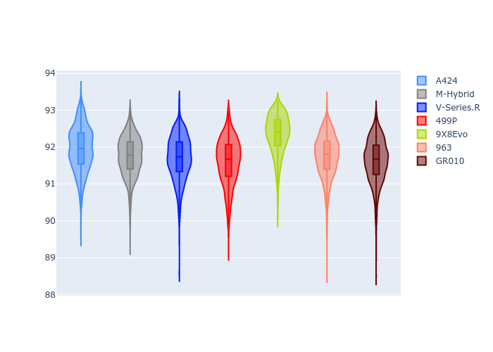
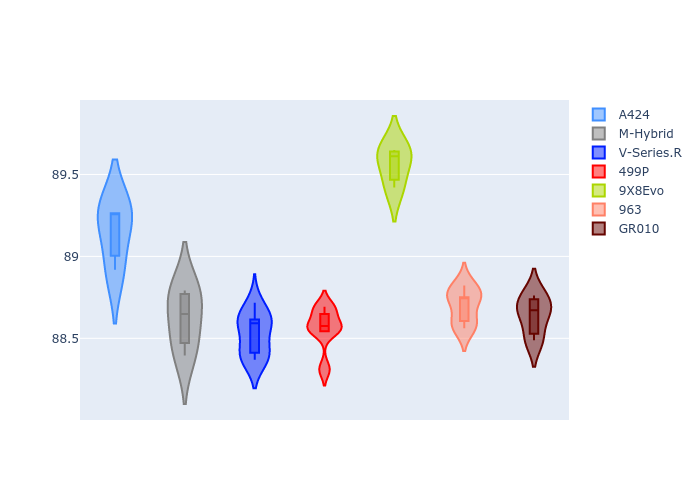
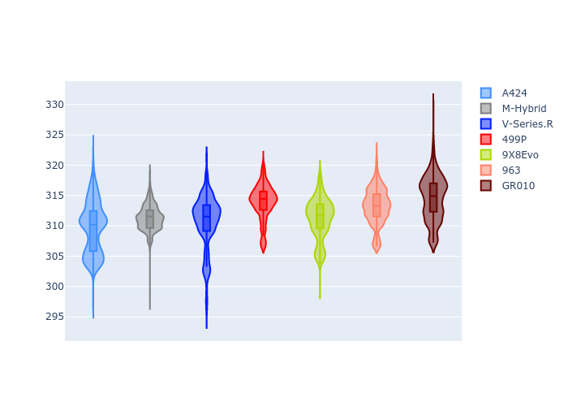
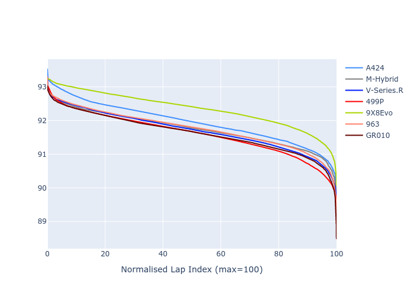

# Combined Plots

## Metadata

- BoP Accuracy: 99.75%
- Overall BoP Grade: A1
- Track: FUJI
- Threshhold: 250.0kph
- Average Laptime: 1:32.07
- Average Quali Laptime: 1:28.82
- Laptime Std Dev: 0.26 seconds
- Filtered Average Topspeed: 312.06kph

## BoP Table
| Manufacturer   | Car        | Weight   | Power   | PINC   | E/Stint   | FDS    | RDP    | QDP    | TDP    |
|:---------------|:-----------|:---------|:--------|:-------|:----------|:-------|:-------|:-------|:-------|
| Alpine         | A424       | 1042kg   | 518.0kw | -3.70% | 907MJ     | -      | 51.38% | 57.54% | 26.10% |
| BMW            | M-Hybrid   | 1037kg   | 515.0kw | -1.20% | 907MJ     | -      | 52.62% | 53.36% | 32.99% |
| Cadillac       | V-Series.R | 1036kg   | 520.0kw | -0.80% | 909MJ     | -      | 48.29% | 59.47% | 18.65% |
| Ferrari        | 499P       | 1055kg   | 500.0kw | +1.30% | 901MJ     | 190kph | 51.25% | 43.28% | 10.17% |
| Peugeot        | 9X8Evo     | 1030kg   | 503.0kw | -1.90% | 903MJ     | 190kph | 48.70% | 50.83% | 18.68% |
| Porsche        | 963        | 1049kg   | 512.0kw | +0.20% | 908MJ     | -      | 50.57% | 42.80% | 29.05% |
| Toyota         | GR010      | 1070kg   | 493.0kw | +5.40% | 908MJ     | 190kph | 51.03% | 51.78% | 14.64% |

## Performance Table
| Manufacturer   | Car        | RP      | QP      | Vavg      |   RDLC | BOP-Grade   | Match   |
|:---------------|:-----------|:--------|:--------|:----------|-------:|:------------|:--------|
| Alpine         | A424       | 1:32.10 | 1:29.15 | 309.65kph |   1.03 | ~A1         | 98.96%  |
| BMW            | M-Hybrid   | 1:31.84 | 1:28.62 | 311.32kph |   1.04 | ~A1         | 100.00% |
| Cadillac       | V-Series.R | 1:31.78 | 1:28.52 | 310.52kph |   1.04 | ~A1         | 99.97%  |
| Ferrari        | 499P       | 1:32.06 | 1:28.56 | 313.84kph |   1.04 | ~A1         | 100.00% |
| Peugeot        | 9X8Evo     | 1:32.62 | 1:29.56 | 311.00kph |   1.03 | ~A1         | 99.86%  |
| Porsche        | 963        | 1:31.96 | 1:28.70 | 313.28kph |   1.04 | ~A1         | 99.95%  |
| Toyota         | GR010      | 1:32.16 | 1:28.64 | 314.82kph |   1.04 | ~A1         | 99.50%  |

## Race Laptimes

## Quali Laptimes

## Topspeeds

## Laptimes Lineplot

