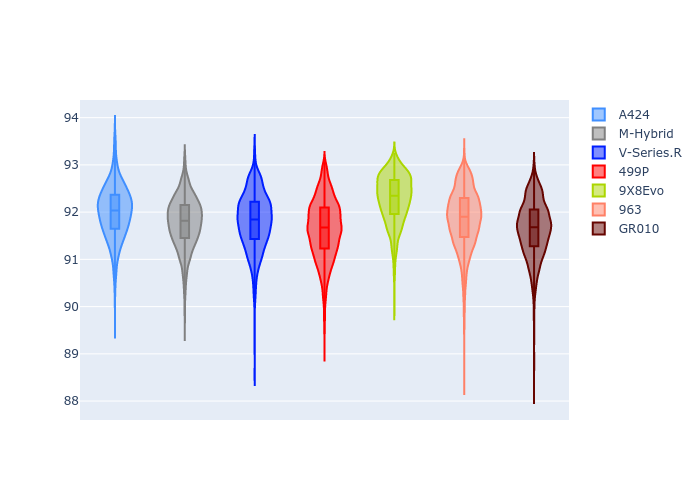

# Combined Plots

## Metadata

- BoP Accuracy: 99.11%
- Overall BoP Grade: A1
- Track: FUJI
- Threshhold: 250.0kph

## BoP Table
| Manufacturer   | Car        | Weight   | Power   | PINC   | E/Stint   | FDS    | RDP    | QDP    | TDP    |
|:---------------|:-----------|:---------|:--------|:-------|:----------|:-------|:-------|:-------|:-------|
| Alpine         | A424       | 1042kg   | 518.0kw | -3.70% | 907MJ     | -      | 52.35% | 61.85% | 27.84% |
| BMW            | M-Hybrid   | 1037kg   | 515.0kw | -1.20% | 907MJ     | -      | 53.26% | 57.23% | 34.54% |
| Cadillac       | V-Series.R | 1036kg   | 520.0kw | -0.80% | 909MJ     | -      | 47.80% | 56.73% | 19.63% |
| Ferrari        | 499P       | 1055kg   | 500.0kw | +1.30% | 901MJ     | 190kph | 53.02% | 42.32% | 9.88%  |
| Peugeot        | 9X8Evo     | 1030kg   | 503.0kw | -1.90% | 903MJ     | 190kph | 48.47% | 51.26% | 16.02% |
| Porsche        | 963        | 1049kg   | 512.0kw | +0.20% | 908MJ     | -      | 50.87% | 45.25% | 30.77% |
| Toyota         | GR010      | 1070kg   | 493.0kw | +5.40% | 908MJ     | 190kph | 52.43% | 57.12% | 12.82% |

## Performance Table
| Manufacturer   | Car        | RP      | QP      | Vavg      |   RDLC | BOP-Grade   | Match   |
|:---------------|:-----------|:--------|:--------|:----------|-------:|:------------|:--------|
| Alpine         | A424       | 1:30.32 | 1:28.81 | 307.72kph |   1.02 | ~A1         | 99.82%  |
| BMW            | M-Hybrid   | 1:30.02 | 1:28.21 | 308.91kph |   1.02 | ~A1         | 100.00% |
| Cadillac       | V-Series.R | 1:29.92 | 1:28.15 | 306.81kph |   1.02 | ~A1         | 99.85%  |
| Ferrari        | 499P       | 1:30.22 | 1:27.99 | 309.63kph |   1.03 | ~A1         | 99.83%  |
| Peugeot        | 9X8Evo     | 1:30.92 | 1:29.21 | 309.50kph |   1.02 | +A2         | 94.48%  |
| Porsche        | 963        | 1:30.24 | 1:28.48 | 308.80kph |   1.02 | ~A1         | 99.88%  |
| Toyota         | GR010      | 1:30.23 | 1:27.91 | 311.05kph |   1.03 | ~A1         | 99.93%  |

## Race Laptimes

## Quali Laptimes

## Topspeeds

## Laptimes Lineplot

