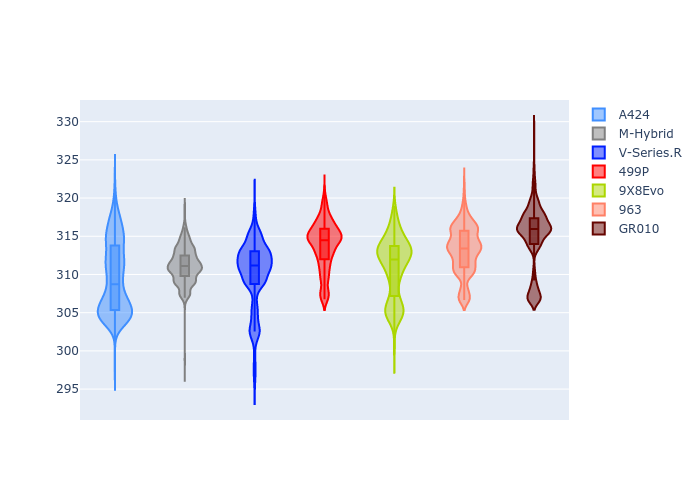

# Combined Plots

## Metadata

- BoP Accuracy: 99.39%
- Overall BoP Grade: A1
- Track: FUJI
- Threshhold: 250.0kph

## BoP Table
| Manufacturer   | Car        | Weight   | Power   | PINC   | E/Stint   | FDS    |
|:---------------|:-----------|:---------|:--------|:-------|:----------|:-------|
| Alpine         | A424       | 1042kg   | 518.0kw | -3.70% | 907MJ     | -      |
| BMW            | M-Hybrid   | 1037kg   | 515.0kw | -1.20% | 907MJ     | -      |
| Cadillac       | V-Series.R | 1036kg   | 520.0kw | -0.80% | 909MJ     | -      |
| Ferrari        | 499P       | 1055kg   | 500.0kw | +1.30% | 901MJ     | 190kph |
| Peugeot        | 9X8Evo     | 1030kg   | 503.0kw | -1.90% | 903MJ     | 190kph |
| Porsche        | 963        | 1049kg   | 512.0kw | +0.20% | 908MJ     | -      |
| Toyota         | GR010      | 1070kg   | 493.0kw | +5.40% | 908MJ     | 190kph |

## Performance Table
| Manufacturer   | Car        | RP      | QP      | Vavg      |   RDLC | BOP-Grade   | Match   |
|:---------------|:-----------|:--------|:--------|:----------|-------:|:------------|:--------|
| Alpine         | A424       | 1:29.74 | 1:28.38 | 307.93kph |   1.02 | ~A1         | 99.46%  |
| BMW            | M-Hybrid   | 1:29.65 | 1:28.00 | 308.95kph |   1.02 | ~A1         | 100.00% |
| Cadillac       | V-Series.R | 1:29.75 | 1:28.17 | 307.06kph |   1.02 | ~A1         | 99.96%  |
| Ferrari        | 499P       | 1:29.35 | 1:27.65 | 309.71kph |   1.02 | ~A1         | 99.57%  |
| Peugeot        | 9X8Evo     | 1:30.01 | 1:28.36 | 309.50kph |   1.02 | ~A1         | 96.99%  |
| Porsche        | 963        | 1:29.73 | 1:28.14 | 308.43kph |   1.02 | ~A1         | 99.89%  |
| Toyota         | GR010      | 1:29.45 | 1:27.66 | 310.61kph |   1.02 | ~A1         | 99.90%  |

## Race Laptimes

## Quali Laptimes

## Topspeeds

## Laptimes Lineplot

