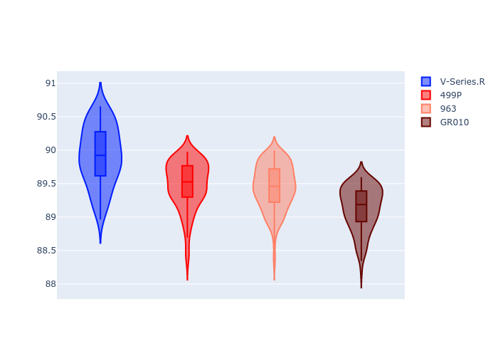
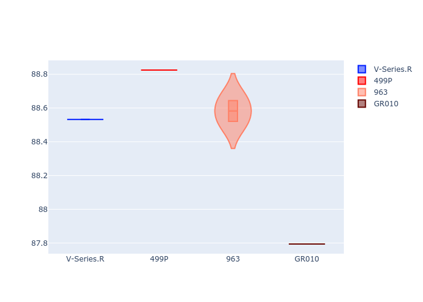
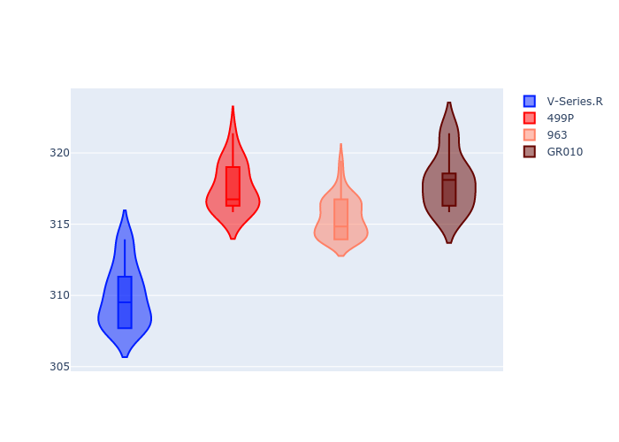
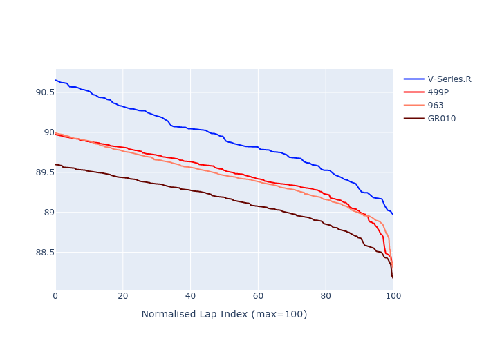

# Combined Plots

## Metadata

- BoP Accuracy: 89.35%
- Overall BoP Grade: B1
- Track: FUJI
- Threshhold: 0.0kph
- Average Laptime: 1:32.11
- Average Quali Laptime: 1:28.34
- Average Topspeed: 315.24kph

## BoP Table
| Manufacturer   | Car        | Weight   | Power   | PINC   | E/Stint   | FDS    | RDP    | QDP    | TDP    |
|:---------------|:-----------|:---------|:--------|:-------|:----------|:-------|:-------|:-------|:-------|
| Cadillac       | V-Series.R | 1039kg   | 505.0kw | -      | 894MJ     | -      | 53.88% | 50.00% | 21.12% |
| Ferrari        | 499P       | 1076kg   | 505.0kw | -      | 898MJ     | 190kph | 58.11% | 20.00% | 4.15%  |
| Porsche        | 963        | 1048kg   | 514.0kw | -      | 906MJ     | -      | 60.72% | 25.00% | 10.69% |
| Toyota         | GR010      | 1080kg   | 514.0kw | -      | 907MJ     | 190kph | 56.77% | 25.00% | 2.48%  |

## Performance Table
| Manufacturer   | Car        | RP      | QP      | Vavg      |   RDLC | BOP-Grade   | Match   |
|:---------------|:-----------|:--------|:--------|:----------|-------:|:------------|:--------|
| Cadillac       | V-Series.R | 1:32.54 | 1:28.44 | 309.95kph |   1.05 | +D2         | 61.02%  |
| Ferrari        | 499P       | 1:32.09 | 1:28.72 | 317.57kph |   1.04 | ~A1         | 99.25%  |
| Porsche        | 963        | 1:32.06 | 1:28.54 | 315.47kph |   1.04 | ~A1         | 99.05%  |
| Toyota         | GR010      | 1:31.73 | 1:27.67 | 317.98kph |   1.05 | ~A1         | 98.08%  |

## Race Laptimes

## Quali Laptimes

## Topspeeds

## Laptimes Lineplot

