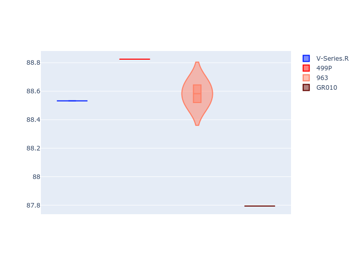
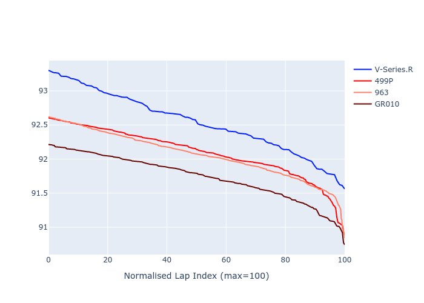

# Combined Plots

## Metadata

- BoP Accuracy: 89.35%
- Overall BoP Grade: B1
- Track: FUJI
- Threshhold: 0.0kph

## BoP Table
| Manufacturer   | Car        | Weight   | Power   | PINC   | E/Stint   | FDS    |
|:---------------|:-----------|:---------|:--------|:-------|:----------|:-------|
| Cadillac       | V-Series.R | 1039kg   | 505.0kw | -      | 894MJ     | -      |
| Ferrari        | 499P       | 1076kg   | 505.0kw | -      | 898MJ     | 190kph |
| Porsche        | 963        | 1048kg   | 514.0kw | -      | 906MJ     | -      |
| Toyota         | GR010      | 1080kg   | 514.0kw | -      | 907MJ     | 190kph |

## Performance Table
| Manufacturer   | Car        | RP      | QP      | Vavg      |   RDLC | BOP-Grade   | Match   |
|:---------------|:-----------|:--------|:--------|:----------|-------:|:------------|:--------|
| Cadillac       | V-Series.R | 1:29.92 | 1:25.65 | 306.33kph |   1.05 | +D2         | 61.02%  |
| Ferrari        | 499P       | 1:29.48 | 1:25.92 | 313.87kph |   1.04 | ~A1         | 99.24%  |
| Porsche        | 963        | 1:29.45 | 1:25.75 | 311.79kph |   1.04 | ~A1         | 99.05%  |
| Toyota         | GR010      | 1:29.13 | 1:24.90 | 314.27kph |   1.05 | ~A1         | 98.08%  |

## Race Laptimes

## Quali Laptimes

## Topspeeds

## Laptimes Lineplot

