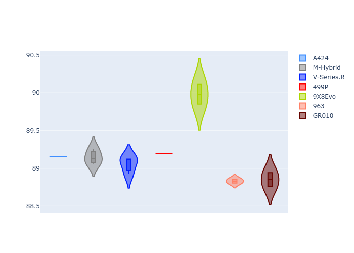

# Combined Plots

## Metadata

- BoP Accuracy: 90.74%
- Overall BoP Grade: A2
- Track: FUJI
- Threshhold: 250.0kph

## BoP Table
| Manufacturer   | Car        | Weight   | Power   | PINC   | E/Stint   | FDS    |
|:---------------|:-----------|:---------|:--------|:-------|:----------|:-------|
| Alpine         | A424       | 1042kg   | 518.0kw | -3.70% | 907MJ     | -      |
| BMW            | M-Hybrid   | 1037kg   | 515.0kw | -1.20% | 907MJ     | -      |
| Cadillac       | V-Series.R | 1036kg   | 520.0kw | -0.80% | 909MJ     | -      |
| Ferrari        | 499P       | 1055kg   | 500.0kw | +1.30% | 901MJ     | 190kph |
| Peugeot        | 9X8Evo     | 1030kg   | 503.0kw | -1.90% | 903MJ     | 190kph |
| Porsche        | 963        | 1049kg   | 512.0kw | +0.20% | 908MJ     | -      |
| Toyota         | GR010      | 1070kg   | 493.0kw | +5.40% | 908MJ     | 190kph |

## Performance Table
| Manufacturer   | Car        | RP      | QP      | Vavg      |   RDLC | BOP-Grade   | Match   |
|:---------------|:-----------|:--------|:--------|:----------|-------:|:------------|:--------|
| Alpine         | A424       | 1:32.39 | 1:29.78 | 309.81kph |   1.03 | +A2         | 93.40%  |
| BMW            | M-Hybrid   | 1:32.30 | 1:29.64 | 312.87kph |   1.03 | ~A1         | 99.52%  |
| Cadillac       | V-Series.R | 1:32.00 | 1:29.51 | 311.43kph |   1.03 | ~A1         | 98.89%  |
| Ferrari        | 499P       | 1:32.64 | 1:29.67 | 314.26kph |   1.03 | +C2         | 73.57%  |
| Peugeot        | 9X8Evo     | 1:32.60 | 1:30.49 | 312.70kph |   1.02 | +C1         | 79.64%  |
| Porsche        | 963        | 1:32.44 | 1:29.31 | 312.14kph |   1.04 | +A2         | 90.14%  |
| Toyota         | GR010      | 1:32.28 | 1:29.36 | 313.35kph |   1.03 | ~A1         | 100.00% |

## Race Laptimes

## Quali Laptimes

## Topspeeds

## Laptimes Lineplot

