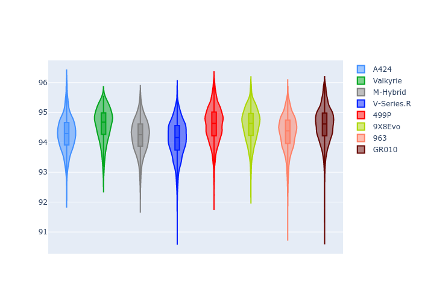
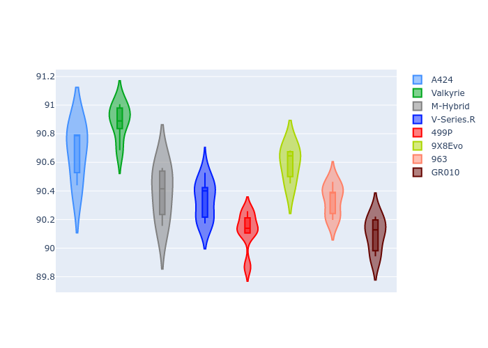
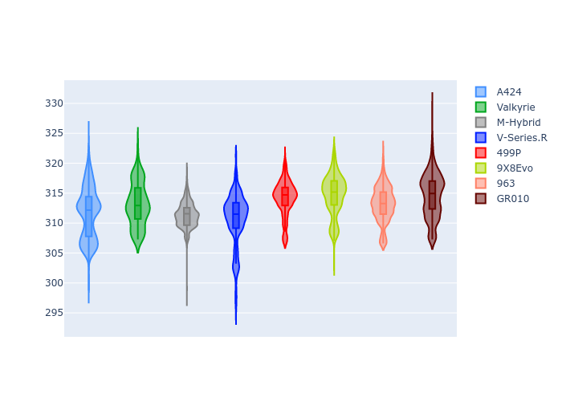
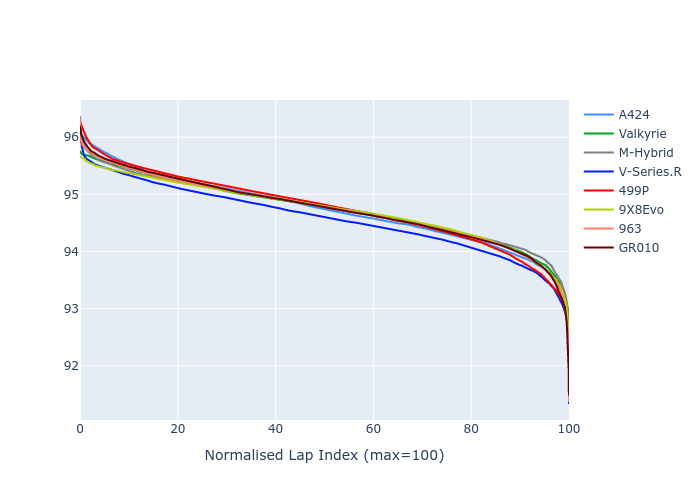

# Combined Plots

## Metadata

- BoP Accuracy: 99.66%
- Overall BoP Grade: A1
- Track: IMOLA
- Threshhold: 250.0kph
- Average Laptime: 1:34.41
- Average Quali Laptime: 1:30.31
- Average Topspeed: 312.91kph

## BoP Table
| Manufacturer   | Car        | Weight   | Power   | PINC   | E/Stint   | FDS    | RDP    | QDP    | TDP    |
|:---------------|:-----------|:---------|:--------|:-------|:----------|:-------|:-------|:-------|:-------|
| Alpine         | A424       | 1068kg   | 515.0kw | +0.70% | 922MJ     | -      | 51.64% | 59.31% | 26.80% |
| Aston Martin   | Valkyrie   | 1040kg   | 516.0kw | -      | 909MJ     | -      | 53.50% | 53.33% | 21.51% |
| BMW            | M-Hybrid   | 1060kg   | 517.0kw | -      | 917MJ     | -      | 52.89% | 56.22% | 33.41% |
| Cadillac       | V-Series.R | 1050kg   | 520.0kw | -      | 912MJ     | -      | 48.63% | 60.80% | 19.01% |
| Ferrari        | 499P       | 1071kg   | 504.0kw | -0.60% | 902MJ     | 190kph | 51.38% | 44.98% | 9.83%  |
| Peugeot        | 9X8Evo     | 1063kg   | 516.0kw | -0.10% | 917MJ     | 190kph | 48.87% | 52.78% | 15.41% |
| Porsche        | 963        | 1063kg   | 514.0kw | -0.10% | 912MJ     | -      | 50.70% | 44.30% | 29.51% |
| Toyota         | GR010      | 1069kg   | 501.0kw | +0.10% | 899MJ     | 190kph | 51.09% | 52.71% | 11.46% |

## Performance Table
| Manufacturer   | Car        | RP      | QP      | Vavg      |   RDLC | BOP-Grade   | Match   |
|:---------------|:-----------|:--------|:--------|:----------|-------:|:------------|:--------|
| Alpine         | A424       | 1:34.27 | 1:30.47 | 311.89kph |   1.04 | ~A1         | 99.45%  |
| Aston Martin   | Valkyrie   | 1:34.59 | 1:30.34 | 313.95kph |   1.05 | ~A1         | 100.00% |
| BMW            | M-Hybrid   | 1:34.22 | 1:30.09 | 311.96kph |   1.05 | ~A1         | 100.00% |
| Cadillac       | V-Series.R | 1:34.12 | 1:30.03 | 311.11kph |   1.05 | ~A1         | 99.96%  |
| Ferrari        | 499P       | 1:34.60 | 1:30.26 | 313.06kph |   1.05 | ~A1         | 98.94%  |
| Peugeot        | 9X8Evo     | 1:34.58 | 1:30.66 | 313.70kph |   1.04 | ~A1         | 99.86%  |
| Porsche        | 963        | 1:34.33 | 1:30.36 | 313.62kph |   1.04 | ~A1         | 99.93%  |
| Toyota         | GR010      | 1:34.59 | 1:30.24 | 313.98kph |   1.05 | ~A1         | 99.16%  |

## Race Laptimes

## Quali Laptimes

## Topspeeds

## Laptimes Lineplot

