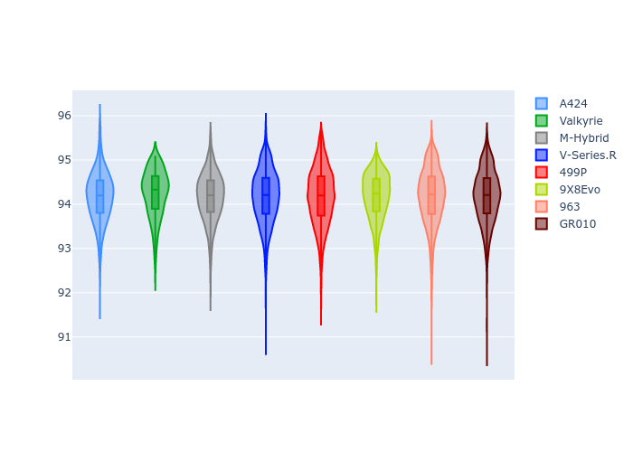
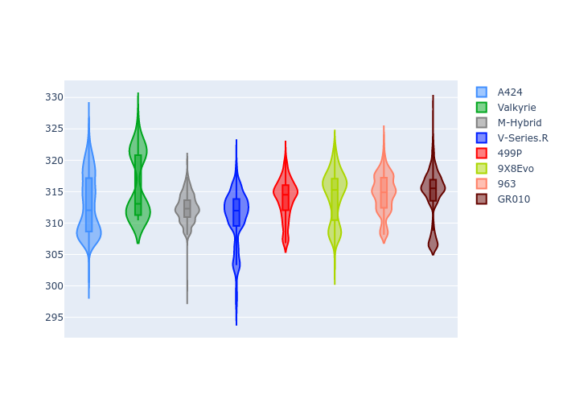

# Combined Plots

## Metadata

- BoP Accuracy: 99.20%
- Overall BoP Grade: A1
- Track: IMOLA
- Threshhold: 210.0kph

## BoP Table
| Manufacturer   | Car        | Weight   | Power   | PINC   | E/Stint   | FDS    |
|:---------------|:-----------|:---------|:--------|:-------|:----------|:-------|
| Alpine         | A424       | 1067kg   | 520.0kw | -1.00% | 922MJ     | -      |
| Aston Martin   | Valkyrie   | 1042kg   | 506.0kw | +0.40% | 901MJ     | -      |
| BMW            | M-Hybrid   | 1061kg   | 512.0kw | +1.00% | 914MJ     | -      |
| Cadillac       | V-Series.R | 1054kg   | 510.0kw | +1.00% | 906MJ     | -      |
| Ferrari        | 499P       | 1083kg   | 508.0kw | -1.00% | 906MJ     | 190kph |
| Peugeot        | 9X8Evo     | 1065kg   | 510.0kw | -1.00% | 910MJ     | 190kph |
| Porsche        | 963        | 1067kg   | 516.0kw | -1.00% | 912MJ     | -      |
| Toyota         | GR010      | 1100kg   | 512.0kw | +1.00% | 915MJ     | 190kph |

## Performance Table
| Manufacturer   | Car        | RP      | QP      | Vavg      |   RDLC | BOP-Grade   | Match   |
|:---------------|:-----------|:--------|:--------|:----------|-------:|:------------|:--------|
| Alpine         | A424       | 1:34.03 | 1:29.83 | 309.92kph |   1.05 | ~A1         | 99.77%  |
| Aston Martin   | Valkyrie   | 1:34.98 | 1:30.07 | 309.63kph |   1.05 | ~A1         | 99.06%  |
| BMW            | M-Hybrid   | 1:34.19 | 1:29.69 | 309.34kph |   1.05 | ~A1         | 99.61%  |
| Cadillac       | V-Series.R | 1:34.47 | 1:30.02 | 306.21kph |   1.05 | ~A1         | 99.96%  |
| Ferrari        | 499P       | 1:34.61 | 1:30.01 | 308.31kph |   1.05 | ~A1         | 99.98%  |
| Peugeot        | 9X8Evo     | 1:34.97 | 1:30.42 | 309.89kph |   1.05 | ~A1         | 95.40%  |
| Porsche        | 963        | 1:34.32 | 1:29.87 | 308.12kph |   1.05 | ~A1         | 99.89%  |
| Toyota         | GR010      | 1:34.48 | 1:29.80 | 309.62kph |   1.05 | ~A1         | 99.97%  |

## Race Laptimes

## Quali Laptimes

## Topspeeds

## Laptimes Lineplot

