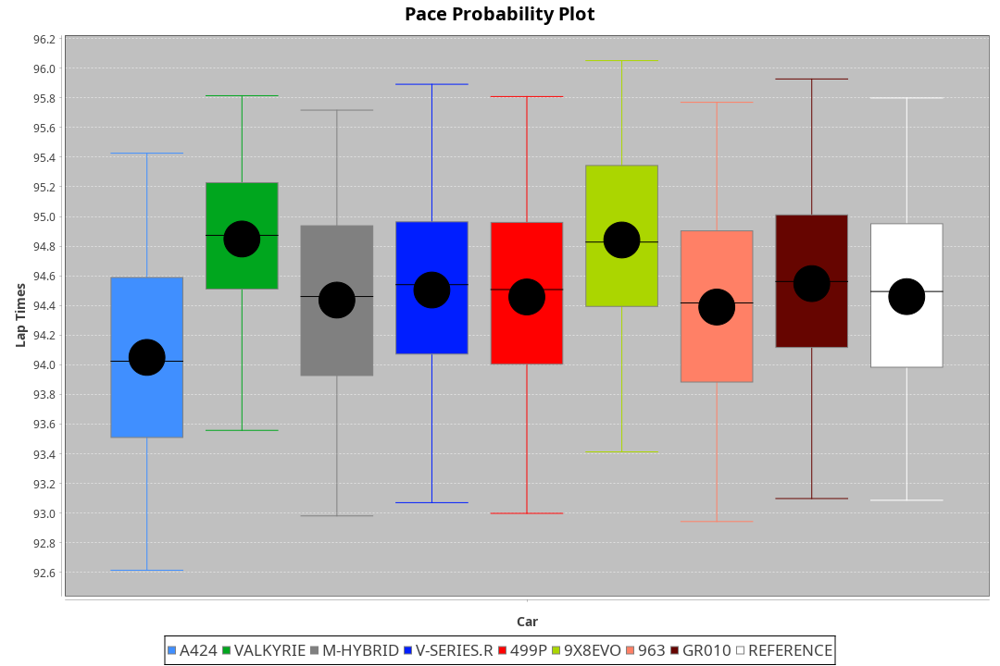
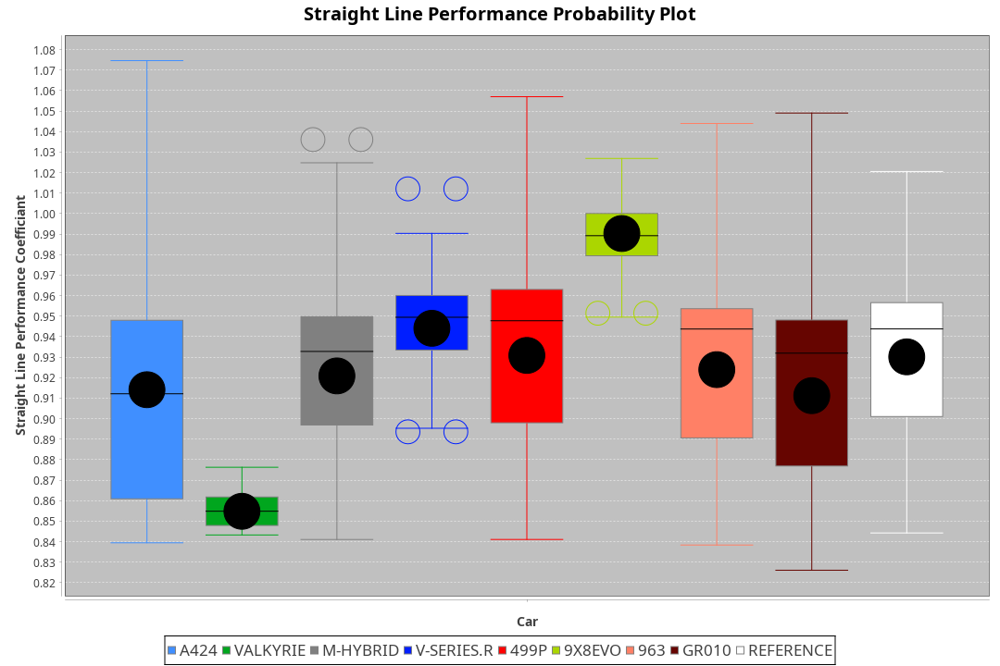
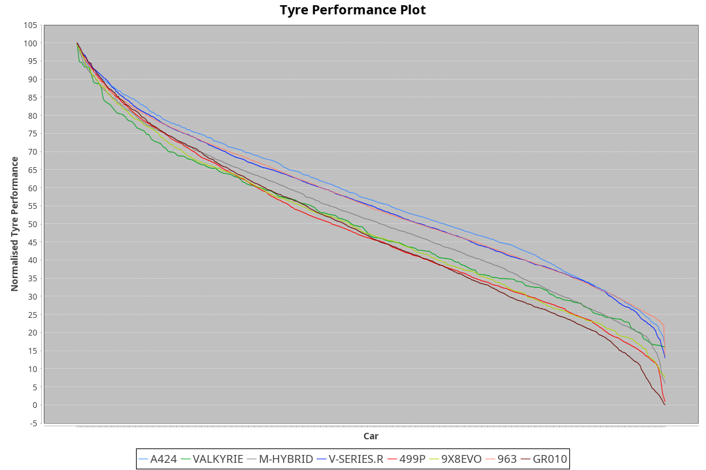

| Manufacturer | Car        | Weight | Power   | PINC    | E/Stint | FDS     |
|:-|:-|:-|:-|:-|:-|:-|
| Alpine       | A424       | 1057kg | 517.0kw |    -    | 913MJ   |    -    |
| Aston Martin | Valkyrie   | 1042kg | 505.0kw | 0.40%   | 900MJ   |    -    |
| BMW          | M-Hybrid   | 1051kg | 509.0kw |    -    | 905MJ   |    -    |
| Cadillac     | V-Series.R | 1044kg | 507.0kw |    -    | 901MJ   |    -    |
| Ferrari      | 499P       | 1073kg | 505.0kw |    -    | 903MJ   | 190kph  |
| Peugeot      | 9X8Evo     | 1060kg | 507.0kw |    -    | 903MJ   | 190kph  |
| Porsche      | 963        | 1057kg | 513.0kw |    -    | 908MJ   |    -    |
| Toyota       | GR010      | 1089kg | 509.0kw |    -    | 913MJ   | 190kph  |

### BoP Accuracy: 88.26%; Overall BoP Grade: B1
| Manufacturer | Car        | Type  | RP      | QP      | Weight | Power¹  | Threshhold | PINC    | Power²   | E/Stint | AVG Vmax  | FDS     | RDLC | L/Stint | BOP-Grade | Model Accuracy | Model Points | Match%  | SimDiff |
|:-|:-|:-|:-|:-|:-|:-|:-|:-|:-|:-|:-|:-|:-|:-|:-|:-|:-|:-|:-|
| Alpine       | A424       | LMDH  | 1:34.58 | 1:30.52 | 1057kg | 517.0kw | 210.0kph   |    -    | 517.00kw |  913MJ  | 298.38kph |    -    | 1.02 | 37      | -C1       | 99.37%         | 2056         | 79.24%  | +0.05   |
| Aston Martin | Valkyrie   | LMHNH | 1:35.31 | 1:30.95 | 1042kg | 505.0kw | 210.0kph   | 0.40%   | 507.00kw |  900MJ  | 288.21kph |    -    | 1.05 | 37      | +D2       | 100.00%        | 247          | 64.45%  | #       |
| BMW          | M-Hybrid   | LMDH  | 1:35.03 | 1:30.56 | 1051kg | 509.0kw | 210.0kph   |    -    | 509.00kw |  905MJ  | 299.88kph |    -    | 1.03 | 37      | ~A1       | 99.20%         | 3081         | 100.00% | -0.15   |
| Cadillac     | V-Series.R | LMDH  | 1:34.85 | 1:30.54 | 1044kg | 507.0kw | 210.0kph   |    -    | 507.00kw |  901MJ  | 301.80kph |    -    | 1.03 | 37      | -A2       | 99.22%         | 5358         | 94.08%  | +0.25   |
| Ferrari      | 499P       | LMHHU | 1:35.07 | 1:30.53 | 1073kg | 505.0kw | 210.0kph   |    -    | 505.00kw |  903MJ  | 299.19kph | 190kph  | 1.03 | 37      | ~A1       | 99.93%         | 6954         | 100.00% | -0.10   |
| Peugeot      | 9X8Evo     | LMHHU | 1:35.20 | 1:31.06 | 1060kg | 507.0kw | 210.0kph   |    -    | 507.00kw |  903MJ  | 310.50kph | 190kph  | 1.00 | 37      | +B1       | 100.00%        | 1458         | 86.55%  | +0.34   |
| Porsche      | 963        | LMDH  | 1:34.70 | 1:30.34 | 1057kg | 513.0kw | 210.0kph   |    -    | 513.00kw |  908MJ  | 299.61kph |    -    | 1.02 | 37      | -B1       | 99.87%         | 14199        | 85.64%  | -0.02   |
| Toyota       | GR010      | LMHHU | 1:35.30 | 1:30.55 | 1089kg | 509.0kw | 210.0kph   |    -    | 509.00kw |  913MJ  | 295.52kph | 190kph  | 1.02 | 37      | ~A1       | 99.92%         | 5012         | 96.15%  | -0.16   |

## Power below Threshhold
| N/Nmax    | A424    | VALKYRIE | M-HYBRID | V-SERIES.R | 499P    | 9X8EVO  | 963     | GR010   |
|:-|:-|:-|:-|:-|:-|:-|:-|:-|
|  0.550    |  255    |  249     |  251     |  250       |  249    |  250    |  253    |  251    |
|  0.575    |  278    |  272     |  274     |  273       |  272    |  273    |  276    |  274    |
|  0.600    |  298    |  292     |  294     |  293       |  292    |  293    |  296    |  294    |
|  0.625    |  320    |  312     |  315     |  314       |  312    |  314    |  317    |  315    |
|  0.650    |  341    |  333     |  336     |  335       |  333    |  335    |  338    |  336    |
|  0.675    |  363    |  355     |  357     |  356       |  355    |  356    |  360    |  357    |
|  0.700    |  385    |  376     |  379     |  377       |  376    |  377    |  382    |  379    |
|  0.725    |  407    |  397     |  400     |  399       |  397    |  399    |  403    |  400    |
|  0.750    |  427    |  417     |  421     |  419       |  417    |  419    |  424    |  421    |
|  0.775    |  446    |  436     |  440     |  438       |  436    |  438    |  443    |  440    |
|  0.800    |  464    |  454     |  457     |  455       |  454    |  455    |  461    |  457    |
|  0.825    |  479    |  469     |  472     |  470       |  469    |  470    |  476    |  472    |
|  0.850    |  491    |  480     |  484     |  482       |  480    |  482    |  487    |  484    |
|  0.875    |  502    |  490     |  494     |  492       |  490    |  492    |  498    |  494    |
|  0.900    |  509    |  497     |  501     |  499       |  497    |  499    |  505    |  501    |
|  0.925    |  514    |  502     |  506     |  504       |  502    |  504    |  510    |  506    |
| **0.950** | **517** | **505**  | **509**  | **507**    | **505** | **507** | **513** | **509** |
|  0.975    |  515    |  503     |  507     |  505       |  503    |  505    |  511    |  507    |
|  1.000    |  511    |  500     |  504     |  502       |  500    |  502    |  507    |  504    |
|  1.025    |  441    |  431     |  435     |  433       |  431    |  433    |  438    |  435    |

## Power above Threshhold
| N/Nmax    | A424    | VALKYRIE   | M-HYBRID | V-SERIES.R | 499P    | 9X8EVO  | 963     | GR010   |
|:-|:-|:-|:-|:-|:-|:-|:-|:-|
|  0.550    |  255    |  250.01    |  251     |  250       |  249    |  250    |  253    |  251    |
|  0.575    |  278    |  273.01    |  274     |  273       |  272    |  273    |  276    |  274    |
|  0.600    |  298    |  293.01    |  294     |  293       |  292    |  293    |  296    |  294    |
|  0.625    |  320    |  314.01    |  315     |  314       |  312    |  314    |  317    |  315    |
|  0.650    |  341    |  335.01    |  336     |  335       |  333    |  335    |  338    |  336    |
|  0.675    |  363    |  356.01    |  357     |  356       |  355    |  356    |  360    |  357    |
|  0.700    |  385    |  377.01    |  379     |  377       |  376    |  377    |  382    |  379    |
|  0.725    |  407    |  399.02    |  400     |  399       |  397    |  399    |  403    |  400    |
|  0.750    |  427    |  419.02    |  421     |  419       |  417    |  419    |  424    |  421    |
|  0.775    |  446    |  438.02    |  440     |  438       |  436    |  438    |  443    |  440    |
|  0.800    |  464    |  455.02    |  457     |  455       |  454    |  455    |  461    |  457    |
|  0.825    |  479    |  470.02    |  472     |  470       |  469    |  470    |  476    |  472    |
|  0.850    |  491    |  482.02    |  484     |  482       |  480    |  482    |  487    |  484    |
|  0.875    |  502    |  492.02    |  494     |  492       |  490    |  492    |  498    |  494    |
|  0.900    |  509    |  499.02    |  501     |  499       |  497    |  499    |  505    |  501    |
|  0.925    |  514    |  504.02    |  506     |  504       |  502    |  504    |  510    |  506    |
| **0.950** | **517** | **507.02** | **509**  | **507**    | **505** | **507** | **513** | **509** |
|  0.975    |  515    |  505.02    |  507     |  505       |  503    |  505    |  511    |  507    |
|  1.000    |  511    |  502.02    |  504     |  502       |  500    |  502    |  507    |  504    |
|  1.025    |  441    |  433.02    |  435     |  433       |  431    |  433    |  438    |  435    |
