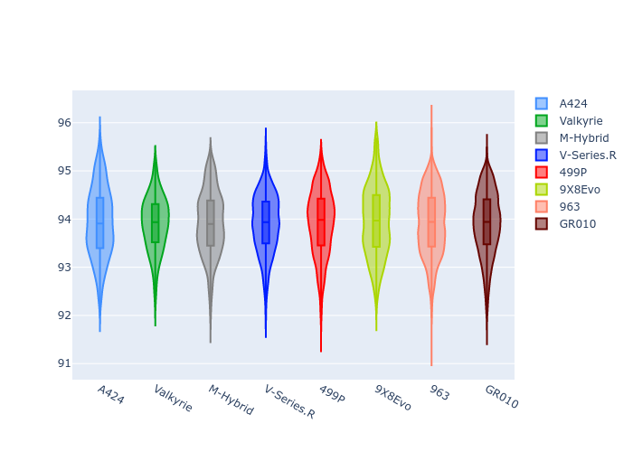
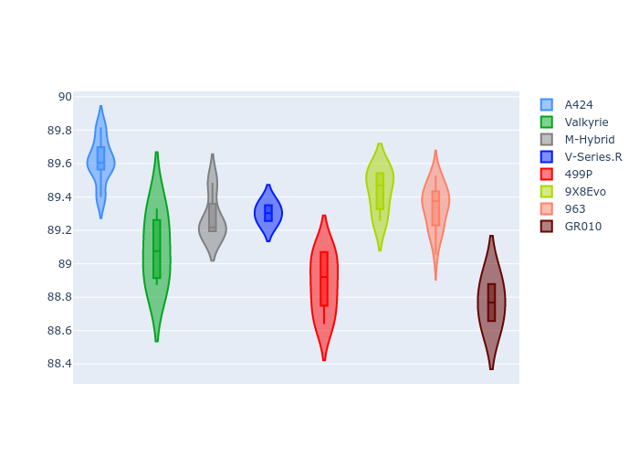
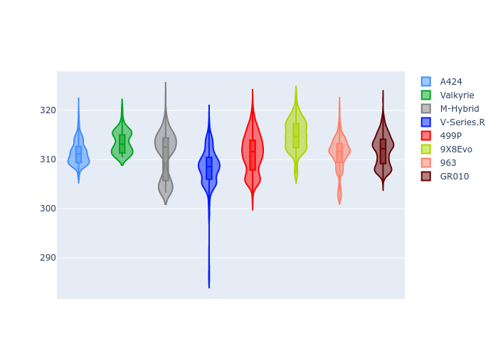

# Combined Plots

## Metadata

- BoP Accuracy: 99.81%
- Overall BoP Grade: A1
- Track: IMOLA
- Threshhold: 0.0kph

## BoP Table
| Manufacturer   | Car        | Weight   | Power   | PINC   | E/Stint   | FDS    |
|:---------------|:-----------|:---------|:--------|:-------|:----------|:-------|
| Alpine         | A424       | 1038kg   | 509.0kw | -      | 911MJ     | -      |
| Aston Martin   | Valkyrie   | 1031kg   | 520.0kw | -      | 911MJ     | -      |
| BMW            | M-Hybrid   | 1039kg   | 511.0kw | -      | 909MJ     | -      |
| Cadillac       | V-Series.R | 1044kg   | 518.0kw | -      | 909MJ     | -      |
| Ferrari        | 499P       | 1063kg   | 510.0kw | -      | 908MJ     | 190kph |
| Peugeot        | 9X8Evo     | 1030kg   | 512.0kw | -      | 910MJ     | 190kph |
| Porsche        | 963        | 1039kg   | 510.0kw | -      | 906MJ     | -      |
| Toyota         | GR010      | 1063kg   | 511.0kw | -      | 908MJ     | 190kph |

## Performance Table
| Manufacturer   | Car        | RP      | QP      | Vavg      |   RDLC | BOP-Grade   | Match   |
|:---------------|:-----------|:--------|:--------|:----------|-------:|:------------|:--------|
| Alpine         | A424       | 1:33.90 | 1:29.71 | 311.44kph |   1.05 | ~A1         | 99.65%  |
| Aston Martin   | Valkyrie   | 1:33.91 | 1:29.09 | 313.58kph |   1.05 | ~A1         | 100.00% |
| BMW            | M-Hybrid   | 1:33.91 | 1:29.42 | 310.65kph |   1.05 | ~A1         | 99.96%  |
| Cadillac       | V-Series.R | 1:33.90 | 1:29.49 | 308.19kph |   1.05 | ~A1         | 99.96%  |
| Ferrari        | 499P       | 1:33.92 | 1:29.36 | 311.67kph |   1.05 | ~A1         | 99.98%  |
| Peugeot        | 9X8Evo     | 1:33.91 | 1:29.44 | 314.95kph |   1.05 | ~A1         | 99.04%  |
| Porsche        | 963        | 1:33.92 | 1:29.49 | 310.62kph |   1.05 | ~A1         | 99.89%  |
| Toyota         | GR010      | 1:33.90 | 1:29.26 | 312.43kph |   1.05 | ~A1         | 99.97%  |

## Race Laptimes

## Quali Laptimes

## Topspeeds

## Laptimes Lineplot

