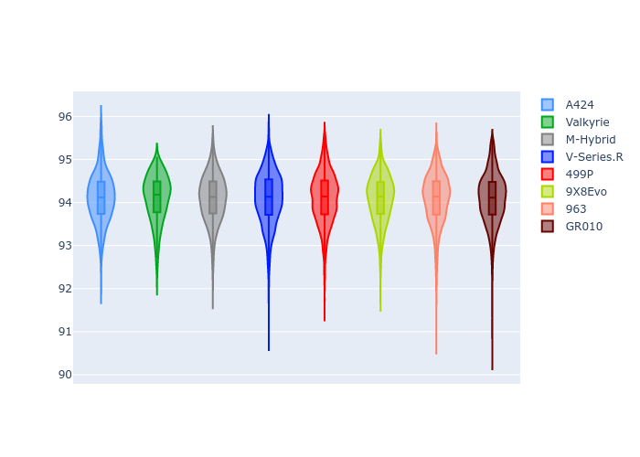
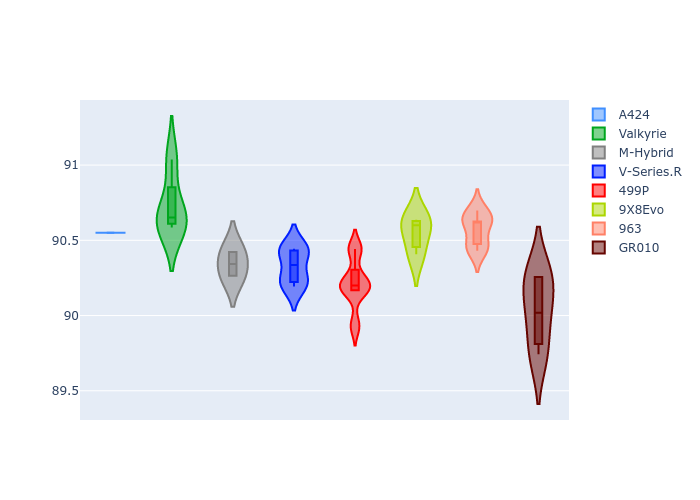
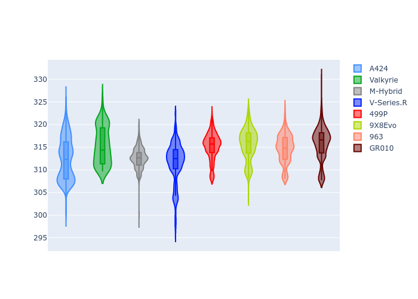
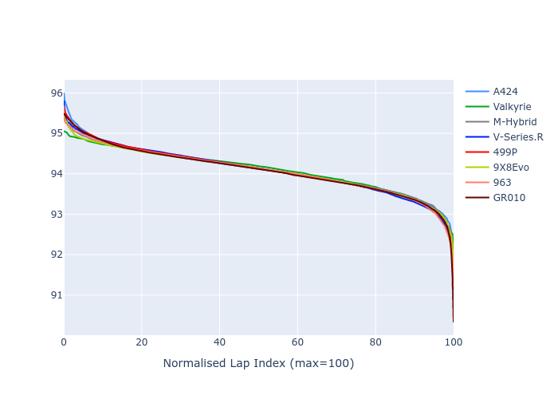

# Combined Plots

## Metadata

- BoP Accuracy: 99.58%
- Overall BoP Grade: A1
- Track: IMOLA
- Threshhold: 0.0kph
- Average Laptime: 1:33.95
- Average Quali Laptime: 1:30.01
- Laptime Std Dev: 0.19 seconds
- Filtered Average Topspeed: 315.61kph

## BoP Table
| Manufacturer   | Car        | Weight   | Power   | PINC   | E/Stint   | FDS    | RDP    | QDP    | TDP    |
|:---------------|:-----------|:---------|:--------|:-------|:----------|:-------|:-------|:-------|:-------|
| Alpine         | A424       | 1033kg   | 513.0kw | -      | 915MJ     | -      | 52.20% | 54.51% | 24.58% |
| Aston Martin   | Valkyrie   | 1030kg   | 520.0kw | -      | 911MJ     | -      | 53.39% | 54.11% | 23.71% |
| BMW            | M-Hybrid   | 1034kg   | 515.0kw | -      | 912MJ     | -      | 53.47% | 52.95% | 33.73% |
| Cadillac       | V-Series.R | 1038kg   | 520.0kw | -      | 910MJ     | -      | 49.22% | 60.31% | 18.04% |
| Ferrari        | 499P       | 1066kg   | 519.0kw | -      | 917MJ     | 200kph | 51.56% | 44.72% | 9.86%  |
| Peugeot        | 9X8Evo     | 1032kg   | 517.0kw | -      | 915MJ     | 190kph | 50.17% | 49.36% | 17.73% |
| Porsche        | 963        | 1030kg   | 510.0kw | -      | 905MJ     | -      | 50.78% | 41.25% | 27.61% |
| Toyota         | GR010      | 1064kg   | 517.0kw | -      | 913MJ     | 190kph | 51.68% | 51.25% | 14.48% |

## Performance Table
| Manufacturer   | Car        | RP      | QP      | Vavg      |   RDLC | BOP-Grade   | Match   |
|:---------------|:-----------|:--------|:--------|:----------|-------:|:------------|:--------|
| Alpine         | A424       | 1:33.88 | 1:30.10 | 314.35kph |   1.04 | ~A1         | 99.94%  |
| Aston Martin   | Valkyrie   | 1:34.45 | 1:30.64 | 313.41kph |   1.04 | ~A1         | 97.35%  |
| BMW            | M-Hybrid   | 1:33.87 | 1:29.86 | 314.42kph |   1.04 | ~A1         | 100.00% |
| Cadillac       | V-Series.R | 1:33.89 | 1:29.90 | 313.13kph |   1.04 | ~A1         | 99.84%  |
| Ferrari        | 499P       | 1:33.87 | 1:29.83 | 317.60kph |   1.04 | ~A1         | 99.77%  |
| Peugeot        | 9X8Evo     | 1:33.88 | 1:30.06 | 317.08kph |   1.04 | ~A1         | 100.00% |
| Porsche        | 963        | 1:33.87 | 1:29.95 | 316.69kph |   1.04 | ~A1         | 99.92%  |
| Toyota         | GR010      | 1:33.89 | 1:29.75 | 318.17kph |   1.05 | ~A1         | 99.83%  |

## Race Laptimes

## Quali Laptimes

## Topspeeds

## Laptimes Lineplot

