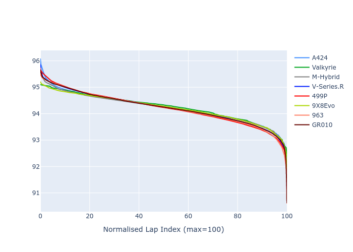

# Combined Plots

## Metadata

- BoP Accuracy: 99.71%
- Overall BoP Grade: A1
- Track: IMOLA
- Threshhold: 0.0kph
- Average Laptime: 1:34.22
- Average Quali Laptime: 1:30.16
- Average Topspeed: 313.13kph

## BoP Table
| Manufacturer   | Car        | Weight   | Power   | PINC   | E/Stint   | FDS    | RDP    | QDP    | TDP    |
|:---------------|:-----------|:---------|:--------|:-------|:----------|:-------|:-------|:-------|:-------|
| Alpine         | A424       | 1044kg   | 506.0kw | -      | 910MJ     | -      | 51.64% | 59.31% | 26.80% |
| Aston Martin   | Valkyrie   | 1030kg   | 520.0kw | -      | 911MJ     | -      | 53.50% | 53.33% | 21.51% |
| BMW            | M-Hybrid   | 1044kg   | 509.0kw | -      | 908MJ     | -      | 52.89% | 56.22% | 33.41% |
| Cadillac       | V-Series.R | 1049kg   | 520.0kw | -      | 912MJ     | -      | 48.63% | 60.80% | 19.01% |
| Ferrari        | 499P       | 1065kg   | 500.0kw | -      | 900MJ     | 190kph | 51.38% | 44.98% | 9.83%  |
| Peugeot        | 9X8Evo     | 1030kg   | 498.0kw | -      | 898MJ     | 190kph | 48.87% | 52.78% | 15.41% |
| Porsche        | 963        | 1039kg   | 503.0kw | -      | 899MJ     | -      | 50.70% | 44.30% | 29.51% |
| Toyota         | GR010      | 1065kg   | 498.0kw | -      | 896MJ     | 190kph | 51.09% | 52.71% | 11.46% |

## Performance Table
| Manufacturer   | Car        | RP      | QP      | Vavg      |   RDLC | BOP-Grade   | Match   |
|:---------------|:-----------|:--------|:--------|:----------|-------:|:------------|:--------|
| Alpine         | A424       | 1:34.23 | 1:30.40 | 311.85kph |   1.04 | ~A1         | 98.93%  |
| Aston Martin   | Valkyrie   | 1:34.25 | 1:30.01 | 315.93kph |   1.05 | ~A1         | 100.00% |
| BMW            | M-Hybrid   | 1:34.22 | 1:30.08 | 311.91kph |   1.05 | ~A1         | 99.81%  |
| Cadillac       | V-Series.R | 1:34.22 | 1:30.12 | 311.22kph |   1.05 | ~A1         | 99.65%  |
| Ferrari        | 499P       | 1:34.20 | 1:30.03 | 313.33kph |   1.05 | ~A1         | 99.74%  |
| Peugeot        | 9X8Evo     | 1:34.22 | 1:30.29 | 313.34kph |   1.04 | ~A1         | 100.00% |
| Porsche        | 963        | 1:34.21 | 1:30.39 | 313.85kph |   1.04 | ~A1         | 99.85%  |
| Toyota         | GR010      | 1:34.23 | 1:29.93 | 313.63kph |   1.05 | ~A1         | 99.71%  |

## Race Laptimes

## Quali Laptimes

## Topspeeds

## Laptimes Lineplot

