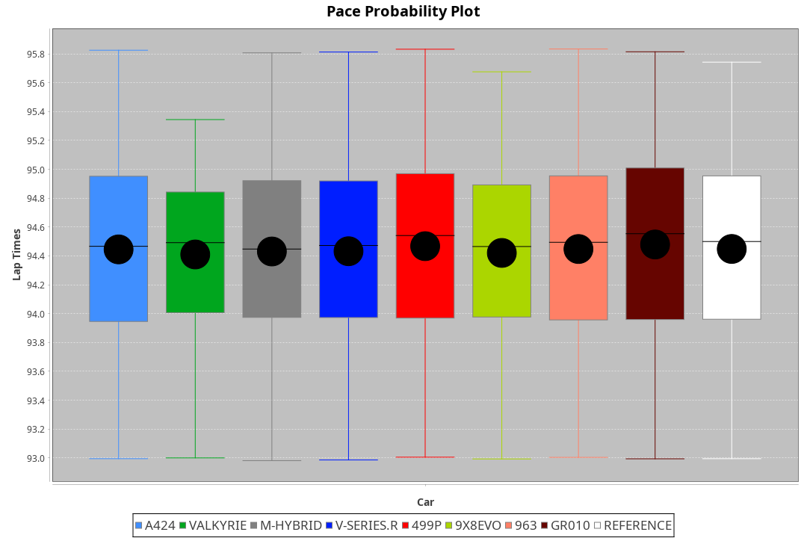
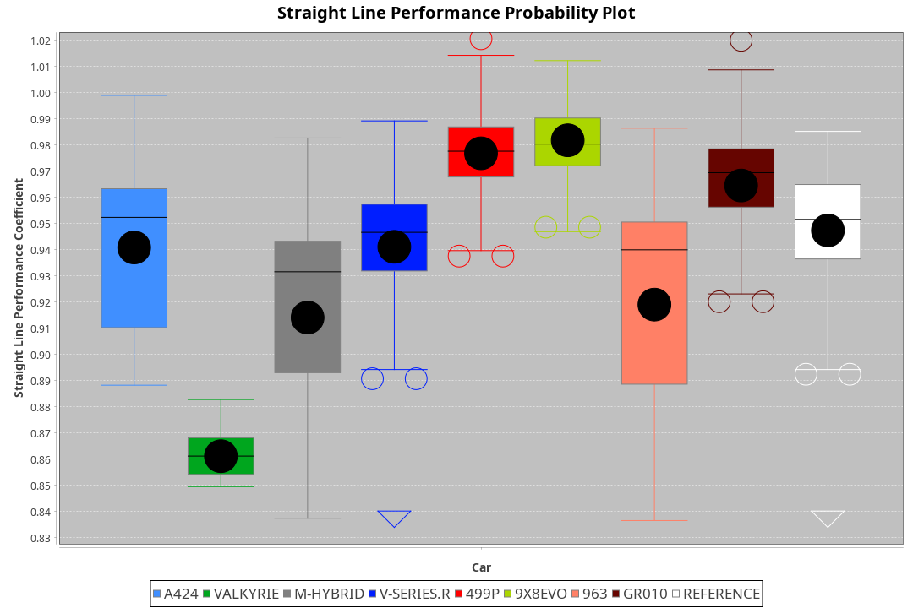
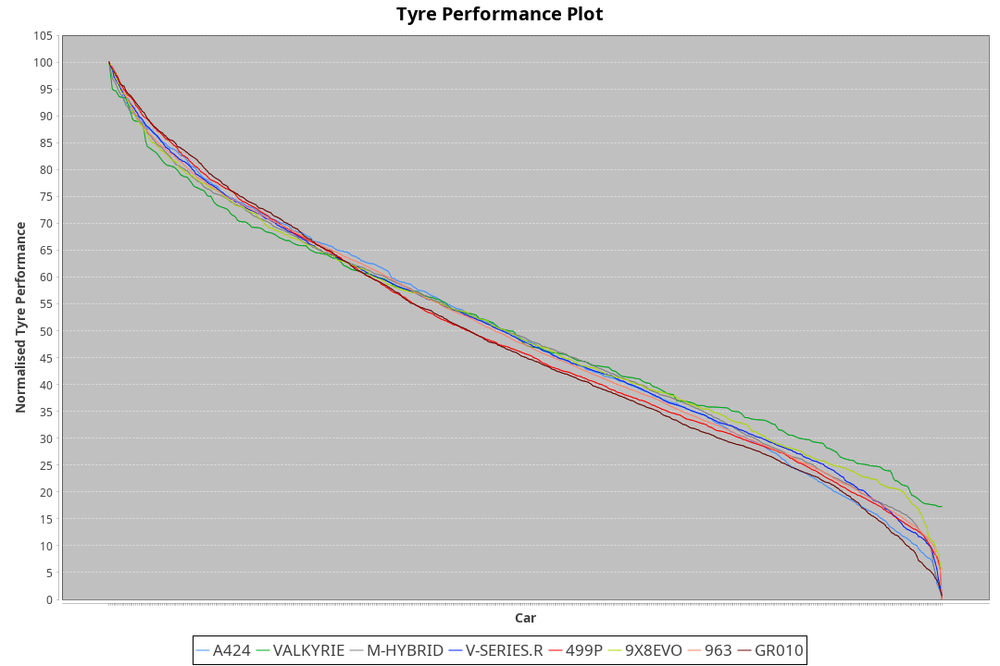

| Manufacturer | Car        | Weight | Power   | PINC    | E/Stint | FDS     |
|:-|:-|:-|:-|:-|:-|:-|
| Alpine       | A424       | 1033kg | 519.0kw |    -    | 912MJ   |    -    |
| Aston Martin | Valkyrie   | 1030kg | 520.0kw |    -    | 911MJ   |    -    |
| BMW          | M-Hybrid   | 1035kg | 520.0kw |    -    | 913MJ   |    -    |
| Cadillac     | V-Series.R | 1042kg | 519.0kw |    -    | 911MJ   |    -    |
| Ferrari      | 499P       | 1061kg | 516.0kw |    -    | 911MJ   | 190kph  |
| Peugeot      | 9X8Evo     | 1031kg | 512.0kw |    -    | 905MJ   | 190kph  |
| Porsche      | 963        | 1037kg | 515.0kw |    -    | 908MJ   |    -    |
| Toyota       | GR010      | 1065kg | 516.0kw |    -    | 917MJ   | 190kph  |

### BoP Accuracy: 71.17%; Overall BoP Grade: C2
| Manufacturer | Car        | Type  | RP      | QP      | Weight | Power¹  | Threshhold | PINC    | Power²   | E/Stint | AVG Vmax  | FDS     | RDLC | L/Stint | BOP-Grade | Model Accuracy | Model Points | Match%  | SimDiff |
|:-|:-|:-|:-|:-|:-|:-|:-|:-|:-|:-|:-|:-|:-|:-|:-|:-|:-|:-|:-|
| Alpine       | A424       | LMDH  | 1:33.64 | 1:30.18 | 1033kg | 519.0kw | 0.0kph     |    -    | 519.00kw |  912MJ  | 316.74kph |    -    | 1.02 | 37      | -B1       | 99.49%         | 1360         | 85.02%  | +0.12   |
| Aston Martin | Valkyrie   | LMHNH | 1:36.25 | 1:31.99 | 1030kg | 520.0kw | 0.0kph     |    -    | 520.00kw |  911MJ  | 307.13kph |    -    | 1.03 | 37      | +Ω2       | 100.00%        | 312          | -11.66% | #       |
| BMW          | M-Hybrid   | LMDH  | 1:33.64 | 1:29.40 | 1035kg | 520.0kw | 0.0kph     |    -    | 520.00kw |  913MJ  | 315.41kph |    -    | 1.02 | 37      | -B1       | 98.62%         | 2363         | 85.28%  | -0.13   |
| Cadillac     | V-Series.R | LMDH  | 1:33.63 | 1:29.70 | 1042kg | 519.0kw | 0.0kph     |    -    | 519.00kw |  911MJ  | 309.70kph |    -    | 1.02 | 37      | -B2       | 98.50%         | 4201         | 84.84%  | +0.49   |
| Ferrari      | 499P       | LMHHU | 1:33.63 | 1:29.57 | 1061kg | 516.0kw | 0.0kph     |    -    | 516.00kw |  911MJ  | 313.80kph | 190kph  | 1.02 | 37      | -B2       | 100.00%        | 4441         | 81.67%  | -0.15   |
| Peugeot      | 9X8Evo     | LMHHU | 1:33.63 | 1:29.90 | 1031kg | 512.0kw | 0.0kph     |    -    | 512.00kw |  905MJ  | 315.82kph | 190kph  | 1.02 | 37      | -C1       | 100.00%        | 808          | 77.92%  | -0.04   |
| Porsche      | 963        | LMDH  | 1:33.63 | 1:29.36 | 1037kg | 515.0kw | 0.0kph     |    -    | 515.00kw |  908MJ  | 312.96kph |    -    | 1.02 | 37      | -B2       | 99.87%         | 12613        | 82.50%  | -0.12   |
| Toyota       | GR010      | LMHHU | 1:33.63 | 1:29.41 | 1065kg | 516.0kw | 0.0kph     |    -    | 516.00kw |  917MJ  | 310.79kph | 190kph  | 1.02 | 37      | -B2       | 99.73%         | 2956         | 83.81%  | +0.03   |

## Power below Threshhold
| N/Nmax    | A424    | VALKYRIE | M-HYBRID | V-SERIES.R | 499P    | 9X8EVO  | 963     | GR010   |
|:-|:-|:-|:-|:-|:-|:-|:-|:-|
|  0.550    |  256    |  256     |  256     |  256       |  254    |  252    |  254    |  254    |
|  0.575    |  279    |  279     |  279     |  279       |  277    |  275    |  277    |  277    |
|  0.600    |  299    |  300     |  300     |  299       |  298    |  296    |  297    |  298    |
|  0.625    |  321    |  322     |  322     |  321       |  319    |  317    |  319    |  319    |
|  0.650    |  342    |  343     |  343     |  342       |  340    |  338    |  340    |  340    |
|  0.675    |  364    |  365     |  365     |  364       |  362    |  359    |  362    |  362    |
|  0.700    |  386    |  387     |  387     |  386       |  384    |  381    |  383    |  384    |
|  0.725    |  408    |  409     |  409     |  408       |  406    |  403    |  405    |  406    |
|  0.750    |  429    |  430     |  430     |  429       |  427    |  423    |  426    |  427    |
|  0.775    |  448    |  449     |  449     |  448       |  446    |  442    |  445    |  446    |
|  0.800    |  466    |  467     |  467     |  466       |  463    |  460    |  463    |  463    |
|  0.825    |  481    |  482     |  482     |  481       |  478    |  475    |  478    |  478    |
|  0.850    |  493    |  494     |  494     |  493       |  490    |  486    |  489    |  490    |
|  0.875    |  504    |  505     |  505     |  504       |  501    |  497    |  500    |  501    |
|  0.900    |  511    |  512     |  512     |  511       |  508    |  504    |  507    |  508    |
|  0.925    |  516    |  517     |  517     |  516       |  513    |  509    |  512    |  513    |
| **0.950** | **519** | **520**  | **520**  | **519**    | **516** | **512** | **515** | **516** |
|  0.975    |  517    |  518     |  518     |  517       |  514    |  510    |  513    |  514    |
|  1.000    |  513    |  514     |  514     |  513       |  510    |  506    |  509    |  510    |
|  1.025    |  443    |  444     |  444     |  443       |  441    |  437    |  440    |  441    |

## Power above Threshhold
| N/Nmax    | A424    | VALKYRIE | M-HYBRID | V-SERIES.R | 499P    | 9X8EVO  | 963     | GR010   |
|:-|:-|:-|:-|:-|:-|:-|:-|:-|
|  0.550    |  256    |  256     |  256     |  256       |  254    |  252    |  254    |  254    |
|  0.575    |  279    |  279     |  279     |  279       |  277    |  275    |  277    |  277    |
|  0.600    |  299    |  300     |  300     |  299       |  298    |  296    |  297    |  298    |
|  0.625    |  321    |  322     |  322     |  321       |  319    |  317    |  319    |  319    |
|  0.650    |  342    |  343     |  343     |  342       |  340    |  338    |  340    |  340    |
|  0.675    |  364    |  365     |  365     |  364       |  362    |  359    |  362    |  362    |
|  0.700    |  386    |  387     |  387     |  386       |  384    |  381    |  383    |  384    |
|  0.725    |  408    |  409     |  409     |  408       |  406    |  403    |  405    |  406    |
|  0.750    |  429    |  430     |  430     |  429       |  427    |  423    |  426    |  427    |
|  0.775    |  448    |  449     |  449     |  448       |  446    |  442    |  445    |  446    |
|  0.800    |  466    |  467     |  467     |  466       |  463    |  460    |  463    |  463    |
|  0.825    |  481    |  482     |  482     |  481       |  478    |  475    |  478    |  478    |
|  0.850    |  493    |  494     |  494     |  493       |  490    |  486    |  489    |  490    |
|  0.875    |  504    |  505     |  505     |  504       |  501    |  497    |  500    |  501    |
|  0.900    |  511    |  512     |  512     |  511       |  508    |  504    |  507    |  508    |
|  0.925    |  516    |  517     |  517     |  516       |  513    |  509    |  512    |  513    |
| **0.950** | **519** | **520**  | **520**  | **519**    | **516** | **512** | **515** | **516** |
|  0.975    |  517    |  518     |  518     |  517       |  514    |  510    |  513    |  514    |
|  1.000    |  513    |  514     |  514     |  513       |  510    |  506    |  509    |  510    |
|  1.025    |  443    |  444     |  444     |  443       |  441    |  437    |  440    |  441    |
