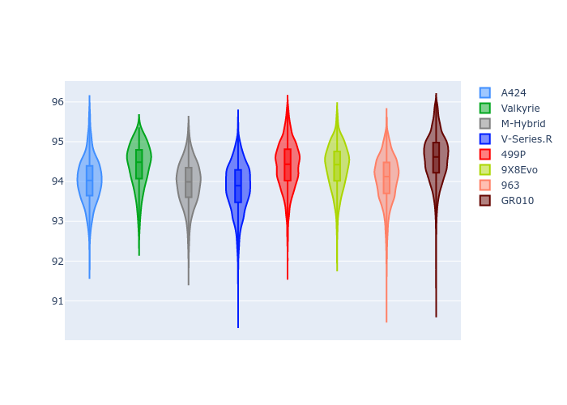
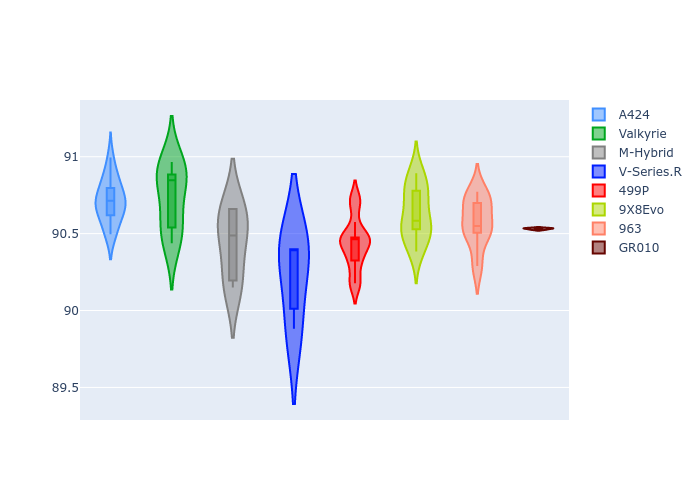
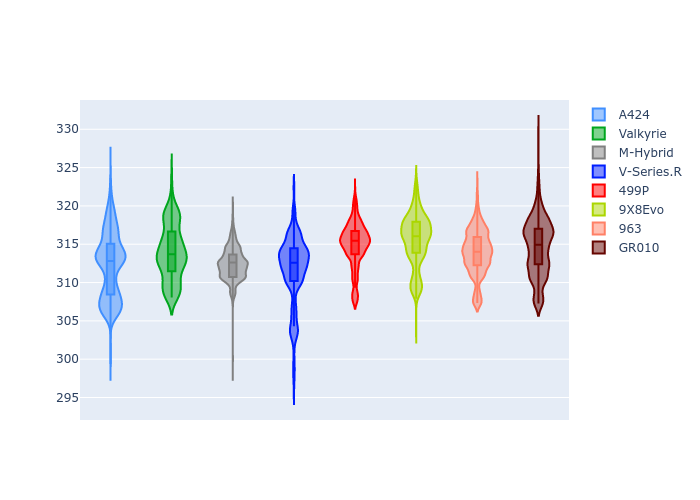
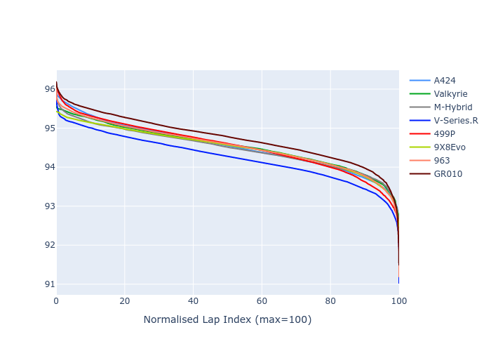

# Combined Plots

## Metadata

- BoP Accuracy: 99.78%
- Overall BoP Grade: A1
- Track: IMOLA
- Threshhold: 250.0kph
- Average Laptime: 1:34.52
- Average Quali Laptime: 1:30.54
- Laptime Std Dev: 0.13 seconds
- Filtered Average Topspeed: 313.62kph

## BoP Table
| Manufacturer   | Car        | Weight   | Power   | PINC   | E/Stint   | FDS    | RDP    | QDP    | TDP    |
|:---------------|:-----------|:---------|:--------|:-------|:----------|:-------|:-------|:-------|:-------|
| Alpine         | A424       | 1050kg   | 511.0kw | +0.10% | 915MJ     | -      | 52.20% | 54.51% | 24.58% |
| Aston Martin   | Valkyrie   | 1031kg   | 519.0kw | -      | 910MJ     | -      | 53.39% | 54.11% | 23.71% |
| BMW            | M-Hybrid   | 1050kg   | 513.0kw | +0.10% | 912MJ     | -      | 53.47% | 52.95% | 33.73% |
| Cadillac       | V-Series.R | 1047kg   | 519.0kw | -      | 910MJ     | -      | 49.22% | 60.31% | 18.04% |
| Ferrari        | 499P       | 1052kg   | 503.0kw | -0.60% | 899MJ     | 190kph | 51.56% | 44.72% | 9.86%  |
| Peugeot        | 9X8Evo     | 1052kg   | 518.0kw | -0.10% | 918MJ     | 190kph | 50.17% | 49.36% | 17.73% |
| Porsche        | 963        | 1052kg   | 511.0kw | -0.10% | 908MJ     | -      | 50.78% | 41.25% | 27.61% |
| Toyota         | GR010      | 1061kg   | 502.0kw | -0.10% | 899MJ     | 190kph | 51.68% | 51.25% | 14.48% |

## Performance Table
| Manufacturer   | Car        | RP      | QP      | Vavg      |   RDLC | BOP-Grade   | Match   |
|:---------------|:-----------|:--------|:--------|:----------|-------:|:------------|:--------|
| Alpine         | A424       | 1:34.54 | 1:30.71 | 312.15kph |   1.04 | ~A1         | 99.85%  |
| Aston Martin   | Valkyrie   | 1:34.54 | 1:30.73 | 313.08kph |   1.04 | ~A1         | 100.00% |
| BMW            | M-Hybrid   | 1:34.49 | 1:30.44 | 312.32kph |   1.04 | ~A1         | 100.00% |
| Cadillac       | V-Series.R | 1:34.24 | 1:30.23 | 311.94kph |   1.04 | ~A1         | 99.98%  |
| Ferrari        | 499P       | 1:34.53 | 1:30.44 | 314.99kph |   1.05 | ~A1         | 99.47%  |
| Peugeot        | 9X8Evo     | 1:34.50 | 1:30.63 | 315.01kph |   1.04 | ~A1         | 100.00% |
| Porsche        | 963        | 1:34.54 | 1:30.58 | 314.40kph |   1.04 | ~A1         | 99.90%  |
| Toyota         | GR010      | 1:34.74 | 1:30.53 | 315.03kph |   1.05 | ~A1         | 99.05%  |

## Race Laptimes

## Quali Laptimes

## Topspeeds

## Laptimes Lineplot

