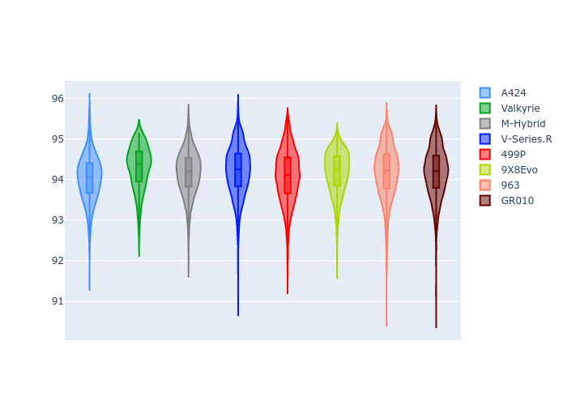
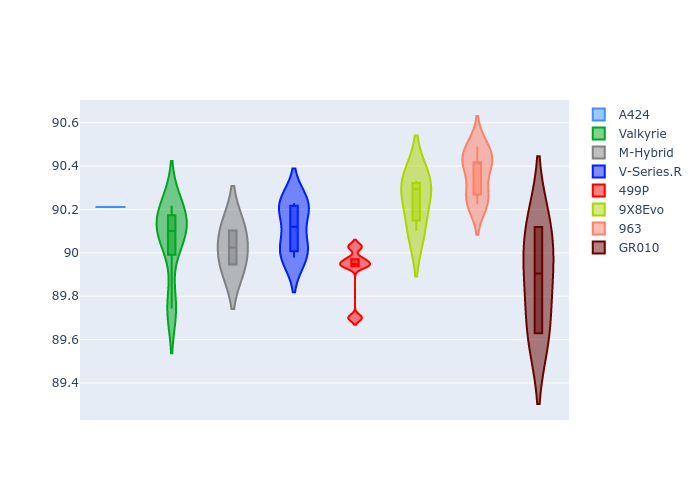
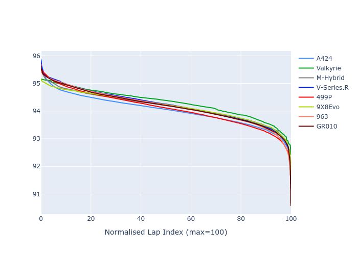

# Combined Plots

## Metadata

- BoP Accuracy: 98.76%
- Overall BoP Grade: A1
- Track: IMOLA
- Threshhold: 210.0kph

## BoP Table
| Manufacturer   | Car        | Weight   | Power   | PINC   | E/Stint   | FDS    |
|:---------------|:-----------|:---------|:--------|:-------|:----------|:-------|
| Alpine         | A424       | 1057kg   | 520.0kw | -1.00% | 921MJ     | -      |
| Aston Martin   | Valkyrie   | 1042kg   | 505.0kw | +0.40% | 900MJ     | -      |
| BMW            | M-Hybrid   | 1051kg   | 512.0kw | +1.00% | 913MJ     | -      |
| Cadillac       | V-Series.R | 1044kg   | 510.0kw | +1.00% | 904MJ     | -      |
| Ferrari        | 499P       | 1073kg   | 508.0kw | -1.00% | 905MJ     | 190kph |
| Peugeot        | 9X8Evo     | 1060kg   | 510.0kw | -1.00% | 909MJ     | 190kph |
| Porsche        | 963        | 1057kg   | 516.0kw | -1.00% | 911MJ     | -      |
| Toyota         | GR010      | 1090kg   | 512.0kw | +1.00% | 914MJ     | 190kph |

## Performance Table
| Manufacturer   | Car        | RP      | QP      | Vavg      |   RDLC | BOP-Grade   | Match   |
|:---------------|:-----------|:--------|:--------|:----------|-------:|:------------|:--------|
| Alpine         | A424       | 1:33.80 | 1:29.62 | 310.98kph |   1.05 | ~A1         | 99.69%  |
| Aston Martin   | Valkyrie   | 1:35.04 | 1:30.13 | 309.41kph |   1.05 | ~A1         | 96.71%  |
| BMW            | M-Hybrid   | 1:33.97 | 1:29.48 | 310.40kph |   1.05 | ~A1         | 99.49%  |
| Cadillac       | V-Series.R | 1:34.25 | 1:29.82 | 307.27kph |   1.05 | ~A1         | 99.96%  |
| Ferrari        | 499P       | 1:34.40 | 1:29.81 | 309.35kph |   1.05 | ~A1         | 99.98%  |
| Peugeot        | 9X8Evo     | 1:34.86 | 1:30.32 | 310.42kph |   1.05 | +A2         | 94.44%  |
| Porsche        | 963        | 1:34.10 | 1:29.66 | 309.18kph |   1.05 | ~A1         | 99.85%  |
| Toyota         | GR010      | 1:34.27 | 1:29.60 | 310.65kph |   1.05 | ~A1         | 99.93%  |

## Race Laptimes

## Quali Laptimes

## Topspeeds

## Laptimes Lineplot

