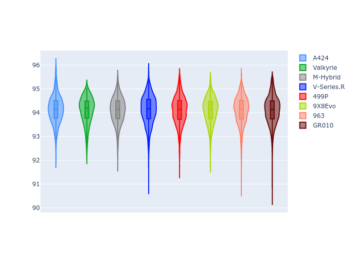
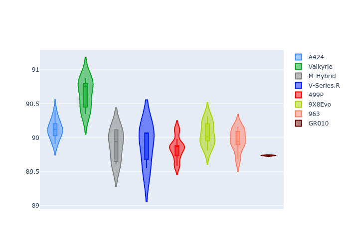
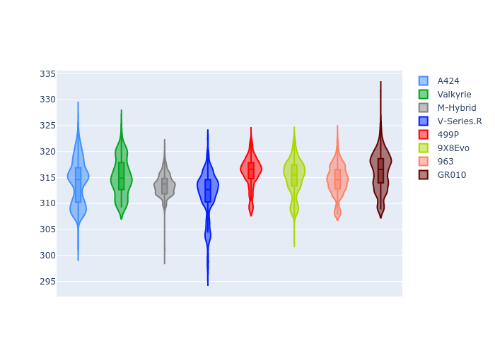
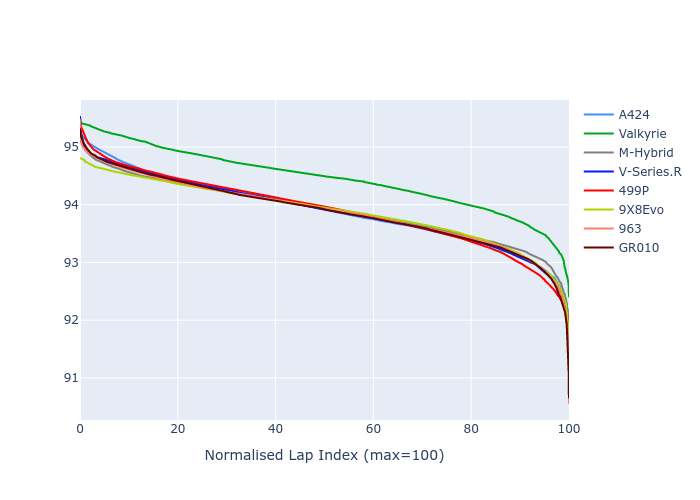

# Combined Plots

## Metadata

- BoP Accuracy: 99.82%
- Overall BoP Grade: A1
- Track: IMOLA
- Threshhold: 250.0kph
- Average Laptime: 1:34.37
- Average Quali Laptime: 1:30.43
- Laptime Std Dev: 0.01 seconds
- Filtered Average Topspeed: 314.54kph

## BoP Table
| Manufacturer   | Car        | Weight   | Power   | PINC   | E/Stint   | FDS    | RDP    | QDP    | TDP    |
|:---------------|:-----------|:---------|:--------|:-------|:----------|:-------|:-------|:-------|:-------|
| Alpine         | A424       | 1045kg   | 504.0kw | +3.10% | 916MJ     | -      | 51.45% | 55.09% | 24.89% |
| Aston Martin   | Valkyrie   | 1030kg   | 520.0kw | -      | 911MJ     | -      | 53.07% | 48.70% | 24.00% |
| BMW            | M-Hybrid   | 1046kg   | 506.0kw | +2.70% | 912MJ     | -      | 52.63% | 52.34% | 34.06% |
| Cadillac       | V-Series.R | 1048kg   | 520.0kw | -      | 911MJ     | -      | 48.80% | 57.26% | 18.10% |
| Ferrari        | 499P       | 1065kg   | 520.0kw | -2.00% | 912MJ     | 200kph | 51.39% | 44.34% | 9.89%  |
| Peugeot        | 9X8Evo     | 1030kg   | 520.0kw | -3.80% | 907MJ     | 200kph | 49.16% | 50.25% | 18.00% |
| Porsche        | 963        | 1041kg   | 512.0kw | -1.30% | 904MJ     | -      | 50.61% | 41.90% | 27.68% |
| Toyota         | GR010      | 1065kg   | 520.0kw | -2.10% | 910MJ     | 190kph | 51.33% | 51.71% | 14.89% |

## Performance Table
| Manufacturer   | Car        | RP      | QP      | Vavg      |   RDLC | BOP-Grade   | Match   |
|:---------------|:-----------|:--------|:--------|:----------|-------:|:------------|:--------|
| Alpine         | A424       | 1:34.36 | 1:30.57 | 314.12kph |   1.04 | ~A1         | 99.88%  |
| Aston Martin   | Valkyrie   | 1:34.37 | 1:30.73 | 315.07kph |   1.04 | ~A1         | 100.00% |
| BMW            | M-Hybrid   | 1:34.38 | 1:30.37 | 313.55kph |   1.04 | ~A1         | 100.00% |
| Cadillac       | V-Series.R | 1:34.37 | 1:30.33 | 311.85kph |   1.04 | ~A1         | 99.85%  |
| Ferrari        | 499P       | 1:34.36 | 1:30.23 | 316.06kph |   1.05 | ~A1         | 99.72%  |
| Peugeot        | 9X8Evo     | 1:34.36 | 1:30.56 | 315.01kph |   1.04 | ~A1         | 100.00% |
| Porsche        | 963        | 1:34.38 | 1:30.59 | 314.49kph |   1.04 | ~A1         | 99.93%  |
| Toyota         | GR010      | 1:34.36 | 1:30.05 | 316.17kph |   1.05 | ~A1         | 99.20%  |

## Race Laptimes

## Quali Laptimes

## Topspeeds

## Laptimes Lineplot

